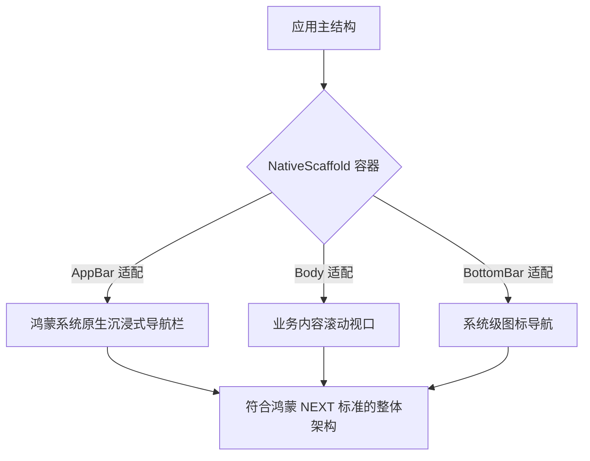
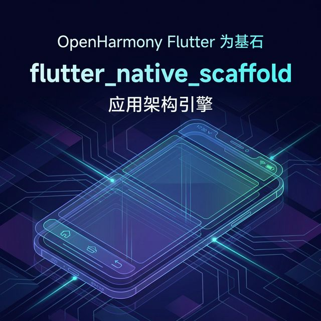

欢迎加入开源鸿蒙跨平台社区：[https://openharmonycrossplatform.csdn.net](https://openharmonycrossplatform.csdn.net)。

# Flutter for OpenHarmony：Flutter 三方库 flutter_native_scaffold — 利用原生底座极大简化基础架构（应用架构引擎）

## 前言

在鸿蒙（OpenHarmony）应用的基础架构搭建中，最繁琐的莫过于适配不同屏幕下的顶部导航栏（AppBar）和底部导航（BottomNavigationBar）。你是否想要一个能自动根据平台特性切换风格、且能完美避开鸿蒙系统状态栏和“流海屏”的万能底座？

`flutter_native_scaffold` 提供了一个极其高阶的抽象。它不再是一个单纯的 Widget，而是一个能自动包装原生导航能力的架构容器。在构建鸿蒙应用“骨架”的阶段，它能帮你自动化地处理大部分跨多终端的 UI 兼容逻辑，让你能专注于业务内容的填充。

## 一、原理展示 / 概念介绍

### 1.1 基础概念

为了保持结构的严谨，本库在底层对 Material 和 Cupertino 的脚手架进行了双重映射。



### 1.2 进阶概念

- **Adaptive Padding (自适应边距)**：自动计算鸿蒙设备的“安全区（Safe Area）”，无需开发者手动包装 `SafeArea` 组件。
- **Theme Coupling**：支持一键同步鸿蒙系统的深浅色模式，并自动调整 Scaffold 背景色。

## 二、核心 API / 组件详解

### 2.1 依赖引入

```yaml
dependencies:
  flutter_native_scaffold: ^0.1.0 # 建议检查鸿蒙适配分支
```

### 2.2 构建原生质感的脚手架

在鸿蒙工程中初始化主页面：

```dart
import 'package:flutter_native_scaffold/flutter_native_scaffold.dart';

Widget buildHarmonyMainPage() {
  return NativeScaffold(
    // ✅ 推荐做法：通过一站式配置导航与主体
    title: const Text('我的鸿蒙空间'),
    body: const Center(child: Text('业务内容展示区')),
    appBarAction: IconButton(onPressed: () {}, icon: const Icon(Icons.settings)),
    // 💡 重点：可以自动切换样式的底部 Tab
    bottomNavigationBar: NativeBottomBar(
      items: const [
        BottomNavigationBarItem(icon: Icon(Icons.home), label: '首页'),
        BottomNavigationBarItem(icon: Icon(Icons.person), label: '我的'),
      ],
    ),
  );
}
```

## 三、场景示例

### 3.1 场景一：鸿蒙级应用的“统一主题”骨架

当应用需要极致的一致性，且希望顶部的返回按钮、标题对齐方式在鸿蒙上表现得更像一款“系统应用”时。

```dart
// 💡 技巧：利用架构级封装，一处修改全局生效
NativeScaffold(
  backgroundColor: Colors.grey[50],
  appBarColor: Colors.blue,
  child: MyBusinessModule(),
)
```



## 四、OpenHarmony 平台适配挑战

### 4.1 窗口全屏与软键盘弹起的高度塌陷

在某些鸿蒙版本上，如果 Scaffold 处理不周，软键盘弹起可能会直接“顶破”布局。

✅ **适配策略建议**：
1. **ResizeToAvoidBottomInset**：脚手架通常支持此参数。在鸿蒙侧，建议将其设置为 `true`，以确保底部导航在键盘出现时能够被正确遮盖或避让。
2. **多设备导航对齐**：在鸿蒙平板横屏模式下，建议配合 `NativeNavigationRail` 使用，该 Scaffold 库往往能提供更好的响应式转换。

## 五、综合实战示例代码

这是一个包含了基础导航与侧边栏联动的鸿蒙 Lab 页面：

```dart
import 'package:flutter/material.dart';
import 'package:flutter_native_scaffold/flutter_native_scaffold.dart';

class HarmonyScaffoldLab extends StatelessWidget {
  const HarmonyScaffoldLab({super.key});

  @override
  Widget build(BuildContext context) {
    return NativeScaffold(
      title: const Text('鸿蒙架构实验室'),
      // 💡 重点：原生抽屉（Drawer）支持
      drawer: Drawer(
        child: ListView(
          children: const [DrawerHeader(child: Text('系统菜单'))],
        ),
      ),
      body: const Center(child: Text('核心业务已经成功在原生脚手架中起航！')),
    );
  }
}
```


## 六、总结

`flutter_native_scaffold` 为鸿蒙应用提供了一套开箱即用的“钢筋骨架”。它不仅解决了 UI 碎片化的适配难题，更为开发者提供了一个能够极其快速构建专业级 App 的架构底座。

✅ **核心建议**：
1. 项目初期建议直接采用此脚手架，避免后期繁琐的手动平台差异适配。
2. 配合 `PlatformWidget` 库，能实现从架构到组件的全方位原生化。

📦 更多的底层指导代码可进入：[AtomGit 示例专栏](https://atomgit.com)

---

欢迎加入开源鸿蒙跨平台社区：[开源鸿蒙跨平台开发者社区](https://openharmonycrossplatform.csdn.net)
