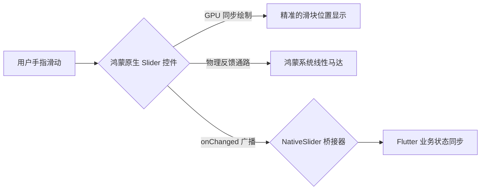

欢迎加入开源鸿蒙跨平台社区：[https://openharmonycrossplatform.csdn.net](https://openharmonycrossplatform.csdn.net)。

# Flutter for OpenHarmony：Flutter 三方库 flutter_native_slider — 毫秒级响应的原生滑动条（参数调节引擎）

## 前言

在鸿蒙（OpenHarmony）调色、亮调节、音频控制或者是复杂的参数配置类应用中，滑动条（Slider）是交互频率极高的控件。如果你觉得 Flutter 自带的 `Slider` 在滑动时有一丝丝的“粘滞感”，或者想要让用户在调节时获得与鸿蒙系统设置（如：音量调节）完全一致的震动反馈和视觉动效。

`flutter_native_slider` 是一个高性能的原生桥接器。它跳过了 Flutter 自身的渲染流水线，直接调用鸿蒙系统的 ArkUI Slider 控件。在执行高频率、像素级的平滑滑动调节时，它是你最稳健的控制器。

## 一、原理展示 / 概念介绍

### 1.1 基础概念

为了实现零延迟的触控同步，每一条 Slider 都是由鸿蒙系统底层直接绘制。



### 1.2 进阶概念

- **Physical Friction (物理阻尼)**：原生滑动条能完美模拟物体滑过的惯性与阻力感，这是纯软件模拟很难做到的质感。
- **Step Support**：完美支持离散步进（如：只能在 1-10 之间整数选择），且步进时的吸附感极其自然。

## 二、核心 API / 组件详解

### 2.1 依赖引入

```yaml
dependencies:
  flutter_native_slider: ^0.1.0 # 建议确认鸿蒙适配分支
```

### 2.2 部署原生滑动条

在鸿蒙工程中实现一个优雅的亮度调节：

```dart
import 'package:flutter_native_slider/flutter_native_slider.dart';

Widget buildHarmonyBrightnessControl() {
  return NativeSlider(
    value: _currentBrightness,
    min: 0.0,
    max: 100.0,
    // ✅ 推荐做法：通过 simple 回调监听高频变化
    onChanged: (double value) {
      setState(() => _currentBrightness = value);
    },
    activeColor: Colors.blue, // 💡 激活后的填充色
    thumbColor: Colors.white, // 💡 滑块自身的颜色
  );
}
```

## 三、场景示例

### 3.1 场景一：鸿蒙级应用的“专业相机”参数调节

当需要调节 ISO、焦距等对响应灵敏度有极高要求的参数时。

```dart
// 💡 技巧：利用原生能力处理每秒 60 次以上的参数刷新，UI 依然纹丝不动
NativeSlider(
  value: camera.iso,
  onChanged: (v) => camera.setISO(v),
)
```


## 四、OpenHarmony 平台适配挑战

### 4.1 跨语言高频通信负载

虽然滑动是原生的，但每一次滑动产生的数值都会通过 MethodChannel 传给 Dart 层。

✅ **适配策略建议**：
1. **onChangeEnd 策略**：如果滑动调节后会触发极其沉重的业务逻辑（如：重新加载高清图），建议仅在 `onChangeEnd` 回调中执行重写逻辑，而 `onChanged` 仅用于同步 UI 状态。
2. **布局避让**：原生 Slider 在鸿蒙某些机型下可能自带一定的横向 Padding。在 Flutter 布局时，建议为其两侧预留出 5-10 像素的主动空间，防止滑块被边缘切断。

## 五、综合实战示例代码

这是一个包含了基础数值显示与多维度调节演示的鸿蒙 Lab 页面：

```dart
import 'package:flutter/material.dart';
import 'package:flutter_native_slider/flutter_native_slider.dart';

class HarmonySliderLab extends StatefulWidget {
  const HarmonySliderLab({super.key});

  @override
  _HarmonySliderLabState createState() => _HarmonySliderLabState();
}

class _HarmonySliderLabState extends State<HarmonySliderLab> {
  double _volume = 50.0;

  @override
  Widget build(BuildContext context) {
    return Scaffold(
      appBar: AppBar(title: const Text('原生滑动条实验室')),
      body: Center(
        child: Column(
          children: [
            const Padding(padding: EdgeInsets.all(30), child: Text('👇 鸿蒙系统底层音频调节')),
            Padding(
              padding: const EdgeInsets.symmetric(horizontal: 40),
              child: NativeSlider(
                value: _volume,
                max: 100.0,
                onChanged: (v) => setState(() => _volume = v),
              ),
            ),
            const SizedBox(height: 20),
            Text('当前音量：${_volume.toInt()}%', style: const TextStyle(fontSize: 24, fontWeight: FontWeight.bold)),
          ],
        ),
      ),
    );
  }
}
```


## 六、总结

`flutter_native_slider` 是追求“操作手感”的开发者不容错过的插件。它让参数的调节不再是一种枯燥的数值变更，而变成了一种充满物理质感的感官享受。

✅ **核心建议**：
1. 编辑类（图片/视频/音频）鸿蒙应用推荐全面启用原生滑块。
2. 涉及无障碍（Accessibility）辅助的应用，原生滑块对读屏软件的支持更佳。

📦 更多的底层指导代码可进入：[AtomGit 示例专栏](https://atomgit.com)

---

欢迎加入开源鸿蒙跨平台社区：[开源鸿蒙跨平台开发者社区](https://openharmonycrossplatform.csdn.net)
