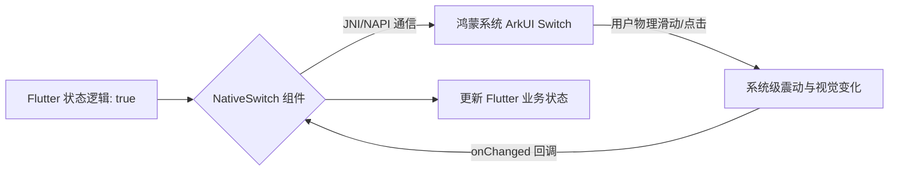

欢迎加入开源鸿蒙跨平台社区：[https://openharmonycrossplatform.csdn.net](https://openharmonycrossplatform.csdn.net)。

# Flutter for OpenHarmony：Flutter 三方库 flutter_native_switch — 极其灵敏的原生系统开关（状态交互引擎）

## 前言

在鸿蒙（OpenHarmony）设置、权限管理或者是功能配置类应用中，开关（Switch）是每一个用户最常触摸的操作点。虽然 Flutter 提供了 `Switch` 组件，但如果你追求那种与鸿蒙系统“完全一致”的物理摆动感、声音反馈效果，甚至是开关切换时的细微阻尼。

`flutter_native_switch` 是一个专注且高效的桥接器。它直接呼叫鸿蒙系统的原生开关控件，确保了无论是在点击灵敏度、色彩过渡动画，还是在盲人辅助的震动反馈上，都能与原生系统做到“像素级同步”。在追求交互真实感的鸿蒙应用中，它是你的状态开关管。

## 一、原理展示 / 概念介绍

### 1.1 基础概念

本库通过 PlatformView 将鸿蒙原生的 Toggle/Switch 逻辑真正嵌入到 UI 树中。



### 1.2 进阶概念

- **Physical Feedback (物理反馈)**：自动触发鸿蒙系统各型号手机内置的线性马达，提供精准的开启/关闭确认感。
- **Theme Sync**：不需要手动设置颜色，原生开关会自动根据用户当前的鸿蒙主题（Theme）色彩进行着色。

## 二、核心 API / 组件详解

### 2.1 依赖引入

```yaml
dependencies:
  flutter_native_switch: ^0.1.0 # 建议检查鸿蒙适配分支
```

### 2.2 部署原生开关

在鸿蒙工程中创建一个极其像“系统设置”的列表项：

```dart
import 'package:flutter_native_switch/flutter_native_switch.dart';

Widget buildHarmonyOption() {
  return ListTile(
    title: const Text('开启分布式通信增强'),
    trailing: NativeSwitch(
      value: _isEnabled,
      // ✅ 推荐做法：通过简单的回调同步状态
      onChanged: (bool value) {
        setState(() => _isEnabled = value);
      },
      activeColor: Colors.blueAccent, // 💡 可选：指定开启后的激活色
    ),
  );
}
```

## 三、场景示例

### 3.1 场景一：鸿蒙级应用的“高性能省电控制”中心

当应用包含几十个开关，且这些开关的开关动作会伴随大量的底层 Service 重启。

```dart
// 💡 技巧：利用原生组件处理连续快速的“无聊”点击，响应极其稳定
NativeSwitch(
  value: data.autoUpdate,
  onChanged: (v) => _handleHeavySwitch(v),
)
```


## 四、OpenHarmony 平台适配挑战

### 4.1 布局缩放与对齐

鸿蒙系统对控件的大小有特定的“最小点击区域”标准。

✅ **适配策略建议**：
1. **统一尺寸**：`NativeSwitch` 的尺寸通常是固定的。建议在 Flutter 层为其包裹一个 `SizedBox`，并设置固定的宽高（如 50x30），以防止在某些极端鸿蒙平板分辨率下出现布局错位。
2. **状态防抖**：如果开关的后端逻辑涉及耗时的磁盘 IO，建议在回调中加入简单的防抖或 Loading 覆盖，防止用户由于误以为“没点上”而进行的疯狂点击。

## 五、综合实战示例代码

这是一个包含了基础布局与状态映射演示的鸿蒙 Lab 页面：

```dart
import 'package:flutter/material.dart';
import 'package:flutter_native_switch/flutter_native_switch.dart';

class HarmonySwitchLab extends StatefulWidget {
  const HarmonySwitchLab({super.key});

  @override
  _HarmonySwitchLabState createState() => _HarmonySwitchLabState();
}

class _HarmonySwitchLabState extends State<HarmonySwitchLab> {
  bool _v1 = true;
  bool _v2 = false;

  @override
  Widget build(BuildContext context) {
    return Scaffold(
      appBar: AppBar(title: const Text('原生开关实验室')),
      body: ListView(
        children: [
          const Padding(padding: EdgeInsets.all(15), child: Text('原生鸿蒙控件展示', style: TextStyle(color: Colors.grey))),
          ListTile(
            title: const Text('允许后台运行'),
            trailing: NativeSwitch(value: _v1, onChanged: (v) => setState(() => _v1 = v)),
          ),
          ListTile(
            title: const Text('接收分布式消息'),
            trailing: NativeSwitch(value: _v2, onChanged: (v) => setState(() => _v2 = v)),
          ),
        ],
      ),
    );
  }
}
```


## 六、总结

`flutter_native_switch` 虽然纯粹，但它是构建高品质、能够“欺骗用户眼镜”的鸿蒙应用的关键。它让你的应用在每一个触觉反馈上都充满了官方的正统感。

✅ **核心建议**：
1. 设置页、功能控制页等对感知极其敏感的场景，推荐全面启用原生开关。
2. 配合 `PlatformAlert`，能打造出一套完美的系统级反馈闭环。

📦 更多的底层指导代码可进入：[AtomGit 示例专栏](https://atomgit.com)

---

欢迎加入开源鸿蒙跨平台社区：[开源鸿蒙跨平台开发者社区](https://openharmonycrossplatform.csdn.net)
