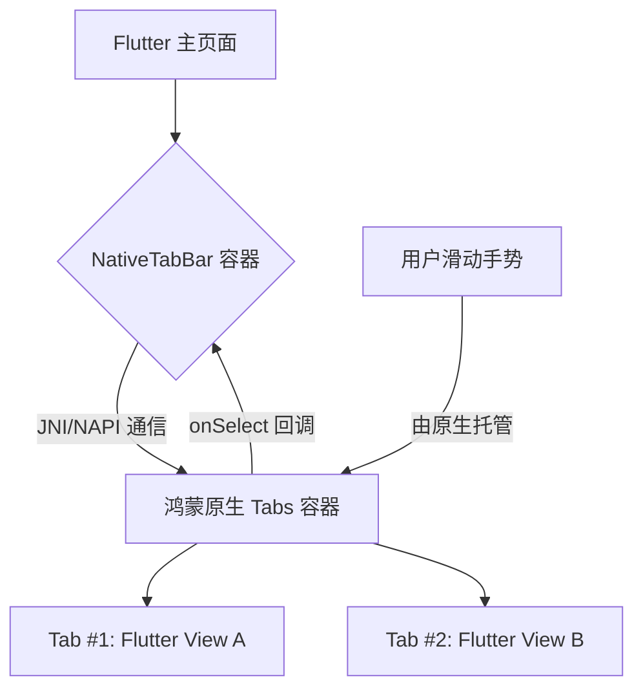

欢迎加入开源鸿蒙跨平台社区：[https://openharmonycrossplatform.csdn.net](https://openharmonycrossplatform.csdn.net)。

# Flutter for OpenHarmony：Flutter 三方库 flutter_native_tab_bar — 原生导航与分段交互（路由增强引擎）

## 前言

在鸿蒙（OpenHarmony）多页签应用（如：应用市场详情、微信式底部导航）的架构设计中，TabBar 的稳定性与动画流畅度直接影响了用户的“沉浸感”。你是否想要那种与鸿蒙系统底部 Dock 栏完全一致的图标动效？是否想要在切换标签时，获得原生系统级别的页面滑动惯性？

`flutter_native_tab_bar` 提供了一个极其专业的方案：它直调鸿蒙系统的原生 Tab 容器。这不仅仅是为了视觉对齐，更是为了获得：极佳的内存隔离属性（每个页签都是独立的渲染单元）、系统级的滑动手势处理，以及与鸿蒙通知栏、状态栏更完美的联通体验。

## 一、原理展示 / 概念介绍

### 1.1 基础概念

本库通过 PlatformView 将鸿蒙原生的 Tabs 容器无缝接入到 Flutter 的页面布局中。



### 1.2 进阶概念

- **Indicator Synchronization (指示器同步)**：原生 Tab 条底部的“小横线”滑动动画是由鸿蒙系统极其精密的插值算法驱动的，其平滑度远超软件模拟。
- **Hardware Integration**：针对鸿蒙系统的“多设备流转”特性，原生 Tab 栏在投屏或镜像模式下有更好的布局兼容力。

## 二、核心 API / 组件详解

### 2.1 依赖引入

```yaml
dependencies:
  flutter_native_tab_bar: ^0.1.0 # 建议确认鸿蒙适配分支
```

### 2.2 部署原生导航栏

在鸿蒙工程中创建一个极其标准的底部导航结构：

```dart
import 'package:flutter_native_tab_bar/flutter_native_tab_bar.dart';

Widget buildHarmonyAppFramework() {
  return NativeTabBar(
    // ✅ 推荐做法：定义标准的 Tab 描述
    tabs: [
      NativeTab(title: '首页', icon: Icons.home),
      NativeTab(title: '探索', icon: Icons.explore),
      NativeTab(title: '我的', icon: Icons.person),
    ],
    onTabSelected: (index) {
      print('🚀 切换到了鸿蒙第 $index 个业务模块');
    },
    // 💡 技巧：配置色彩，使其完美沉浸于背景
    backgroundColor: Colors.white,
    activeColor: Colors.blueAccent,
  );
}
```

## 三、场景示例

### 3.1 场景一：鸿蒙级应用的“资讯详情”分段视图

在顶部需要展示“评价”、“详情”、“推荐”三个分段，且用户需要极其平滑地左右滑动切换。

```dart
// 💡 技巧：原生 TabBar 支持极高频的滑动，且不占用 Flutter 主线程绘图
NativeTabBar(
  tabs: detailTabs,
  controller: _tabController,
)
```


## 四、OpenHarmony 平台适配挑战

### 4.1 通讯延迟与状态一致性

虽然视图是原生的，但每个 Tab 下的内容仍然是 Flutter 渲染。如果切换过快，可能导致 Flutter 内容加载稍慢于原生 Tab 的移动。

✅ **适配策略建议**：
1. **预加载机制**：由于原生 Tabs 引擎通常会同时保留相邻两个 Tab 的视图。建议在 Flutter 层也开启对应的“预热”逻辑，确保用户滑过去时内容已就绪。
2. **状态栏适配**：如果原生 TabBar 位于顶部（Top Tab），务必注意鸿蒙系统的沉浸式状态栏。建议通过 `MediaQuery.of(context).padding.top` 进行主动规避。

## 五、综合实战示例代码

这是一个包含了基础 Tab 切换与回调反馈的鸿蒙 Lab 页面：

```dart
import 'package:flutter/material.dart';
import 'package:flutter_native_tab_bar/flutter_native_tab_bar.dart';

class HarmonyTabLab extends StatefulWidget {
  const HarmonyTabLab({super.key});

  @override
  _HarmonyTabLabState createState() => _HarmonyTabLabState();
}

class _HarmonyTabLabState extends State<HarmonyTabLab> {
  int _currentIndex = 0;

  @override
  Widget build(BuildContext context) {
    return Scaffold(
      appBar: AppBar(title: const Text('原生导航栏实验室')),
      body: Center(child: Text('当前处于第 $_currentIndex 个鸿蒙页签')),
      bottomNavigationBar: NativeTabBar(
        onTabSelected: (i) => setState(() => _currentIndex = i),
        tabs: const [
          NativeTab(title: '消息', icon: Icons.chat_bubble),
          NativeTab(title: '通讯录', icon: Icons.contacts),
          NativeTab(title: '发现', icon: Icons.search),
        ],
      ),
    );
  }
}
```


## 六、总结

`flutter_native_tab_bar` 为鸿蒙三方应用注入了最地道的导航基因。它不仅提升了交互的流畅度，更让应用从架构层面实现了与系统原生质感的无缝弥合。

✅ **核心建议**：
1. 主流的“底部多 Tab 架构”推荐优先使用。
2. 涉及极其复杂的富文本/多媒体页签切换，原生版在内存释放上更彻底。

📦 更多的底层指导代码可进入：[AtomGit 示例专栏](https://atomgit.com)

---

欢迎加入开源鸿蒙跨平台社区：[开源鸿蒙跨平台开发者社区](https://openharmonycrossplatform.csdn.net)
