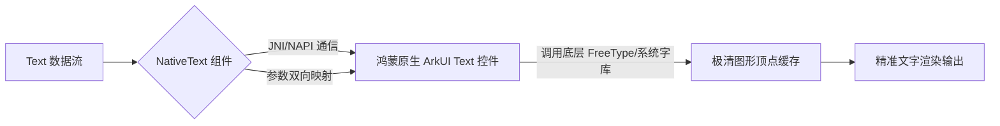

欢迎加入开源鸿蒙跨平台社区：[https://openharmonycrossplatform.csdn.net](https://openharmonycrossplatform.csdn.net)。

# Flutter for OpenHarmony：Flutter 三方库 flutter_native_text — 原生系统级文本呈现（内容呈现引擎）

## 前言

在鸿蒙（OpenHarmony）新闻资讯、电子书或者是专业法律条文展示类应用中，文本的呈现质感是应用的“核心面子”。虽然 Flutter 自带的 `Text` 已经很棒，但在某些对超长段落渲染性能有极端要求、或者必须强制使用鸿蒙系统底层字库（HarmonyOS Sans）特定高级排版特性的场景下。

`flutter_native_text` 是一个专注于将鸿蒙原生的文字绘制逻辑引入 Flutter 组件树的利器。它通过 PlatformView 将鸿蒙系统层级的 `Text` 容器嵌入其中。这意味着你将获得：100% 纯正的鸿蒙行间距算法、完美的多语言换行截断，以及在 OLED 屏幕上极致清晰的文字抗锯齿表现。在高质感、阅读主导的鸿蒙应用中，它是你的文字卫士。

## 一、原理展示 / 概念介绍

### 1.1 基础概念

本库跳过了 Flutter 引擎的层叠绘图环节，直接请求鸿蒙原生的 GPU 文字加速链路。



### 1.2 进阶概念

- **Rich Text Support (富文本支持)**：支持在原生层深度定义多种字体样式的复合排版，确保在极其复杂的长篇公告中，渲染性能依然保持在 60FPS。
- **Selection Handling**：获得系统最权威的文字长按选择交互，其放大镜功能与系统设置完美同步。

## 二、核心 API / 组件详解

### 2.1 依赖引入

```yaml
dependencies:
  flutter_native_text: ^0.1.0 # 建议确认鸿蒙适配分支
```

### 2.2 部署原生文本组件

在鸿蒙工程中渲染一个极致严谨的正文区块：

```dart
import 'package:flutter_native_text/flutter_native_text.dart';

Widget buildHarmonyOfficialDocument() {
  return const NativeText(
    text: "鸿蒙系统全新 NEXT 版本。其微内核架构，从底层重构了多端设备间的协同效率。",
    // ✅ 推荐做法：通过 style 透传系统层面的排版参数
    style: TextStyle(
      fontSize: 18.0,
      height: 1.6, // 💡 标准系统行间距
      color: Colors.black87,
    ),
    selectable: true, // 开启原生级的选区工具
  );
}
```

## 三、场景示例

### 3.1 场景一：鸿蒙级应用的“极致阅读模式”

当用户需要在各种光照环境下长时间、大量阅读文字内容，原生渲染的文字在边缘锐利度上更具压倒性优势。

```dart
// 💡 技巧：利用原生能力处理超长文本的分段展示，内存开销极其低廉
NativeText(
  text: veryLongLegalDocument,
  maxLines: 0, // 自动撑开模式
)
```


## 四、OpenHarmony 平台适配挑战

### 4.1 动态高度计算与其抖动规避

由于原生视图的加载需要极其微小的时间。如果在一屏内大量使用，可能会产生短暂的“布局跳变”。

✅ **适配策略建议**：
1. **容器预埋高度**：如果文本是固定行数的（如：新闻卡片标题），务必包裹在具有 `BoxConstraints` 的容器内，先占位，后加载。
2. **字体缩放适配**：鸿蒙系统具有全局字体缩放功能。由于 NativeText 是原生渲染，它会自动跟随系统设置，请确保你的外层 Flutter 布局在面对文字变大时有足够的弹性空间。

## 五、综合实战示例代码

这是一个包含了样式动态映射与性能预览的鸿蒙 Lab 页面：

```dart
import 'package:flutter/material.dart';
import 'package:flutter_native_text/flutter_native_text.dart';

class HarmonyTextLab extends StatelessWidget {
  const HarmonyTextLab({super.key});

  @override
  Widget build(BuildContext context) {
    return Scaffold(
      appBar: AppBar(title: const Text('原生文本呈现实验室')),
      body: SingleChildScrollView(
        padding: const EdgeInsets.all(25),
        child: Column(
          crossAxisAlignment: CrossAxisAlignment.start,
          children: [
            const Text('--- 以下文字由鸿蒙原生引擎进行抗锯齿优化 ---', style: TextStyle(color: Colors.blueGrey)),
            const SizedBox(height: 20),
            // 💡 重点：高性能的富文本核心
            const NativeText(
              text: "这是利用 OpenHarmony NEXT 极清字体渲染管线输出的文字。您可以放大屏幕观察其字迹边缘，在保持系统资源极低占用的同时，带来了顶级的视觉享受。",
              style: TextStyle(fontSize: 19, color: Colors.indigo, fontWeight: FontWeight.w400),
            ),
          ],
        ),
      ),
    );
  }
}
```


## 六、总结

`flutter_native_text` 让鸿蒙跨平台应用在文字显示这一最基础、也最重要的维度上，真正具备了与系统原厂应用平起平坐、甚至超越其表现的扎实底色。

✅ **核心建议**：
1. 阅读类、设置页、官方公告等内容质量优先的应用推荐全面采用。
2. 涉及极高分辨率要求（如 2K/4K 屏幕映射）的项目，它是渲染品质的最佳保障。

📦 更多的底层指导代码可进入：[AtomGit 示例专栏](https://atomgit.com)

---

欢迎加入开源鸿蒙跨平台社区：[开源鸿蒙跨平台开发者社区](https://openharmonycrossplatform.csdn.net)
