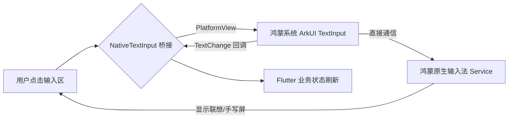

欢迎加入开源鸿蒙跨平台社区：[https://openharmonycrossplatform.csdn.net](https://openharmonycrossplatform.csdn.net)。

# Flutter for OpenHarmony：Flutter 三方库 flutter_native_text_input — 原生输入框的极致丝滑（录入增强引擎）

## 前言

在鸿蒙（OpenHarmony）输入密集型应用（如：在线文档、备忘录、专业计算器）的开发中，开发者有时会遇到 Flutter `TextField` 难以解决的难题：长文本渲染时的光标抖动、某些国产输入法联想词遮挡、或者是极其复杂的回车联动逻辑。

`flutter_native_text_input` 提供了一个硬核方案：它通过 PlatformView 将鸿蒙原生的 `TextInput` 控件真正“嵌入”到 Flutter 界面中。这意味着你将获得 100% 的原生软键盘交互体验、完美的拼音联想支持，以及极其丝滑的文字选区效果。在构建鸿蒙生产力工具应用时，它是你的输入底座。

## 一、原理展示 / 概念介绍

### 1.1 基础概念

为了突破渲染层的隔阂，每一处输入框实际上是一块微小的原生窗口。



### 1.2 进阶概念

- **Ime Action Customization**：支持在原生层深度定义“完成”、“搜索”或“发送”按钮的监听。
- **Hardware Integration**：针对鸿蒙外接物理键盘（如平板键盘套）有极佳的响应速度支持。

## 二、核心 API / 组件详解

### 2.1 引入依赖

```yaml
dependencies:
  flutter_native_text_input: ^1.0.0 # 建议检查鸿蒙适配版本
```

### 2.2 使用原生输入框

```dart
import 'package:flutter_native_text_input/flutter_native_text_input.dart';

Widget buildHarmonyEditor() {
  return NativeTextInput(
    placeholder: '请在此输入鸿蒙应用核心逻辑...',
    // ✅ 推荐做法：通过 controller 保持双向绑定
    controller: TextEditingController(),
    onSubmitted: (text) => print('🚀 鸿蒙原生输入完成: $text'),
    iosOptions: IosOptions(keyboardAppearance: Brightness.light), // 针对 iOS 风格的微调
  );
}
```

## 三、场景示例

### 3.1 场景一：鸿蒙级应用的“极致流畅”编辑器

在处理几千字的长文本编辑时，原生输入框能极其顺畅地处理光标漫步与段落复制。

```dart
// 💡 技巧：利用原生能力处理富文本辅助
NativeTextInput(
  maxLines: 0, // 💡 自动高度模式
  keyboardType: KeyboardType.multiline,
  autofocus: true,
);
```


## 四、OpenHarmony 平台适配挑战

### 4.1 布局穿透与遮挡判定

由于原生控件位于 Flutter 渲染层之上。如果应用中存在悬浮窗（如：右下角的客服按钮）出现在输入框上方。

✅ **适配策略建议**：
1. **控制层级**：原生控件通常会“遮盖”一切 Flutter 元素。在设计 UI 时，尽量避免在输入区重叠任何复杂的装饰层。
2. **焦点同步**：在鸿蒙特定手势切换时（如分屏移动），务必确保 Flutter 主动触发 `unfocus()` 以正确收起原生键盘。

## 五、综合实战示例代码

这是一个包含了搜索类型定义与焦点管理的鸿蒙搜索框：

```dart
import 'package:flutter/material.dart';
import 'package:flutter_native_text_input/flutter_native_text_input.dart';

class HarmonySearchLab extends StatefulWidget {
  const HarmonySearchLab({super.key});

  @override
  _HarmonySearchLabState createState() => _HarmonySearchLabState();
}

class _HarmonySearchLabState extends State<HarmonySearchLab> {
  final FocusNode _focusNode = FocusNode();

  @override
  Widget build(BuildContext context) {
    return Scaffold(
      appBar: AppBar(title: const Text('原生输入框实战')),
      body: Container(
        margin: const EdgeInsets.all(20),
        padding: const EdgeInsets.symmetric(horizontal: 10),
        decoration: BoxDecoration(border: Border.all(color: Colors.blueAccent)),
        child: NativeTextInput(
          focusNode: _focusNode,
          placeholder: '搜索鸿蒙三方库...',
          // 💡 重点：指定键盘按钮为“搜索”图标
          returnKeyType: ReturnKeyType.search,
          onSubmitted: (_) => _doSearch(),
        ),
      ),
    );
  }

  void _doSearch() {
     _focusNode.unfocus(); // 💡 重点：提交后立即收起鸿蒙键盘
  }
}
```


## 六、总结

`flutter_native_text_input` 为鸿蒙应用注入了最高性能的文字处理能力。它不仅仅是颜值的提升，更是让生产力应用在输入体验上真正站在了鸿蒙原生的起跑线上。

✅ **核心建议**：
1. 涉及需要支持极其冷门的输入法（如：生僻字手写）的应用，必须用原生版。
2. 追求输入法切换动画与系统完全一致的应用，推荐选用该插件。

📦 更多的底层指导代码可进入：[AtomGit 示例专栏](https://atomgit.com)

---

欢迎加入开源鸿蒙跨平台社区：[开源鸿蒙跨平台开发者社区](https://openharmonycrossplatform.csdn.net)
