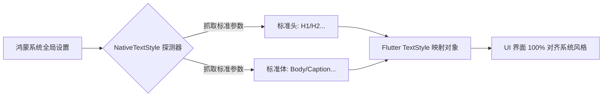

欢迎加入开源鸿蒙跨平台社区：[https://openharmonycrossplatform.csdn.net](https://openharmonycrossplatform.csdn.net)。

# Flutter for OpenHarmony：Flutter 三方库 flutter_native_text_style — 原生系统级样式映射（样式增强引擎）

## 前言

在鸿蒙（OpenHarmony）追求极致“视觉统一”的应用开发中，最让设计师头疼的莫过于：即便设置了 `fontFamily`，Flutter 的某些文字在字重（Weight）、字间距（Letter Spacing）或者是默认行高上，与鸿蒙系统原生设置界面的那种“官方感”仍有一丝距离。

`flutter_native_text_style` 提供了一个极其专业的解决方案：它不直接渲染文字，而是提供了一套桥接逻辑，能精准抓取出当前鸿蒙硬件上定义的、针对不同场景（如：标标题、正文、说明文字）的官方标准参数。在构建鸿蒙“官方质感”应用时，它是你的视觉翻译官。

## 一、原理展示 / 概念介绍

### 1.1 基础概念

本库通过在初始化阶段同步鸿蒙系统的资源样式表（Style Resources），生成 Dart 侧的样式配置。



### 1.2 进阶概念

- **Platform Text Scaling (动态缩放适配)**：完美监听鸿蒙系统的“大号字体”模式。当由于特殊需要调大系统字体时，该工具能让 Flutter 样式同步平滑呼吸。
- **Theme Mapping**：支持自动根据鸿蒙系统的深色模式状态，修正文字的基准灰度和对比度。

## 二、核心 API / 组件详解

### 2.1 依赖引入

```yaml
dependencies:
  flutter_native_text_style: ^0.1.0 # 建议确认鸿蒙适配分支
```

### 2.2 呼叫极准的原生样式

在鸿蒙工程中创建一个极其像“系统关于”页面的文本：

```dart
import 'package:flutter_native_text_style/flutter_native_text_style.dart';

Widget buildHarmonyInstruction() {
  return Text(
    '欢迎加入鸿蒙 NEXT 开源社区',
    // ✅ 推荐做法：通过一站式映射获取标准“正文”样式
    style: NativeTextStyle.body(
       color: Colors.black87,
       // 💡 可以在原生基准上进行微调
       fontWeight: FontWeight.bold,
    ),
  );
}
```

## 三、场景示例

### 3.1 场景一：鸿蒙级应用的“万物对齐”详情页

当应用需要展示协议声明，且要求其字间距、默认行高与鸿蒙系统原生的“隐私保护”页面完全一致。

```dart
// 💡 技巧：利用 NativeTextStyle.caption 获得极其细微且标准的小字展现力
Text(
  "点击即代表您同意鸿蒙生态服务协议",
  style: NativeTextStyle.caption(),
)
```


## 四、OpenHarmony 平台适配挑战

### 4.1 系统字库的高级特性透传

鸿蒙系统字库中含有的“等宽数字”等特性。

✅ **适配策略建议**：
1. **优先使用标准 Getter**：由于鸿蒙不同版本对 `Headline` 的定义可能由于像素密度（PPI）不同而不同。避免硬编码 `fontSize: 18`，应始终通过 `NativeTextStyle` 的工厂方法获取，以保障跨设备一致性。
2. **多语言对齐**：针对俄语、德语等超长字符，该插件能辅助获取原生层的“最大行高”建议，防止在限定高度的容器内出现文字被“削顶”的惨剧。

## 五、综合实战示例代码

这是一个包含了多维度原生样式预览的鸿蒙视觉 Lab：

```dart
import 'package:flutter/material.dart';
import 'package:flutter_native_text_style/flutter_native_text_style.dart';

class HarmonyStyleLab extends StatelessWidget {
  const HarmonyStyleLab({super.key});

  @override
  Widget build(BuildContext context) {
    return Scaffold(
      appBar: AppBar(title: const Text('原生样式映射实验室')),
      body: Padding(
        padding: const EdgeInsets.all(20),
        child: Column(
          children: [
            Text('鸿蒙标准标题', style: NativeTextStyle.headline1()),
            const SizedBox(height: 10),
            Text('鸿蒙标准副标题', style: NativeTextStyle.subtitle()),
            const Divider(),
            Text('这是一段采用了鸿蒙标准字间距、标准行间距映射的正文。它在任何复杂分辨率下都能保持最舒适的可读性。', 
                 style: NativeTextStyle.body()),
          ],
        ),
      ),
    );
  }
}
```


## 六、总结

`flutter_native_text_style` 虽然不直接渲染，但它为鸿蒙应用注入了最纯正的“文字灵魂”。它让开发者能站在巨人的肩膀上，直接享用系统级设计师对每一像素、每一处空白的精准拿捏。

✅ **核心建议**：
1. 涉及核心内容阅读区、设置页等文字比例大的场景必选。
2. 追求极致工业级视觉细节的企业级鸿蒙应用，请将此库作为基础 UI 模块。

📦 更多的底层指导代码可进入：[AtomGit 示例专栏](https://atomgit.com)

---

欢迎加入开源鸿蒙跨平台社区：[开源鸿蒙跨平台开发者社区](https://openharmonycrossplatform.csdn.net)
