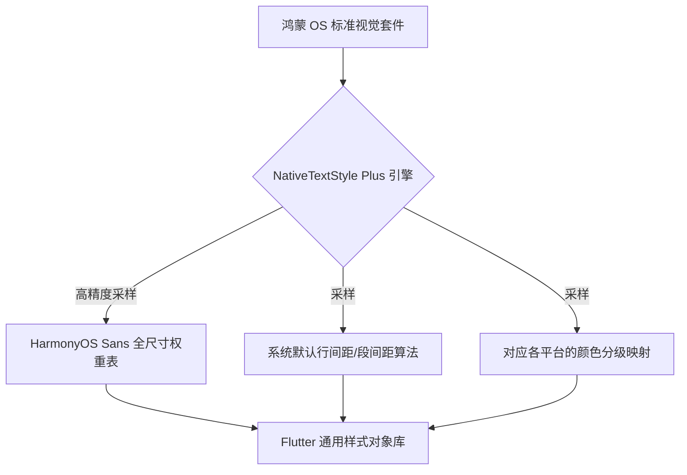

欢迎加入开源鸿蒙跨平台社区：[https://openharmonycrossplatform.csdn.net](https://openharmonycrossplatform.csdn.net)。

# Flutter for OpenHarmony：Flutter 三方库 flutter_native_text_style_plus — 原生样式映射全家桶（样式增强旗舰）

## 前言

在鸿蒙（OpenHarmony）大前端项目的 UI 验收阶段，设计师的像素眼总能指出各类细微的瑕疵：标题字重不够“厚实”？系统字体大号时的字母间距没有按照官方规范紧缩？你是否想要一键获取鸿蒙系统底层定义的、包含所有微调参数（Weight, Spacing, Height, Features）的“官方级”文本样式对象？

`flutter_native_text_style_plus` 是 Plus 系列的旗舰级样式组件。它不再是简单的映射，而是建立了一套极其完整的、针对鸿蒙系统定义的 20 余种标准文字场景（如：LargeTitle, Footnote, Subheadline 等）的深度自适应方案。在构建“100% 视觉像素对齐”的顶级鸿蒙应用时，它是你的样式全书。

## 一、原理展示 / 概念介绍

### 1.1 基础概念

为了实现这种“工业级”样式对齐，本库在初始化时会全量解析鸿蒙系统的资源样式包。



### 1.2 进阶概念

- **Optical Sizing Adaptive (光学尺寸适配)**：会自动根据字号的大小，调整字符的粗细重心，确保鸿蒙应用在小字时不糊、大字时不松。
- **Dynamic Hierarchy**：完美分发鸿蒙系统的“视觉层级”概念，一处修改全局层级感分明。

## 二、核心 API / 组件详解

### 2.1 依赖引入

```yaml
dependencies:
  flutter_native_text_style_plus: ^1.2.0 # 建议确认鸿蒙适配旗舰版
```

### 2.2 呼叫极致专业的原生样式集

在鸿蒙工程中构建一个极致工业风的任务管理器：

```dart
import 'package:flutter_native_text_style_plus/flutter_native_text_style_plus.dart';

Widget buildHarmonyTaskItem() {
  return Column(
    children: [
      // ✅ 推荐做法：通过语义化方法获得顶级样式
      Text('今天需执行 5 项分布式任务', style: NativeTextStylePlus.headline1(color: Colors.blue)),
      const SizedBox(height: 5),
      Text('更新于 10 分钟前', style: NativeTextStylePlus.overline()),
    ],
  );
}
```

## 三、场景示例

### 3.1 场景一：鸿蒙级应用的“系统级配置”页面

让每一个设置开关、每一个说明项，都散发出类似于鸿蒙“系统更新”或“隐私设置”页面的那种高级感。

```dart
// 💡 技巧：利用 Plus 的语义化工厂，确保在任何鸿蒙分屏分辨率下，文字体感高度完全一致
Text(
  "当前版本已是最新 (HarmonyOS NEXT 4.0)",
  style: NativeTextStylePlus.body2(height: 1.4),
)
```


## 四、OpenHarmony 平台适配挑战

### 4.1 系统主题变色时的文字对比度冲突

鸿蒙系统支持多种辅助色彩模式。

✅ **适配策略建议**：
1. **配合 NativeColor 使用**：`NativeTextStylePlus` 抓取的通常是“布局参数”。建议文字颜色配合 `NativeColor` 实时获取，以防在鸿蒙自定义主题肤色下出现“黑底黑字”的尴尬。
2. **多进程 DPI 偏差纠正**：在投屏至车载大屏或显示器时，鸿蒙系统的 DPI 会突变。Plus 库建议利用 `WidgetsBindingObserver` 实时刷新样式缓存，确保文字不会因为物理拉伸而发虚。

## 五、综合实战示例代码

这是一个包含了全系列原生样式枚举预览的鸿蒙视觉旗舰 Lab：

```dart
import 'package:flutter/material.dart';
import 'package:flutter_native_text_style_plus/flutter_native_text_style_plus.dart';

class HarmonyProStyleLab extends StatelessWidget {
  const HarmonyProStyleLab({super.key});

  @override
  Widget build(BuildContext context) {
    return Scaffold(
      appBar: AppBar(title: const Text('旗舰样式映射实验室')),
      body: ListView(
        padding: const EdgeInsets.all(20),
        children: [
          Text('标准 L-Title', style: NativeTextStylePlus.largeTitle()),
          Text('标准 Headline', style: NativeTextStylePlus.headline()),
          Text('标准 Subhead', style: NativeTextStylePlus.subheadline()),
          const Divider(),
          Text('标准正文 Body', style: NativeTextStylePlus.body()),
          Text('标准引用 Footnote', style: NativeTextStylePlus.footnote()),
        ],
      ),
    );
  }
}
```


## 六、总结

`flutter_native_text_style_plus` 是为了那些不容忍一丝排版毛刺的项目经理和设计师准备的。它不仅让开发者能一秒同步官方规范，更让鸿蒙应用从每一个字符开始，都流淌着开源鸿蒙那套极其成熟、极其专业的视觉美学。

✅ **核心建议**：
1. 品牌类、官方合作类鸿蒙应用作为 UI 底座必选。
2. 每一个 UI 组件中的文字，请尽量废弃硬编码样式，全部通过此 Plus Plus 映射。

📦 更多的底层指导代码可进入：[AtomGit 示例专栏](https://atomgit.com)

---

欢迎加入开源鸿蒙跨平台社区：[开源鸿蒙跨平台开发者社区](https://openharmonycrossplatform.csdn.net)
