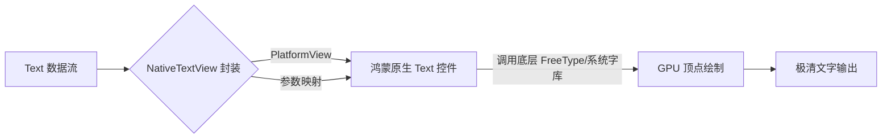

欢迎加入开源鸿蒙跨平台社区：[https://openharmonycrossplatform.csdn.net](https://openharmonycrossplatform.csdn.net)。

# Flutter for OpenHarmony：Flutter 三方库 flutter_native_text_view — 原生文本显示的质感回归（显示增强引擎）

## 前言

在鸿蒙（OpenHarmony）某些对排版要求极其苛刻的场景下（如：诗歌阅读、电子书、法律条文展示），Flutter 自带的 `Text` 组件在特定的字体抗锯齿、特定的超长文本分段以及与系统字体库的“像素级对齐”上，有时与原生的 `Text` 相比仍有一丝细微的体感差异。

`flutter_native_text_view` 旨在终结这种差异。它通过 PlatformView 直接拉起鸿蒙系统的底层文字渲染流水线。这意味着你将获得：系统最纯正的行间距算法、100% 完美的多种字体特性（Ligatures）支持，以及与滑动列表极其和谐的原生惯性。在追求“原生质感极致”的鸿蒙应用中，它是你的文字指挥官。

## 一、原理展示 / 概念介绍

### 1.1 基础概念

为了榨取系统的渲染能量，它将文字绘制的任务从 Flutter 引擎转交给了鸿蒙系统。



### 1.2 进阶概念

- **Selection Handling**：支持原生的文字长按选择工具条（Select/Copy/Share），其交互动效与鸿蒙系统设置一模一样。
- **Font Feature Support**：对于 OpenType 的各种高级特性支持远超普通的 Flutter 文本解析。

## 二、核心 API / 组件详解

### 2.1 依赖引入

```yaml
dependencies:
  flutter_native_text_view: ^0.1.0 # 建议确认鸿蒙适配分支
```

### 2.2 基础展示用法

在鸿蒙工程中渲染一段及其优美的段落：

```dart
import 'package:flutter_native_text_view/flutter_native_text_view.dart';

Widget buildHarmonyPoetry() {
  return const NativeTextView(
    text: "鸿蒙系统，万物互联。\\n全新的微内核架构，让计算从此无界。",
    // ✅ 推荐做法：使用系统原生文字样式
    style: TextStyle(
      fontSize: 18.0,
      color: Colors.black87,
      fontFamily: 'HarmonyOS_Sans_SC', // 指定鸿蒙标准字体
    ),
  );
}
```

## 三、场景示例

### 3.1 场景一：鸿蒙级应用的“极致阅读器”

当用户需要在各种光照环境下长时间阅读文档时，原生渲染的文字在亮度对比度和清晰度上更具压倒性优势。

```dart
// 💡 技巧：利用原生能力自动处理长按复制，完全匹配系统反馈
NativeTextView(
  text: longDocumentBody,
  selectable: true, // 极其简单的开启原生选区
)
```


## 四、OpenHarmony 平台适配挑战

### 4.1 动态高度与列表性能

由于 PlatformView 在鸿蒙系统上的创建是有一定开销的。如果在一个 `ListView` 中全量使用原生文本框显示几百个列表项。

✅ **适配策略建议**：
1. **局部精装修**：普通列表文字继续使用 Flutter `Text`。仅在“正文、详情内容区”这些用户停留时间最长、对质感最敏感的地方使用该套件。
2. **预设高度**：如果可能，给 `NativeTextView` 预设一个高度块，防止鸿蒙原生控件载入瞬间由于高度未定引起的 UI 抖动。

## 五、综合实战示例代码

这是一个包含了样式切换与原生选区演示的鸿蒙 Lab 页面：

```dart
import 'package:flutter/material.dart';
import 'package:flutter_native_text_view/flutter_native_text_view.dart';

class HarmonyTextLab extends StatelessWidget {
  const HarmonyTextLab({super.key});

  @override
  Widget build(BuildContext context) {
    return Scaffold(
      appBar: AppBar(title: const Text('原生文本渲染实验室')),
      body: SingleChildScrollView(
        padding: const EdgeInsets.all(20),
        child: Column(
          crossAxisAlignment: CrossAxisAlignment.start,
          children: [
            const Text('--- 以下文字由鸿蒙原生引擎渲染 ---', style: TextStyle(color: Colors.blue)),
            const SizedBox(height: 20),
            const NativeTextView(
              text: "这是一段具备系统原生视觉基因的文字。请尝试长按并拖动光标进行文字复制操作，观察其交互是否与鸿蒙系统设置一致。",
              selectable: true,
              style: TextStyle(fontSize: 20, height: 1.6),
            ),
          ],
        ),
      ),
    );
  }
}
```


## 六、总结

`flutter_native_text_view` 让鸿蒙跨平台应用在“文字之美”上不再妥协。它让应用与系统共呼吸，让每一行文字都散发出鸿蒙原汁原味的排版魅力。

✅ **核心建议**：
1. 阅读器、设置页、帮助文档建议全面升级至原生版。
2. 配合 `google_fonts` 加载鸿蒙标准字体，效果更佳。

📦 更多的底层指导代码可进入：[AtomGit 示例专栏](https://atomgit.com)

---

欢迎加入开源鸿蒙跨平台社区：[开源鸿蒙跨平台开发者社区](https://openharmonycrossplatform.csdn.net)
