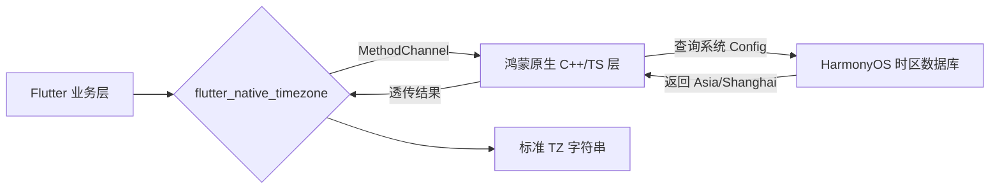

欢迎加入开源鸿蒙跨平台社区：[https://openharmonycrossplatform.csdn.net](https://openharmonycrossplatform.csdn.net)。

# Flutter for OpenHarmony：Flutter 三方库 flutter_native_timezone — 精准同步鸿蒙端侧地理时区（时效交互引擎）

## 前言

在鸿蒙（OpenHarmony）全球化应用、跨时区会议日程或智能物流跟踪场景中，我们经常需要获取用户设备当前真实的“地理时区名称”（如 `Asia/Shanghai` 或 `America/Los_Angeles`）。你可能觉得 Dart 自带的 `DateTime.now().timeZoneName` 就够了，但实际上它返回的多是缩写（如 CST），容易产生歧价。

`flutter_native_timezone` 是一款极简的桥接插件。它能穿透沙箱，直接从鸿蒙系统的底层配置中拉取出符合 IANA 标准的完整时区字符串。在处理时间敏感型的业务时，它是你确保全球“分秒不差”的基石。

## 一、原理展示 / 概念介绍

### 1.1 基础概念

为了获取最权威的时区信息，插件必须与原生鸿蒙系统进行一次异步对话。



### 1.2 进阶概念

- **IANA Standard (TZ 数据库)**：这是全球公认的时间标准命名，完美契合后端数据库（如 MySQL/PostgreSQL）的存储需求。
- **Auto-Sync**：当鸿蒙用户由于旅行导致物理时区发生改变时，插件能再次通过调用获取最新状态。

## 二、核心 API / 组件详解

### 2.1 依赖引入

在鸿蒙工程的 `pubspec.yaml` 中添加：

```yaml
dependencies:
  flutter_native_timezone: ^2.0.0 # 建议检查最新版本
```

### 2.2 获取当前时区名

```dart
import 'package:flutter_native_timezone/flutter_native_timezone.dart';

void syncHarmonyTimezone() async {
  try {
    // ✅ 推荐做法：通过静态方法快速获取
    final String currentTimeZone = await FlutterNativeTimezone.getLocalTimezone();
    print('🕐 鸿蒙设备当前地理位置时区: $currentTimeZone');
  } catch (e) {
    print('❌ 无法同步鸿蒙端侧时区信息');
  }
}
```

## 三、场景示例

### 3.1 场景一：鸿蒙级应用的“智能闹钟/提醒”

当本地闹钟同步到云端时，必须带上准确的时区名，否则跨时区同步会出现数小时的偏差。

```dart
import 'package:flutter_native_timezone/flutter_native_timezone.dart';

Map<String, dynamic> generateAlarmPayload() {
  return {
    'remind_at': '2026-08-01 08:00:00',
    // 💡 技巧：必须使用 IANA 时区名称存入后端
    'tz': 'Asia/Shanghai' 
  };
}
```


## 四、OpenHarmony platform 适配挑战

### 4.1 鸿蒙系统权限与隐私管控

在最新的鸿蒙版本中，获取地理相关信息（虽然是时区）可能会受到更严格的审计。

✅ **适配策略建议**：
1. **异常捕获**：即使在 Flutter 层逻辑正确，也可能因为鸿蒙系统权限未通过而返回失败。务必包装 `try-catch`。
2. **静默失败策略**：如果鸿蒙端获取失败，建议 Fallback 回 `DateTime.now().timeZoneName` 并在 UI 提示用户检查系统设置。

## 五、综合实战示例代码

这是一个包含了实时时区检测与展示的鸿蒙全球通 Demo：

```dart
import 'package:flutter/material.dart';
import 'package:flutter_native_timezone/flutter_native_timezone.dart';

class HarmonyTimezoneChecker extends StatefulWidget {
  const HarmonyTimezoneChecker({super.key});

  @override
  _HarmonyTimezoneCheckerState createState() => _HarmonyTimezoneCheckerState();
}

class _HarmonyTimezoneCheckerState extends State<HarmonyTimezoneChecker> {
  String _timezone = "点击按钮同步中...";

  Future<void> _refresh() async {
    final tz = await FlutterNativeTimezone.getLocalTimezone();
    setState(() => _timezone = tz);
  }

  @override
  Widget build(BuildContext context) {
    return Scaffold(
      appBar: AppBar(title: const Text('时区专家 - 鸿蒙同步版')),
      body: Center(
        child: Column(
          mainAxisAlignment: MainAxisAlignment.center,
          children: [
            const Icon(Icons.public, size: 80, color: Colors.indigo),
            const SizedBox(height: 20),
            const Text('检测到的 IANA 时区标识为：'),
            Text(_timezone, style: const TextStyle(fontSize: 24, fontWeight: FontWeight.bold, color: Colors.blue)),
            const Spacer(),
            ElevatedButton(onPressed: _refresh, child: const Text('立即从鸿蒙底层触发同步')),
            const SizedBox(height: 50),
          ],
        ),
      ),
    );
  }
}
```


## 六、总结

`flutter_native_timezone` 是跨时区业务开发的“最后一公里”。它让鸿蒙应用真正具备了感知地理属性的能力，让你的应用在全球化征程中显得更加专业稳健。

✅ **核心建议**：
1. 涉及与后端进行“绝对时间”交互的鸿蒙应用，必须引入此库。
2. 在日志埋点中加入时区信息，能极大地方便后续数据清洗与分片。

📦 更多的底层指导代码可进入：[AtomGit 示例专栏](https://atomgit.com)

---

欢迎加入开源鸿蒙跨平台社区：[开源鸿蒙跨平台开发者社区](https://openharmonycrossplatform.csdn.net)
