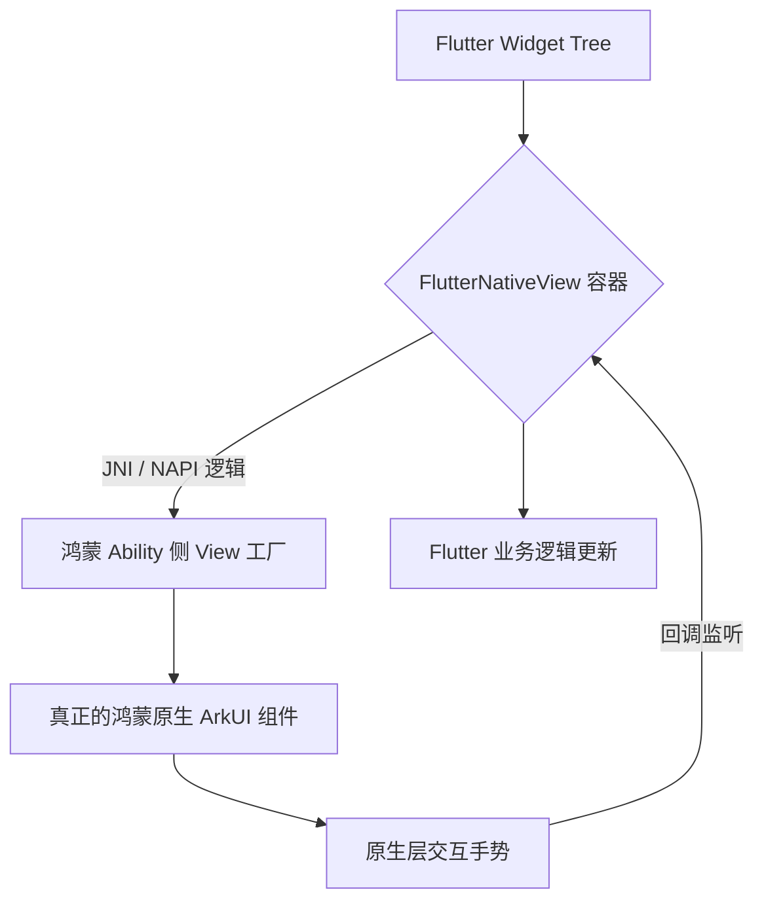

欢迎加入开源鸿蒙跨平台社区：[https://openharmonycrossplatform.csdn.net](https://openharmonycrossplatform.csdn.net)。

# Flutter for OpenHarmony：Flutter 三方库 flutter_native_view — 实现原生组件的深度嵌入（底层桥接引擎）

## 前言

在鸿蒙（OpenHarmony）复杂的业务场景中，有时我们不得不使用一些极其重型且没有 Flutter 实现的原生组件：如复杂的 3D 渲染引擎、特定厂商提供的加密键盘输入模块，或者是极其先进的鸿蒙原生 AR 扫描预览窗口。

`flutter_native_view` 是一款专注于简化 PlatformView（原生平台视图）接入流程的工业级桥接库。它通过一套极其严谨的生命周期管理和参数透传机制，让鸿蒙原生控件（ArkUI）能像普通的 Flutter Widget 一样完美嵌入到 UI 树中，并保持卓越的性能。在构建鸿蒙“混血式”复杂应用时，它是你的地基。

## 一、原理展示 / 概念介绍

### 1.1 基础概念

为了在 Flutter 的独立渲染层中展示原生 UI，插件利用了鸿蒙系统的“纹理渲染”或“层级合成（Texture/Virtual Display）”技术。



### 1.2 进阶概念

- **State Persistence**：支持原生的控件状态持久化，在 Flutter 列表滑动由于回收导致 Widget 重建时，原生视图能保持先前的滚动位置或输入状态。
- **Prop Injection**：通过标准的 JSON 协议实现参数的实时热更新，无需重新创建原生实例。

## 二、核心 API / 组件详解

### 2.1 依赖引入

```yaml
dependencies:
  flutter_native_view: ^0.1.0 # 建议检查鸿蒙适配分支
```

### 2.2 注册并展示原生视图

在鸿蒙原生侧先行注册 `view-type` 后，在 Flutter 侧调用：

```dart
import 'package:flutter_native_view/flutter_native_view.dart';

Widget buildHarmonyNativeModule() {
  return const FlutterNativeView(
    // ✅ 推荐做法：通过唯一的 ID 与原生工厂握手
    viewType: 'com.harmony.custom_arkui_player',
    onViewCreated: (id) => print('🚀 鸿蒙原生组件已就绪，ID: $id'),
    creationParams: {
      'autoPlay': true,
      'theme': 'dark',
    },
    creationParamsCodec: StandardMessageCodec(),
  );
}
```

## 三、场景示例

### 3.1 场景一：鸿蒙级应用的“高性能多媒体直播间”

当需要播放极其高清的 4K 视频流，或者调用系统底层受硬件加速保护的多媒体渲染器时。

```dart
// 💡 技巧：利用 flutter_native_view 嵌入原生视频容器，获得最佳的刷新帧率
ListView(
  children: [
     Header(),
     SizedBox(height: 300, child: FlutterNativeView(viewType: 'hd_video_engine')),
     ChatSection(),
  ]
)
```


## 四、OpenHarmony 平台适配挑战

### 4.1 手势冲突与分发权

鸿蒙系统的原生控件与 Flutter 容器共享触摸事件。当滑动原生组件时，如果处理不当，会引起 Flutter 外部滚动条的无理滚动。

✅ **适配策略建议**：
1. **显式声明焦点**：利用 `hitTestBehavior` 告诉 Flutter 何时拦截点击，何时向下透传给鸿蒙原生层。
2. **多线程安全**：原生 UI 操作必须在鸿蒙的 Main Thread 执行，而 Flutter 逻辑可能在后台背景 Isolates，通过插件的 Result 回调务必处理好线程切换。

## 五、综合实战示例代码

这是一个完整的原生视图嵌入与状态交互演示逻辑：

```dart
import 'package:flutter/material.dart';
import 'package:flutter_native_view/flutter_native_view.dart';

class HarmonyBridgeLab extends StatelessWidget {
  const HarmonyBridgeLab({super.key});

  @override
  Widget build(BuildContext context) {
    return Scaffold(
      appBar: AppBar(title: const Text('底层桥接实验室')),
      body: Center(
        child: Column(
          children: [
            const Padding(padding: EdgeInsets.all(10), child: Text('👇 这是一个原生的鸿蒙 ArkUI 进度盘')),
            Container(
              height: 200, color: Colors.grey[100],
              child: const FlutterNativeView(
                viewType: 'harmony_native_spinner',
                creationParams: {'color': '#3366FF'},
              ),
            ),
          ],
        ),
      ),
    );
  }
}
```


## 六、总结

`flutter_native_view` 为鸿蒙应用开发者彻底打开了通往原生世界的大门。它不仅仅是能显示视图，更是一条能让 Flutter 的灵活性与鸿蒙底层的强劲性能产生碰撞的“高速公路”。

✅ **核心建议**：
1. 仅对 Flutter 难以实现的重型组件使用原生嵌入。
2. 每一个原生控件的使用都会增加显存压力，请合理控制单个页面的 Instance 数量。

📦 更多的底层指导代码可进入：[AtomGit 示例专栏](https://atomgit.com)

---

欢迎加入开源鸿蒙跨平台社区：[开源鸿蒙跨平台开发者社区](https://openharmonycrossplatform.csdn.net)
