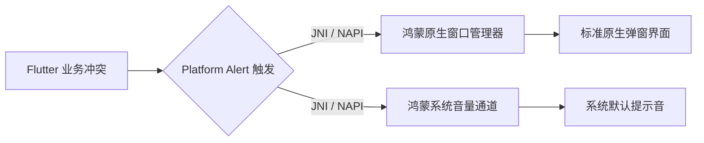

欢迎加入开源鸿蒙跨平台社区：[https://openharmonycrossplatform.csdn.net](https://openharmonycrossplatform.csdn.net)。

# Flutter for OpenHarmony：flutter_platform_alert — 极简原生对话框与提示音


## 前言

在追求轻量化的鸿蒙应用中，若仅需简单的删除确认等交互，无需渲染复杂的组件。`flutter_platform_alert` 允许开发者直接调用系统底层 Alert 弹窗与反馈音，在保障原生感的同时显著降低了资源占用的开销。

## 一、核心价值

### 1.1 基础概念

插件通过 MethodChannel 直接向操作系统发出指令。



### 1.2 进阶概念

- **System Alert Sound**：支持调用鸿蒙预设的几种声音类型（如 `Success`, `Warning`, `Error`），这在盲人辅助或视障友好的场景下极其关键。
- **Hardware Interaction**：弹窗时伴随系统的默认反馈逻辑，让应用感觉更像系统的一部分。

## 二、核心 API / 组件详解

### 2.1 依赖引入

```yaml
dependencies:
  flutter_platform_alert: ^1.1.0 # 建议检查鸿蒙适配分支
```

### 2.2 呼叫极简原生弹窗

```dart
import 'package:flutter_platform_alert/flutter_platform_alert.dart';

Future<void> showHarmonyNativeAlert() async {
  // ✅ 推荐做法：极其简单的一行代码，返回用户的选择结果
  final result = await FlutterPlatformAlert.showAlert(
    windowTitle: '系统警告',
    text: '检测到鸿蒙环境异常，是否继续执行？',
    alertStyle: AlertButtonStyle.yesNo,
    iconStyle: IconStyle.warning,
  );
  
  if (result == AlertButton.yesButton) {
    print('用户选择了继续');
  }
}
```

### 2.3 触发原生反馈音

```dart
FlutterPlatformAlert.playAlertSound(iconStyle: IconStyle.information);
```

## 三、场景示例

### 3.1 场景一：鸿蒙级应用的“低功耗”消息通知

当应用处于某些由于能效限制无法渲染复杂动画的状态下，直接通过原生弹窗确保用户能看到紧急消息。

```dart
import 'package:flutter_platform_alert/flutter_platform_alert.dart';

void onHeavyError() {
  // 💡 技巧：利用原生弹窗绕过所有 Flutter 遮罩层，直接呈现在最顶层
  FlutterPlatformAlert.showAlert(
    windowTitle: '硬件访问故障',
    text: '当前传感器无法连接，请重启设备。',
  );
}
```


## 四、OpenHarmony 平台适配挑战

### 4.1 弹窗阻塞与 UI 线程锁

原生弹窗有时由鸿蒙系统的渲染线程托管。

✅ **适配策略建议**：
1. **异步非阻塞**：始终监听 `showAlert` 返回的 `Future`。不要试图在同步主线程中依赖其结果。
2. **多语言对齐**：原生弹窗的按钮文本（如 Yes/No）通常会根据鸿蒙系统当前的语言设置自动本地化。无需再在 Flutter 代码里手动翻译按钮名称。

## 五、综合实战示例代码

这是一个包含了声音与弹窗联动的鸿蒙实验室功能页面：

```dart
import 'package:flutter/material.dart';
import 'package:flutter_platform_alert/flutter_platform_alert.dart';

class HarmonyAlertLab extends StatelessWidget {
  const HarmonyAlertLab({super.key});

  @override
  Widget build(BuildContext context) {
    return Scaffold(
      appBar: AppBar(title: const Text('原生弹窗与提示音实战')),
      body: Center(
        child: Column(
          mainAxisAlignment: MainAxisAlignment.center,
          children: [
            ElevatedButton(
              onPressed: () => FlutterPlatformAlert.playAlertSound(iconStyle: IconStyle.error),
              child: const Text('测试：鸿蒙错误反馈音'),
            ),
            const SizedBox(height: 20),
            ElevatedButton(
              onPressed: () => FlutterPlatformAlert.showAlert(
                windowTitle: '操作确认',
                text: '您确定要提交鸿蒙工程代码吗？',
              ),
              child: const Text('测试：系统原生对话框'),
            ),
          ],
        ),
      ),
    );
  }
}
```


## 六、总结

`flutter_platform_alert` 是一款追求极致执行效率的插件。它让你的应用在交互上能“借力”系统底层的设计语言，不仅能获得极佳的性能，还能获得系统级的稳定反馈。

✅ **核心建议**：
1. 后台由于 Service 异常需要强制打断并通知用户时，它是最佳手段。
2. 追求极致精简体积的项目，可以使用它代替复杂的 UI Dialog 库。

📦 更多的底层指导代码可进入：[AtomGit 示例专栏](https://atomgit.com)

---

欢迎加入开源鸿蒙跨平台社区：[开源鸿蒙跨平台开发者社区](https://openharmonycrossplatform.csdn.net)
