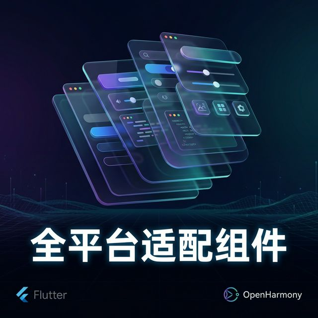
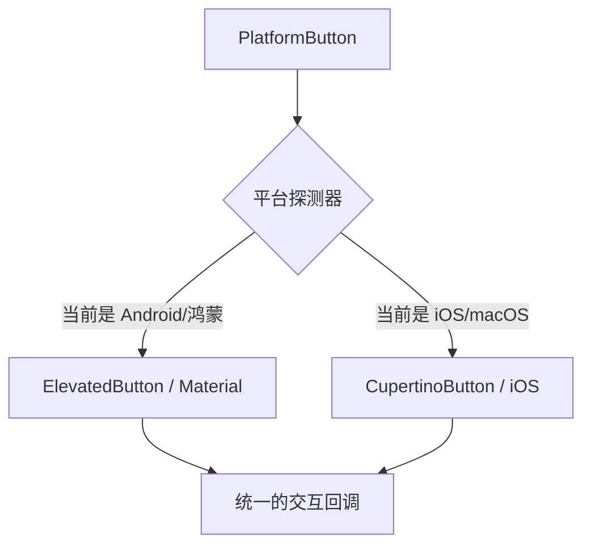

欢迎加入开源鸿蒙跨平台社区：[https://openharmonycrossplatform.csdn.net](https://openharmonycrossplatform.csdn.net)。

# Flutter for OpenHarmony：Flutter 三方库 flutter_platform_widgets 让 UI 一套代码多终端原生体验（适配转换引擎）




## 前言

在打造鸿蒙（OpenHarmony）跨平台应用时，开发者常面临一个视觉痛点：如果直接使用 Material Design，在鸿蒙系统上可能会显得有些“外来感”；而如果全部手写两套 UI（Material 对应 Android/鸿蒙，Cupertino 对应 iOS），代码维护量将翻倍。

`flutter_platform_widgets` 完美解决了这一矛盾。它提供了一套极其智能的抽象组件（如 `PlatformWidget`, `PlatformButton`），能根据当前运行的鸿蒙物理环境或平台设置，自动在 Material 和 Cupertino 风格之间无缝切换。在鸿蒙应用追求“既要跨平台，又要原生感”的今天，它是你的视觉翻译官。

## 一、原理展示 / 概念介绍

### 1.1 基础概念

它在底层通过简单的 `if-else` 逻辑封装了 Flutter 所有的基础组件对。



### 1.2 进阶概念

- **Data Object Mapping**：它不仅转换组件，还支持将特定的平台参数（如图标大小、阴影高度）通过对应的 `MaterialData` 或 `CupertinoData` 进行精准注入。

## 二、核心 API / 组件详解

### 2.1 依赖引入

```yaml
dependencies:
  flutter_platform_widgets: ^6.2.0
```

### 2.2 使用通用的平台组件

```dart
import 'package:flutter_platform_widgets/flutter_platform_widgets.dart';

Widget buildHarmonyAction() {
  // ✅ 推荐做法：使用抽象的 PlatformButton
  return PlatformButton(
    onPressed: () => print('触发鸿蒙按钮'),
    child: const Text('立即体验'),
    // 💡 技巧：如果需要，可以针对特定平台做微调
    material: (_, __) => MaterialRaisedButtonData(elevation: 4),
    cupertino: (_, __) => CupertinoButtonData(pressedOpacity: 0.5),
  );
}
```

## 三、场景示例

### 3.1 场景一：鸿蒙级应用的“系统级弹窗”适配

让鸿蒙用户看到熟悉的确认框风格，让 iOS 用户看到经典的圆角弹窗。

```dart
import 'package:flutter_platform_widgets/flutter_platform_widgets.dart';

void showHarmonyDialog(BuildContext context) {
  showPlatformDialog(
    context: context,
    builder: (_) => PlatformAlertDialog(
      title: const Text('重要提示'),
      content: const Text('发现鸿蒙系统有新更新'),
      actions: [
        PlatformDialogAction(child: const Text('取消'), onPressed: () {}),
        PlatformDialogAction(child: const Text('更新'), onPressed: () {}),
      ],
    ),
  );
}
```


## 四、OpenHarmony 平台适配挑战

### 4.1 鸿蒙特有的视觉规范对齐

虽然鸿蒙底层多采用 Material 风格，但某些控件（如：选择器 Picker）在鸿蒙系统自带应用中更倾向于 iOS 式的滚轮效果。

✅ **适配策略建议**：
1. **强制指定**：你可以利用 `PlatformProvider` 全局强制设置鸿蒙环境下的特定组件呈现 iOS 风格。
2. **主题注入**：在鸿蒙侧，建议通过 `material: (_, __) => ...` 注入更符合鸿蒙 NEXT 视觉标准的色彩和圆角。

```dart
// 💡 适配提示：手动重写当前平台判定，让鸿蒙也显示 Cupertino 样式的 TabBar
PlatformProvider(
  initialPlatform: TargetPlatform.iOS, // 强制欺骗框架，在鸿蒙上渲染 iOS 风格
  child: MyApp(),
)
```

## 五、综合实战示例代码

这是一个包含了基础输入框与开关的鸿蒙全适配设置页面：

```dart
import 'package:flutter/material.dart';
import 'package:flutter_platform_widgets/flutter_platform_widgets.dart';

class HarmonyPlatformSettings extends StatelessWidget {
  const HarmonyPlatformSettings({super.key});

  @override
  Widget build(BuildContext context) {
    return PlatformScaffold(
      appBar: PlatformAppBar(title: const Text('多端原生体验适配')),
      body: SingleChildScrollView(
        child: Column(
          children: [
            // 💡 核心：自动切换输入框风格
            PlatformTextField(hintText: '请输入鸿蒙开发者账号'),
            const SizedBox(height: 20),
            // 💡 核心：自动切换开关风格（Material 开关 vs iOS 开关）
            PlatformSwitch(value: true, onChanged: (v) {}),
            const SizedBox(height: 40),
            PlatformElevatedButton(
              onPressed: () {},
              child: const Text('保存配置'),
            )
          ],
        ),
      ),
    );
  }
}
```


## 六、总结

`flutter_platform_widgets` 真正实现了“逻辑一次编写，视觉处处原生”。它让鸿蒙应用能以极其优雅的姿态融入到全球移动生态中，同时又保留了对本地系统的视觉尊重。

✅ **核心建议**：
1. 在应用的 Base 文件夹下建立一套基于 `PlatformWidget` 的公共组件库。
2. 涉及对话框（Dialog）和导航栏（AppBar）时，由于平台差异最大，必须优先使用此库。

📦 更多的底层指导代码可进入：[AtomGit 示例专栏](https://atomgit.com)

---

欢迎加入开源鸿蒙跨平台社区：[开源鸿蒙跨平台开发者社区](https://openharmonycrossplatform.csdn.net)
