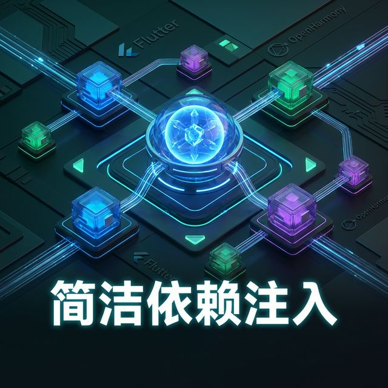
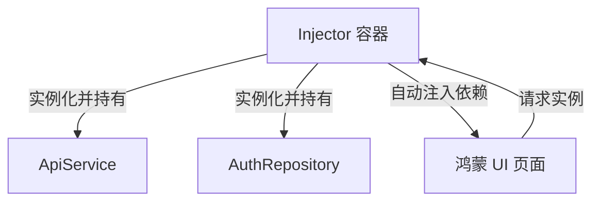

欢迎加入开源鸿蒙跨平台社区：[https://openharmonycrossplatform.csdn.net](https://openharmonycrossplatform.csdn.net)。

# Flutter for OpenHarmony：Flutter 三方库 flutter_simple_dependency_injection 解耦你的应用架构（依赖注入神器）




## 前言

随着鸿蒙（OpenHarmony）工程复杂度的提升，原本简单的代码结构会逐渐变得臃肿：Service 调用 Repository，Repository 调用 ApiClient，所有的构造函数都堆满了各种实例。这种“硬编码”的依赖关系会让单元测试和未来的功能扩展变得极其困难。

`flutter_simple_dependency_injection` 提供了一种轻量级且强大的 **DI (Dependency Injection, 依赖注入)** 方案。通过将依赖的创建和生命周期管理交给一个中立的“注入器”，我们可以让鸿蒙组件之间实现真正的解耦。

## 一、原理解析 / 概念介绍

### 1.1 基础概念

依赖注入的核心思想是：**“不要自己去找桶，而是让别人把水送过来”**。



### 1.2 进阶概念

- **Singleton (单例)**：整个应用生命周期内只有一个实例，非常适合鸿蒙的数据库连接或全局配置。
- **Factory (工厂)**：每次获取时都创建一个新对象，适合每个页面独立的逻辑控制器（Controller）。
- **Inject (手动注入)**：在无法通过构造函数注入的地方（如：第三方组件内部），手动从容器取值。

## 二、核心 API / 组件详解

### 2.1 容器配置

在鸿蒙应用启动时（如 `main.dart` 之前），统一规划依赖地图。

```dart
import 'package:flutter_simple_dependency_injection/injector.dart';

void setupHarmonyInjections() {
  final injector = Injector.getInjector();

  // ✅ 推荐做法：注册全局单例
  injector.map<HarmonyApiService>((i) => HarmonyApiService(), isSingleton: true);
  
  // ✅ 注册需要自动装配的 Repository
  injector.map<AuthRepository>((i) {
    // 💡 技巧：i.get<T>() 会自动寻找已注册的依赖
    return AuthRepository(i.get<HarmonyApiService>());
  });
}
```

### 2.2 实例获取

```dart
final authRepo = Injector.getInjector().get<AuthRepository>();
```

## 三、场景示例

### 3.1 场景一：模拟单元测试中的 Mock 注入

当我们想在预览模式或真机测试环境下替换真实的支付接口，而不用改动任何 UI 代码时。

```dart
import 'package:flutter_simple_dependency_injection/injector.dart';

// 接口定义
abstract class PayService {
  void pay();
}

// ✅ 策略：根据是否在测试环境注入不同实现
void setupPayDI(bool isTest) {
  final injector = Injector.getInjector();
  if (isTest) {
    injector.map<PayService>((i) => MockPayService()); // 注入模拟器用的支付
  } else {
    injector.map<PayService>((i) => RealHarmonyPayService()); // 注入真机支付
  }
}
```


## 四、OpenHarmony 平台适配挑战

### 4.1 容器的跨 UI 容器共享

在鸿蒙的分屏（Multi-Window）或多个 Ability 渲染同一个 Flutter 视图时，确保 `Injector` 的单例对象能被正确管理。

✅ **适配策略建议**：
1. **统一初始化**：在鸿蒙 HAP 的入口 Ability 中早期触发 `setupInjections`。
2. **避免循环依赖**：如果 A 依赖 B，B 也依赖 A，DI 容器会报错导致鸿蒙应用崩溃。请通过定义接口（抽象类）来打破环路。

```dart
// 💡 最佳实践：使用接口来降低适配耦合
injector.map<LoggerInterface>((i) => HarmonyProductionLogger());
```

## 五、综合实战示例代码

这是一个完整的鸿蒙用户中心解耦示例：

```dart
import 'package:flutter/material.dart';
import 'package:flutter_simple_dependency_injection/injector.dart';

// 1. 服务定义
class HarmonyUserService {
  String getWelcomeMsg() => "欢迎回到鸿蒙生态系统！";
}

// 2. 注入配置
void configDI() {
  Injector.getInjector().map<HarmonyUserService>((i) => HarmonyUserService());
}

// 3. UI 使用
class HarmonyUserPage extends StatelessWidget {
  HarmonyUserPage({super.key}) {
    // 💡 重点：这里不需要 new UserService，而是从容器拿
    _service = Injector.getInjector().get<HarmonyUserService>();
  }

  late final HarmonyUserService _service;

  @override
  Widget build(BuildContext context) {
    return Scaffold(
      appBar: AppBar(title: const Text('DI 解耦架构实战')),
      body: Center(
        child: Column(
          children: [
            const Icon(Icons.verified_user, size: 80, color: Colors.blue),
            Text(_service.getWelcomeMsg(), style: const TextStyle(fontSize: 18)),
          ],
        ),
      ),
    );
  }
}
```


## 六、总结

`flutter_simple_dependency_injection` 是构建高质量鸿蒙应用不可或缺的基石。通过将对象的生命周期与业务逻辑剥离，你的代码将变得异常“易于测试”且“易于更换”。

✅ **核心建议**：
1. 始终使用 `final injector = Injector.getInjector()` 获取全局默认容器。
2. 每一个 Service 对应的 UI 交互，都尝试通过 DI 传入，而不是在 UI 内部 new。

📦 更多的底层指导代码可进入：[AtomGit 示例专栏](https://atomgit.com)

---

欢迎加入开源鸿蒙跨平台社区：[开源鸿蒙跨平台开发者社区](https://openharmonycrossplatform.csdn.net)
