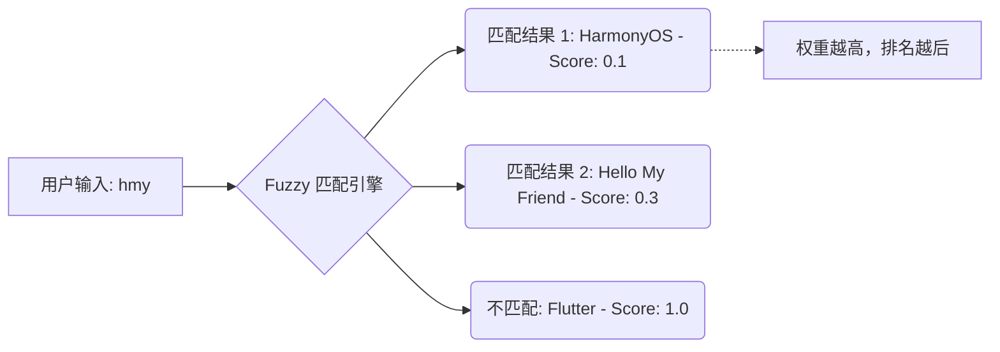

欢迎加入开源鸿蒙跨平台社区：[https://openharmonycrossplatform.csdn.net](https://openharmonycrossplatform.csdn.net)。

# Flutter for OpenHarmony：Flutter 三方库 fuzzy 毫秒级实现模糊搜索（搜索算法引擎）


## 前言

在鸿蒙（OpenHarmony）应用中，搜索框是几乎所有列表页面的核心组件。普通的字符串 `contains` 匹配往往太死板，无法处理错别字、拼音首字母简写或词序颠倒的情况。

`fuzzy` 提供了基于 Fuse.js 方案的轻量级模糊搜索实现。它不需要复杂的外部索引服务器，非常适合在鸿蒙设备端侧直接运行。无论是联系人查找、设置项搜索还是商品导购，`fuzzy` 都能为你的用户提供极其智能的搜索体验。

## 一、原理解析 / 概念介绍

### 1.1 基础概念

`fuzzy` 采用了一种启发式的相似度计算算法，它会对每一个候选项计算一个“加权距离”。



### 1.2 进阶概念

- **阈值 (Threshold)**：控制模糊搜索的“容错度”。取值 0.0 要求精准匹配，1.0 则会匹配任何内容。
- **权重 (Weights)**：如果我们搜索联系人，可以将“姓名”属性的权重设为 0.7，而“备注”设为 0.3。

## 二、核心 API / 组件详解

### 2.1 初始化索引

在鸿蒙应用中，我们应当在数据加载完成后初始化 `Fuzzy` 实例。

```dart
import 'package:fuzzy/fuzzy.dart';

void initHarmonySearch() {
  final list = ['鸿蒙系统', 'HarmonyOS', '分布式开发', '原子化服务'];
  
  final fuse = Fuzzy(
    list,
    options: FuzzyOptions(
      findAllMatches: true,
      threshold: 0.5, // ✅ 推荐值：兼顾准确率与容错
    ),
  );
}
```

### 2.2 执行搜索

```dart
final results = fuse.search('hm');
results.forEach((r) {
  print('找到匹配项: ${r.item}, 匹配分值: ${r.score}');
});
```

## 三、场景示例

### 3.1 场景一：鸿蒙联系人管理系统

在处理含有多个字段的对象列表时，我们可以指定字段搜索。

```dart
import 'package:fuzzy/fuzzy.dart';

class Contact {
  final String name;
  final String phone;
  Contact(this.name, this.phone);
}

void searchContactExample() {
  final contacts = [
    Contact('张三', '1388888'),
    Contact('张小凡', '1399999'),
  ];

  final fuse = Fuzzy<Contact>(
    contacts,
    options: FuzzyOptions(
      keys: [
        WeightedKey<Contact>(
          name: 'name', 
          getter: (c) => c.name, 
          weight: 1.0
        ),
      ],
    ),
  );

  final result = fuse.search('张凡'); // 🎨 技巧：即使漏了字也能搜到
}
```


## 四、OpenHarmony 平台适配挑战

### 4.1 内存与性能优化

在鸿蒙低能耗设备（如：智能穿戴设备）上，大型列表的频繁搜索可能导致 UI 卡顿。

✅ **适配策略**：
1. **异步搜索**：使用 Dart 的 `Isolate` 或 `Future` 搬离主线程。
2. **防抖处理**：用户输入停止 300ms 后再触发搜索。

```dart
// 💡 鸿蒙防抖搜索写法建议
Timer? _debounce;
void onSearchChanged(String query) {
  if (_debounce?.isActive ?? false) _debounce!.cancel();
  _debounce = Timer(const Duration(milliseconds: 300), () {
     // 执行执行 fuzzy.search(query)
  });
}
```

## 五、实战示例代码

这是一个完整的鸿蒙搜索页实现：

```dart
import 'package:flutter/material.dart';
import 'package:fuzzy/fuzzy.dart';

void main() => runApp(const HarmonySearchApp());

class HarmonySearchApp extends StatelessWidget {
  const HarmonySearchApp({super.key});

  @override
  Widget build(BuildContext context) {
    return MaterialApp(home: const SearchPage());
  }
}

class SearchPage extends StatefulWidget {
  const SearchPage({super.key});

  @override
  _SearchPageState createState() => _SearchPageState();
}

class _SearchPageState extends State<SearchPage> {
  final List<String> _data = ["ArkTS", "ArkUI", "HarmonyOS NEXT", "DevEco Studio", "Ohos", "Flutter"];
  List<String> _results = [];
  late Fuzzy<String> _fuse;

  @override
  void initState() {
    super.initState();
    _fuse = Fuzzy(_data, options: FuzzyOptions(threshold: 0.4));
    _results = _data; // 初始展示全部
  }

  void _onSearch(String text) {
    setState(() {
      if (text.isEmpty) {
        _results = _data;
      } else {
        _results = _fuse.search(text).map((r) => r.item).toList();
      }
    });
  }

  @override
  Widget build(BuildContext context) {
    return Scaffold(
      appBar: AppBar(title: const Text('鸿蒙模糊搜索实战')),
      body: Column(
        children: [
          Padding(
            padding: const EdgeInsets.all(16.0),
            child: TextField(
              onChanged: _onSearch,
              decoration: const InputDecoration(
                labelText: '输入搜索关键词（如：hmny）',
                prefixIcon: Icon(Icons.search),
                border: OutlineInputBorder(),
              ),
            ),
          ),
          Expanded(
            child: ListView.builder(
              itemCount: _results.length,
              itemBuilder: (context, index) => ListTile(
                title: Text(_results[index]),
                leading: const Icon(Icons.label_outline, color: Colors.blue),
              ),
            ),
          ),
        ],
      ),
    );
  }
}
```


## 六、总结

`fuzzy` 让复杂的搜索逻辑在鸿蒙跨平台应用中变得唾手可得。通过设置合适的 **Threshold** 和 **Weights**，你可以轻松平衡搜索的灵活性与准确度。

✅ **核心建议**：
1. 数据量超过 1000 条时，务必考虑异步处理以防鸿蒙系统 ANR。
2. 结合鸿蒙特有的 `Search` 系统组件样式，提升原生感。

📦 更多的底层指导代码可进入：[AtomGit 示例专栏](https://atomgit.com)

---

欢迎加入开源鸿蒙跨平台社区：[开源鸿蒙跨平台开发者社区](https://openharmonycrossplatform.csdn.net)
