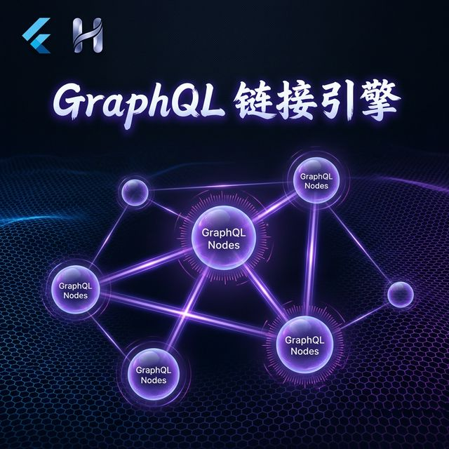
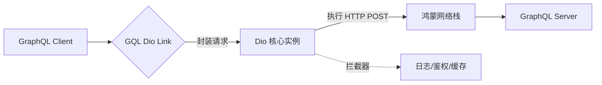

欢迎加入开源鸿蒙跨平台社区：[https://openharmonycrossplatform.csdn.net](https://openharmonycrossplatform.csdn.net)。

# Flutter for OpenHarmony：gql_dio_link — Dio 与 GraphQL 的无缝桥梁



## 前言

在鸿蒙（OpenHarmony）开发中，Dio 是公认的网络利器。当后端采用 GraphQL 协议时，`gql_dio_link` 充当了完美的转换层，允许开发者在保留 Dio 强大拦截器与配置能力的同时，优雅地发起 GraphQL 请求，提升网络联调效率。

## 一、核心价值

### 1.1 基础概念

在 GraphQL 体系中，`Link` 负责执行网络请求。`gql_dio_link` 将其底层替换为 `Dio`。



### 1.2 进阶概念

- **Link Chaining (链式调用)**：你可以将 `gql_dio_link` 与 `AuthLink` 或 `ErrorLink` 拼装，形成一个极其稳固的生产级网络链条。
- **Response Mapping**：自动将 Dio 返回的 `Response` 映射为 `gql` 规范的 `Response` 结构，包含 `data` 和 `errors`。

## 二、核心 API / 组件详解

### 2.1 依赖引入

```yaml
dependencies:
  dio: ^5.0.0
  gql_dio_link: ^1.0.0
  ferry: any # 或者 graphql_flutter
```

### 2.2 核心初始化流程

```dart
import 'package:dio/dio.dart';
import 'package:gql_dio_link/gql_dio_link.dart';
import 'package:graphql/client.dart';

void setupHarmonyGqlLink() {
  // 1. 先创建一个极其强大的 Dio 实例
  final dio = Dio(BaseOptions(baseUrl: 'https://api.harmony.io/graphql'));
  
  // 💡 技巧：利用 Dio 的拦截器处理鸿蒙 Token 刷新
  dio.interceptors.add(LogInterceptor());

  // 2. 将其转化为 GraphQL 可用的 Link
  final link = DioLink('https://api.harmony.io/graphql', client: dio);

  // 3. 构建 Client
  final client = GraphQLClient(link: link, cache: GraphQLCache());
}
```

## 三、场景示例

### 3.1 场景一：鸿蒙级应用的“统一鉴权”体系

通过 Dio 的全局配置，让所有的 GraphQL 请求都带上鸿蒙设备的特征签名。

```dart
final dio = Dio();
dio.options.headers['X-Harmony-Device'] = 'MatePad_Pro';

final link = DioLink('/graphql', client: dio); // 所有的请求都自动继承了 Header
```


## 四、OpenHarmony 平台适配挑战

### 4.1 Cookie 与持久化会话

在某些鸿蒙 Web 应用迁移场景下，GraphQL 请求需要依赖 Dio 的 Cookie 管理器。

✅ **适配策略建议**：
1. **CookieJar 注入**：为底层 Dio 实例配置好 `dio_cookie_manager`，`gql_dio_link` 发起请求时会自动附带鸿蒙系统的持久化 Cookie。
2. **连接池复用**：由于 Dio 默认支持 HTTP/2 和连接池复用，在高频的 GraphQL 转场和查询（Subscriptions）中，性能极其优异。

## 五、综合实战示例代码

这是一个完整的鸿蒙 GraphQL 数据获取页面：

```dart
import 'package:flutter/material.dart';
import 'package:graphql/client.dart';
import 'package:gql_dio_link/gql_dio_link.dart';
import 'package:dio/dio.dart';

class HarmonyGqlPage extends StatefulWidget {
  const HarmonyGqlPage({super.key});

  @override
  _HarmonyGqlPageState createState() => _HarmonyGqlPageState();
}

class _HarmonyGqlPageState extends State<HarmonyGqlPage> {
  late GraphQLClient _client;
  String _userName = "正在查询...";

  @override
  void initState() {
    super.initState();
    // 💡 重点：初始化桥接层
    final link = DioLink('https://countries.trevorblades.com/', client: Dio());
    _client = GraphQLClient(link: link, cache: GraphQLCache());
    _fetch();
  }

  Future<void> _fetch() async {
    final result = await _client.query(QueryOptions(
      document: gql(r'''
        query GetCountry($code: ID!) {
          country(code: $code) { name emoji }
        }
      '''),
      variables: {'code': 'CN'},
    ));
    setState(() => _userName = result.data?['country']['name'] ?? '错误');
  }

  @override
  Widget build(BuildContext context) {
    return Scaffold(
      appBar: AppBar(title: const Text('GQL Dio Link 鸿蒙互通实战')),
      body: Center(
        child: Text('鸿蒙节点查询结果: $_userName', style: const TextStyle(fontSize: 20)),
      ),
    );
  }
}
```


## 六、总结

`gql_dio_link` 是一款极其完美的“粘合剂”。它让鸿蒙开发者在拥抱 GraphQL 现代协议的同时，能继续享受 `Dio` 极其成熟的生态环境。

✅ **核心建议**：
1. 涉及文件上传且使用 GraphQL 时的 `UploadLink` 需求，配合 Dio 的 `FormData` 处理效果极其理想。
2. 定义一个全局的 Dio 实例，统一管理所有 REST 和 GQL 的超时、重试逻辑。

📦 更多的底层指导代码可进入：[AtomGit 示例专栏](https://atomgit.com)

---

欢迎加入开源鸿蒙跨平台社区：[开源鸿蒙跨平台开发者社区](https://openharmonycrossplatform.csdn.net)
