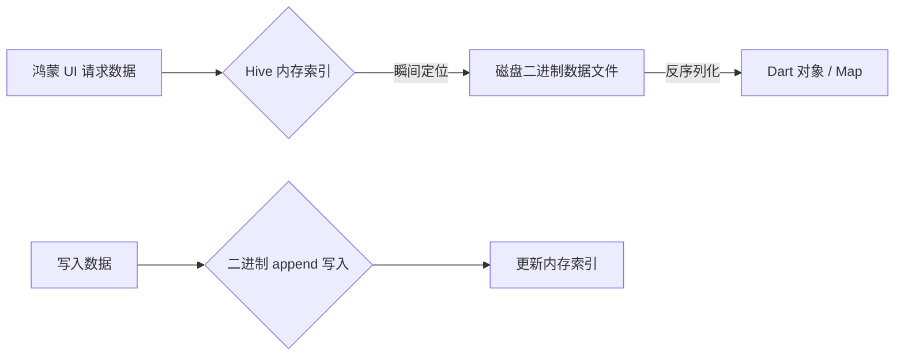

欢迎加入开源鸿蒙跨平台社区：[https://openharmonycrossplatform.csdn.net](https://openharmonycrossplatform.csdn.net)。

# Flutter for OpenHarmony：Flutter 三方库 hive_flutter — 超高性能本地 NoSQL 存储（轻量数据库引擎）

## 前言

在鸿蒙（OpenHarmony）大前端开发中，如何极其高效地存储用户的偏好设置、离线缓存或是复杂的业务对象？传统的 SQLite 虽然强大但太过繁重，而 SharedPreferences/MMKV 虽然快但不支持复杂对象的层级存储。

`Hive` 是一款纯 Dart 编写、具备极致性能的键值对（Key-Value）数据库。它不依赖于任何 Native C++ 库，这意味着它能极其完美地在鸿蒙沙箱内运行。根据官方测评，它的读写性能远超 SQLite。在鸿蒙应用追求“毫秒级数据回显”的今天，`Hive` 是你的不二之选。

## 一、原理展示 / 概念介绍

### 1.1 基础概念

Hive 将数据存储在被称为“Box（盒子）”的容器中。它在内存中保留了一份索引，极大地提升了查询速度。



### 1.2 进阶概念

- **Type Adapters (类型适配器)**：Hive 本身只能存储基础类型。如果你想直接存入一个鸿蒙业务对象（如 `User` 类），需要通过代码生成生成一套 Adapter。
- **Strong Encryption**：内置支持对 Box 进行 AES 加密，在鸿蒙侧安全性要求较高的场景中非常关键。

## 二、核心 API / 组件详解

### 2.1 依赖引入与初始化

在鸿蒙工程中，启动时必须进行初始化定位：

```dart
import 'package:hive_flutter/hive_flutter.dart';

void initHarmonyHive() async {
  // ✅ 推荐做法：一键初始化，自动识别鸿蒙沙箱路径
  await Hive.initFlutter(); 
  
  // 打开一个名为 'settings' 的盒子
  var box = await Hive.openBox('settings');
}
```

### 2.2 极简读写操作

```dart
var box = Hive.box('settings');

// 写入
box.put('harmony_mode', 'NEXT');

// 读取 (支持默认值)
String mode = box.get('harmony_mode', defaultValue: 'Legacy');
```

## 三、场景示例

### 3.1 场景一：鸿蒙级应用的“离线草稿箱”存储

当用户在撰写博客或讯息时，实时将每一步内容存入 Hive，即便应用异常闪退或系统强制回收进程，内容也不会丢失。

```dart
void saveDraft(String content) {
  final draftBox = Hive.box('drafts');
  // 💡 技巧：利用 Hive 的低延迟特性，在高频输入时自动保存
  draftBox.put('current_edit', content);
}
```


## 四、OpenHarmony 平台适配挑战

### 4.1 异步初始化时序

在鸿蒙应用启动流程中，如果主界面渲染快于 `Hive.initFlutter()`，可能导致盒字尚未打开就调用的 Crash。

✅ **适配策略建议**：
1. **启动屏预加载**：配合 `flutter_native_splash`，在 `remove` 之前先 `await` 所有的 `openBox` 动作。
2. **多进程并发锁**：由于 Hive 默认不支持跨隔离（Isolate）的多进程同时写入，在鸿蒙处理高并发后台任务时，务必将所有的 Hive 操作通过单个“数据管理者”单例进行路由。

## 五、综合实战示例代码

这是一个包含了自定义对象（TypeAdapter）映射的鸿蒙健康统计 Demo：

```dart
import 'package:flutter/material.dart';
import 'package:hive_flutter/hive_flutter.dart';

// 1. 定义数据模型并标注生成适配器
@HiveType(typeId: 0)
class HarmonyUser {
  @HiveField(0) String name;
  @HiveField(1) int level;
  HarmonyUser(this.name, this.level);
}

class HarmonyDatabaseLab extends StatelessWidget {
  const HarmonyDatabaseLab({super.key});

  @override
  Widget build(BuildContext context) {
    return Scaffold(
      appBar: AppBar(title: const Text('Hive 鸿蒙极速存储')),
      body: ValueListenableBuilder(
        // 💡 重点：Hive 支持监听 Box 的变化自动刷新 UI
        valueListenable: Hive.box('userData').listenable(),
        builder: (context, Box box, _) {
          return Center(
            child: Text('当前本地缓存值: ${box.get('score', defaultValue: 0)}'),
          );
        },
      ),
      floatingActionButton: FloatingActionButton(
        onPressed: () => Hive.box('userData').put('score', 100),
        child: const Icon(Icons.save),
      ),
    );
  }
}
```


## 六、总结

`Hive` 终结了鸿蒙本地存储“快但功能弱”或“强但太慢”的尴尬。它让 Dart 开发者的本地持久化逻辑变得极其丝滑。

✅ **核心建议**：
1. 涉及复杂业务对象的存储，必须使用代码生成 `TypeAdapter`。
2. 每一个“盒子”不宜过大（建议控制在几十 MB 以内），对于超大规模数据集，应拆分为多个 Box。

📦 更多的底层指导代码可进入：[AtomGit 示例专栏](https://atomgit.com)

---

欢迎加入开源鸿蒙跨平台社区：[开源鸿蒙跨平台开发者社区](https://openharmonycrossplatform.csdn.net)
