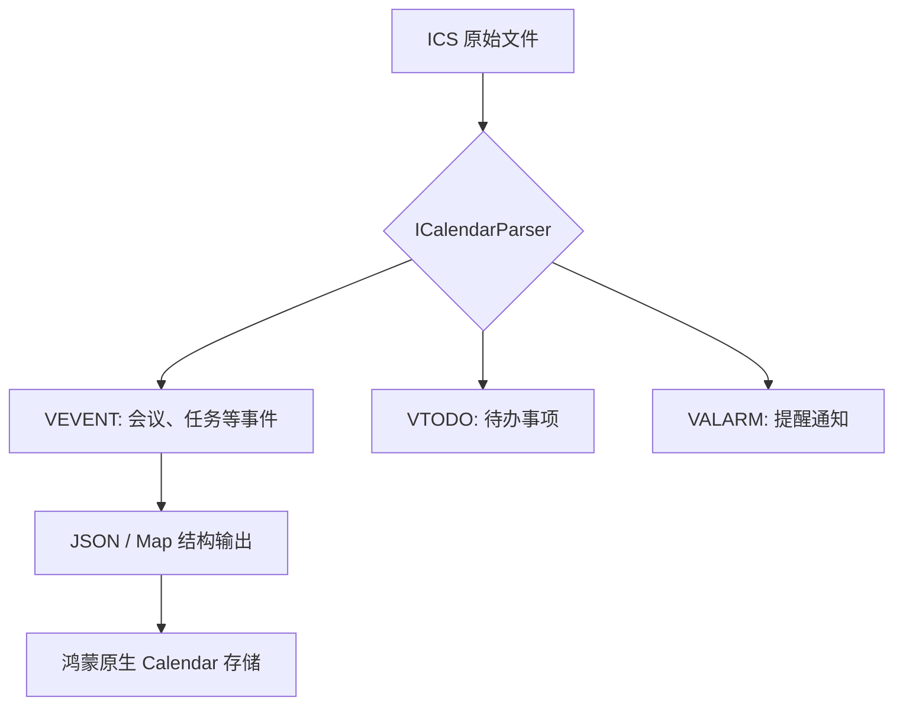

欢迎加入开源鸿蒙跨平台社区：[https://openharmonycrossplatform.csdn.net](https://openharmonycrossplatform.csdn.net)。

# Flutter for OpenHarmony：Flutter 三方库 icalendar_parser 精准解析与操作 iCal 日程（日历数据引擎）

## 前言

在鸿蒙（OpenHarmony）办公类或效率类应用的开发中，处理标准的日历数据（RFC 5545, iCalendar）是一个绕不开的需求。无论是导入外部的会议链接、学校的课表文件，还是同步云端的日程安排，iCalendar (.ics) 都是绝对的行业标准。

`icalendar_parser` 是一个纯 Dart 实现的高性能解析器。它能将复杂的文本块极其快速地转换为结构化的 Dart 对象。在鸿蒙系统上，利用它你可以轻松实现与各种第三方日历生态的无缝互通。

## 一、原理解析 / 概念介绍

### 1.1 基础概念

iCalendar 格式本质上是一种基于键值对的结构化文本。



### 1.2 进阶概念

- **Component (组件)**：如 `VEVENT`, `VTIMEZONE`。每个组件包含一系列属性（Property）。
- **Data Conversion**：解析器会自动处理复杂的日期时区字符串（如 `20260221T100000Z`）并尝试将其对齐。

## 二、核心 API / 组件详解

### 2.1 解析本地字符串

在鸿蒙存储中读取到 `.ics` 文件内容后：

```dart
import 'package:icalendar_parser/icalendar_parser.dart';

void parseHarmonyIcs(String rawIcs) {
  // 1. 执行解析
  final ICalendar iCalendar = ICalendar.fromString(rawIcs);
  
  // 2. 遍历极其重要的 VEVENT 数据
  for (var data in iCalendar.data) {
    if (data['type'] == 'VEVENT') {
      print('📅 发现日程: ${data['summary']}');
      print('⏰ 开始时间: ${data['dtstart']}');
    }
  }
}
```

### 2.2 导出回明文

```dart
Map<String, dynamic> myEvent = {
  'summary': '鸿蒙开发者大会',
  'dtstart': '20260809T090000Z'
};
// 💡 技巧：利用解析器生成的结构可以方便地回推字符串
```

## 三、场景示例

### 3.1 场景一：鸿蒙校园助手的课表一键导入

将教务系统导出的 `.ics` 课表文件自动解析并入库。

```dart
import 'package:icalendar_parser/icalendar_parser.dart';

Future<void> importSchedule(String icsFileContent) async {
  final ic = ICalendar.fromString(icsFileContent);
  
  // 🎨 实战技巧：过滤出所有的课程（VEVENT）
  final lectures = ic.data.where((e) => e['type'] == 'VEVENT').toList();
  
  print('✅ 鸿蒙助手已识别出 ${lectures.length} 节课程！');
}
```


## 四、OpenHarmony 平台适配挑战

### 4.1 编码与转义符处理

`.ics` 格式允许文本折行。在鸿蒙读取文件流时，务必确保 `UTF-8` 编码的一致性。

✅ **适配策略建议**：
1. **多行合并**：`icalendar_parser` 内部自动处理了 RFC 5545 的折行逻辑，但手动截断文件可能导致解析失败。务必传入完整的文件字符串。
2. **时区适配**：解析出的时间通常是 UTC 格式。存入鸿蒙 `CalendarData` 前，需通过 `DateTime.toLocal()` 转换为鸿蒙系统当前设置的时区。

```dart
// 💡 适配提示：处理转义字符后的文本
String summary = (data['summary'] as String).replaceAll(r'\,', ',');
```

## 五、综合实战示例代码

这是一个鸿蒙 ICS 文件探测器 Demo：

```dart
import 'package:flutter/material.dart';
import 'package:icalendar_parser/icalendar_parser.dart';

class HarmonyIcsViewer extends StatefulWidget {
  const HarmonyIcsViewer({super.key});

  @override
  _HarmonyIcsViewerState createState() => _HarmonyIcsViewerState();
}

class _HarmonyIcsViewerState extends State<HarmonyIcsViewer> {
  final String _mockIcs = '''
BEGIN:VCALENDAR
VERSION:2.0
BEGIN:VEVENT
SUMMARY:鸿蒙 NEXT 发布会
DTSTART:20260221T100000Z
LOCATION:东莞松山湖
END:VEVENT
END:VCALENDAR
''';

  List<dynamic> _events = [];

  void _parse() {
    final ic = ICalendar.fromString(_mockIcs);
    setState(() {
      _events = ic.data;
    });
  }

  @override
  Widget build(BuildContext context) {
    return Scaffold(
      appBar: AppBar(title: const Text('iCalendar 鸿蒙解析实战')),
      body: Column(
        children: [
          ElevatedButton(onPressed: _parse, child: const Text('执行解析命令')),
          Expanded(
            child: ListView.builder(
              itemCount: _events.length,
              itemBuilder: (context, index) {
                final ev = _events[index];
                return ListTile(
                  leading: const Icon(Icons.event_note, color: Colors.blue),
                  title: Text(ev['summary'] ?? '未知项'),
                  subtitle: Text('地点: ${ev['location'] ?? '未设置'}'),
                );
              },
            ),
          )
        ],
      ),
    );
  }
}
```


## 六、总结

`icalendar_parser` 是一款专为处理 RFC 标准而生的硬核工具。它让鸿蒙开发者能够极其轻松地跨出系统自带日历的局限，与全球主流的日历交换协议站在一起。

✅ **核心建议**：
1. 始终使用 `ICalendar.fromString()` 获取结构。
2. 在鸿蒙端处理教务、OA 系统对接时，它是唯一的标准方案。

📦 更多的底层指导代码可进入：[AtomGit 示例专栏](https://atomgit.com)

---

欢迎加入开源鸿蒙跨平台社区：[开源鸿蒙跨平台开发者社区](https://openharmonycrossplatform.csdn.net)
