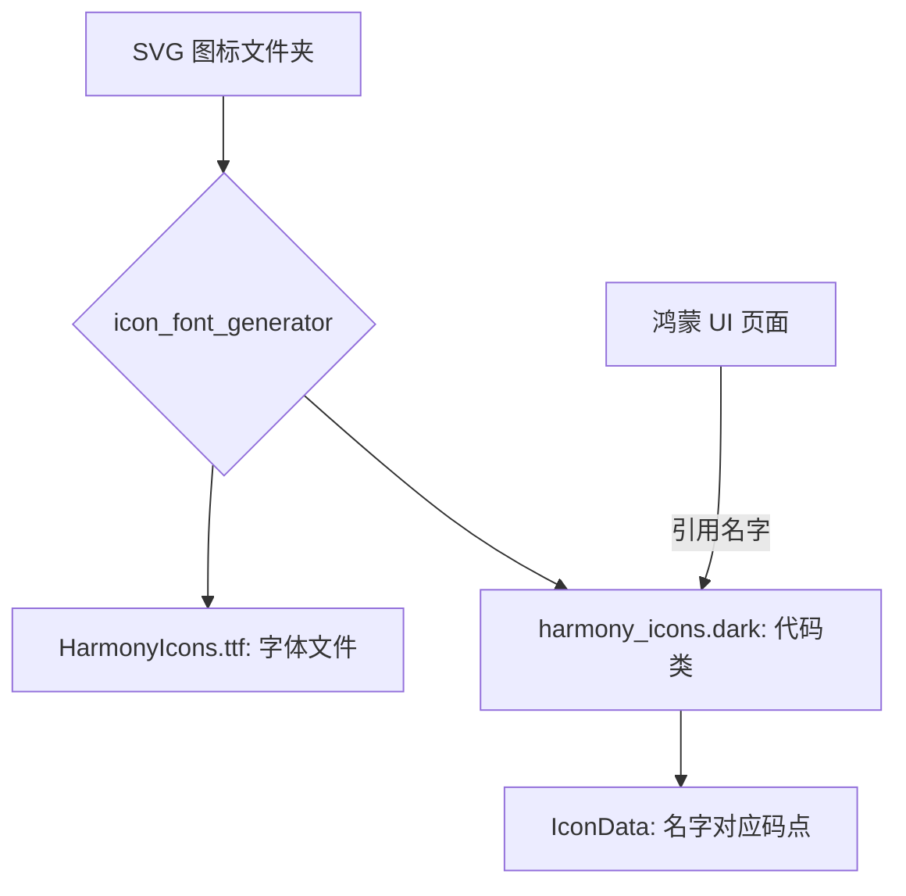

欢迎加入开源鸿蒙跨平台社区：[https://openharmonycrossplatform.csdn.net](https://openharmonycrossplatform.csdn.net)。

# Flutter for OpenHarmony：icon_font_generator — 自动化图标字体工作流


## 前言

在鸿蒙（OpenHarmony）应用中，使用 IconFont 是优化性能与包体积的最佳实践。`icon_font_generator` 命令行工具能将 SVG 图标一键转换为 .ttf 字体文件并生成 Dart 引用类，大幅提升了图标资产管理的自动化程度。

## 一、核心价值

### 1.1 基础概念

图标字体的本质是将矢量图映射到字体的特定“码点”（Glyph）上。



### 1.2 进阶概念

- **自动化命名**：根据 SVG 文件名（如 `home_active.svg`）自动生成 Dart 变量名（`static const homeActive = ...`）。
- **零配置成本**：无需开启庞大的第三方设计网站，在鸿蒙工程本地即可完成闭环。

## 二、核心 API / 组件详解

### 2.1 安装与运行

这是一个纯粹的 CLI 工具，通常在开发环境的命令行中使用：

```bash
# 安装
dart pub global activate icon_font_generator

# 在鸿蒙工程根目录执行一键转换
icon_font_generator --from assets/svgs --to assets/fonts/MyIcons.ttf --class-name MyIcons
```

### 2.2 在鸿蒙工程中注册字体

修改 `pubspec.yaml`：

```yaml
flutter:
  fonts:
    - family: MyIcons
      fonts:
        - asset: assets/fonts/MyIcons.ttf
```

## 三、场景示例

### 3.1 场景一：鸿蒙级项目的“统一度量衡”

当设计师新增了 10 个业务图标时，开发者只需将 SVG 丢入文件夹，跑一次命令，即可在代码中直接调用，完全不需要管 Unicode。

```dart
// 💡 技巧：生成的代码通常如下，极其直观
import 'package:your_app/gen/my_icons.dart';

Widget buildIcon() {
  return const Icon(MyIcons.scanner_filled, color: Colors.blue);
}
```


## 四、OpenHarmony 平台适配挑战

### 4.1 字体文件的实时加载与缓存

在鸿蒙特定的元服务（元服务卡片）中，字体文件的大小直接影响加载延迟。

✅ **适配策略建议**：
1. **子集化生成**：`icon_font_generator` 只包含你目录下的图标，确保了 `.ttf` 文件的极致精简。
2. **预览校验**：由于 SVG 转换为字体 Glyphs 时可能会出现路径闭合问题。建议在运行完命令后，通过鸿蒙预览器快速查看一次图标是否有“实心”或“缺失”现象。

```bash
# 💡 技巧：使用 --out-flutter 指定生成代码的位置，方便鸿蒙工程管理
icon_font_generator --out-flutter lib/src/icons/harmony_icons.dart
```

## 五、综合实战示例代码

这是一个演示如何利用生成的图标字体构建鸿蒙侧边栏导航的示例：

```dart
import 'package:flutter/material.dart';
// 假设已通过工具生成了 HarmonyIcons 类
// import 'package:app/icons/harmony_icons.dart';

class HarmonyDrawerMenu extends StatelessWidget {
  const HarmonyDrawerMenu({super.key});

  @override
  Widget build(BuildContext context) {
    return Drawer(
      child: ListView(
        children: [
          const DrawerHeader(child: Text('鸿蒙业务中心')),
          _buildItem('数据看板', Icons.dashboard), // 💡 以后可替换为 HarmonyIcons.dashboard
          _buildItem('分布式流转', Icons.sync_alt),
          _buildItem('设置', Icons.settings),
        ],
      ),
    );
  }

  Widget _buildItem(String title, IconData icon) {
    return ListTile(
      leading: Icon(icon, color: Colors.blue),
      title: Text(title),
      onTap: () {},
    );
  }
}
```


## 六、总结

`icon_font_generator` 彻底终结了“人工维护图标 Unicode 码”的历史。它让 UI 资源到代码的转化过程变得极其工业化、自动化。

✅ **核心建议**：
1. 建立专门的 `assets/icons_src` 文件夹存放原始 SVG。
2. 将生成命令加入到鸿蒙项目的 `pre-commit` 钩子或简单的 `shell` 脚本中，实现真正的一键同步。

📦 更多的底层指导代码可进入：[AtomGit 示例专栏](https://atomgit.com)

---

欢迎加入开源鸿蒙跨平台社区：[开源鸿蒙跨平台开发者社区](https://openharmonycrossplatform.csdn.net)
