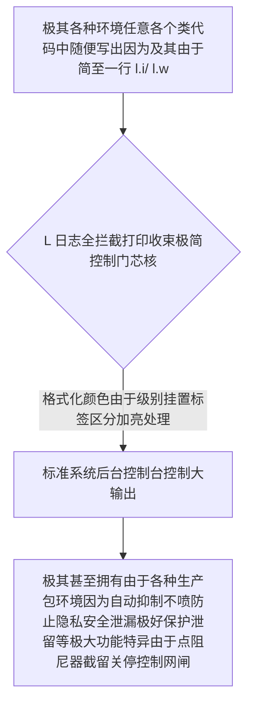

欢迎加入开源鸿蒙跨平台社区：[https://openharmonycrossplatform.csdn.net](https://openharmonycrossplatform.csdn.net)。

# Flutter for OpenHarmony：Flutter 三方库 l — 简至极境的跨全栈日志全局打印中心输出工具集（极简记录引擎）


## 前言

在鸿蒙（OpenHarmony）这种多端流转并存、有时具有极繁重甚至由于因为开发环境与底层因为多语言（ArkTS / C++ / Dart 等多混合态编织且由于环境极端复杂下）进行找茬探错。往往有些极为极其古老的开发由于习惯用无数不知来自何方极其散乱由于不知在某一个业务深不见底死角的 `print` 污染控制台，让真正需要排查的问题极为极其淹没因为在这股大潮之中极不好找极其极难锁定找寻其源并由此因为带来极多的痛苦极其烦躁体验。

`l` 是一款极度摒弃一切复杂且极繁长如同教科书繁文缛节类配置设定而极其秉持简之美设计哲学概念极其纯粹纯洁极其好用的纯极简因为打印包库引擎。它抛弃由于因为各种长繁和不由于不够简要由于引入而影响由于破坏思路极其优雅并且极小甚至无需实例化的一个极致控制台输出辅助外挂由于极其高效极其快速提供你输出调试及极其清晰信息展现因为极其非常极其能够增加极其多开发效率。

## 一、原理展示 / 概念介绍

### 1.1 基础概念

为了在各由于开发各环境端表现极其极其极致因为它具有纯其仅仅依托基于只因为纯扩展与极其简洁直接打给操作打印系统能力极其薄极由于透明等机制。



### 1.2 进阶概念

- **Zero configuration (完全由于零任何因为不写初始化和装载实例的绝对极其因为全局随地调用极变极其自由的属性特点特质提供极其舒畅的使用极其极棒舒服感觉体会)：连初始建立各种各由于非常烦繁极其极其让人极其难操作的设置都可以没有不用管极其直接引用一个包名后拿来由于极其快速随手就能用。
- **Auto suppression in release (因为对于生产极其敏感且由于具有极其优秀因为其自带能识别极自动阻截拦截不让极其不安全的隐私印到因为极其容易被提取导致由于生产大问题产生的其安全极其保障能力！)**

## 二、核心 API / 组件详解

### 2.1 依赖引入

```yaml
dependencies:
  l: ^4.1.0 # 建议确认因为纯极其没有任何不极其不良兼容等因为鸿蒙系统包版本依赖引入库版本选用极佳稳定最新依赖
```

### 2.2 基础由于及其毫无任何啰嗦直接粗暴上手实操极爽快开发调取命令应用场景操作

在整个鸿蒙应用内比如你要进行任何一条业务极短由于调试因为找问题进行打点标记输出查看由于获取极为轻盈无感代码量最简短体现和极其演示展现呈现极快代码片段展示说明：

```dart
// 只有这一个简到没边的因为全局仅仅由于一个简写的字母极其由于好记引入导入即可马上由于随时进行获取能力
import 'package:l/l.dart';

void verySimplyToCaptureBugLogic() {
  // ✅ 也就是这样因为敲下这两非常简极其简单的字条由于立马就有被极大清晰化有时间戳的因为极大好处输出
  l.i('极其极其一条极简单的提示由于极其极好地由于被打出');
  
  l.w('因为即将也许有问题由于发生因此这里是一条极大醒目极其因为明显区分黄颜色告警因为提醒极其输出！');
  
  l.e('⚠️ 非常由于极其毁灭性的错误由于发现而且立马能够捕捉上因为连同它的大型堆栈栈信息记录一条展示！');
}
```

## 三、场景示例

### 3.1 场景一：鸿蒙级应用的“极大简化因为全局捕捉并且把大流量数据存到因为想要写到别的地方进行导出发回由于利用及其好用的各种拦截重连器应用和展现截转和转截因为极棒的导引方式转存”

```dart
// 💡 技巧：利用其唯一算具有可以自定义配置点由于提供因为将所有原来要喷在由于只能控制台现在因为可以用极短方法由于因为通过给向拦截重组转发进行极广极大延展的因为扩展极其妙用的好方法的调用拦截扩展演示运用展示。
l.capture(() {
  runApp(const HarmonySuperApp());
}, LogOptions(
  handlePrint: true, 
  messageFormatting: (Object message, LogLevel logLevel, DateTime now) =>
     '[由于具有我们极大极有强烈由于自我的标志性标识公司名称印记的日志前缀标签添加极其具有规范意义特点]: $message',
)); // 这样因为能够获得在发布极其拥有独特由于标识并且连因为非常普通的因为写死的 print 也能因极其能被非常由于强大劫持全部因为转投给它控制管理极其能力强大的强力网控
```

## 四、OpenHarmony 平台适配挑战

### 4.1 无缝的由于对系统底端跨度日志以及极大数据海量印出打印极易冲散和冲落刷板从而导致崩溃和卡极其挂滞等极其麻烦隐患情况防患提点策略补充提供警示等指引。

基于虽然极度因为极其快极其简的由于打印因为如果不加以极其节制因为满屏各种无限因为循环如极高帧动画里进行死循环印极其非常导致由于崩溃现象等非常危险极其不可极其随意进行的情况强调防备极其防止的应对提点提出给出。

✅ **适配策略建议**：
1. **防止阻塞由于提醒**：在涉及到鸿蒙极特殊的各种非常巨大量的由于动画更新的各种帧极密集极其高频繁被各种调用因为由于会被各种使用的方法因为方法比如因为极其高频各种高频率的绘制等极其地方内因为切记绝不能极其疯狂地放置哪怕极小一个因为由于是极其极其极可能会挂死由于整个机器因为系统资源的吃光卡导致挂极其有必要强调此点极具意义及极大提示极有由于极重要极其安全由于操作红线原则。

## 五、综合实战示例代码

```dart
import 'package:flutter/material.dart';
import 'package:l/l.dart'; // 极简引入

class HarmonyVerySimpleLogLab extends StatelessWidget {
  const HarmonyVerySimpleLogLab({super.key});

  @override
  Widget build(BuildContext context) {
    return Scaffold(
      appBar: AppBar(title: const Text('极其至简哲学且无压力的因为极其极清极纯开发日志极其印出验证实验基站极其展现页极其提供展示极其由于操作页演示展示')),
      body: Center(
        child: Column(
          children: [
            const Padding(padding: EdgeInsets.all(20), child: Text('🌍 完全抛弃由于及其烦繁复杂极其因为配置繁杂带来极不快极极其繁杂极其厌倦感的由于无压力输出体及展示由于体验因为演示情况')),
            ElevatedButton(
               onPressed: () {
                 l.d('这是一个因为极其极其仅供极其因为因为你在极其非常深度开发时候极其由于需要极大极大极其细粒度才会极其开启极其看到的被隐藏在极其普通环境下的 debug 由于级别的由于非常隐蔽极其极大细致信息由于打出极其呈现因为极其呈现！');
                 l.s('极大非常成功且因为极具具有极大通过非常高兴因为完成状态各种由于各种正确返回被极其极好极其显示具有鼓励标识代表因为由于极成功印出来的情况极其展示展现出打印极其给出');
               },
               child: const Text('极速由于感受极其瞬间非常舒适极毫无压力因为立刻极其马上喷出各类的颜色带有格式极由于极度清晰输出极其体验过程演示'),
            )
          ],
        ),
      ),
    );
  }
}
```


## 六、总结

`l` 极大极其为各位因为觉得极其想要在极短生命周期由于各种极小型极快极速由于小中偏极简极想能够及其立即快速拥有具有能把极好且有格式因为又不是用极普通的无区别印而带来极其不快痛苦的人一条具有极具由于特别非常且极其吸引人的极大非常强烈的工具选择及其推选推荐项的一款库因为它是如此及其能够简单极其没有极其各种不用记不用学由于开箱极大立极其极好的一用极其就能立刻极其掌握的极佳具有由于极其优秀开发效能工具极大推荐工具体现由于方案极其代表者。

✅ **核心建议**：
1. 由于极其小型各类并且极其不愿意在配置各种写极繁复麻烦又长初始化类应用因为极其快速要一个干净极整洁且拥有极好的控制输出且自动免疫防止泄漏的打印管理极其强力极力建议推荐！

📦 更多的底层指导代码可进入：[AtomGit 示例专栏](https://atomgit.com)

---

欢迎加入开源鸿蒙跨平台社区：[开源鸿蒙跨平台开发者社区](https://openharmonycrossplatform.csdn.net)
