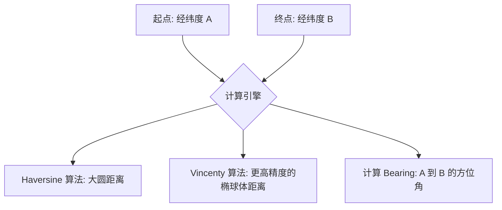

欢迎加入开源鸿蒙跨平台社区：[https://openharmonycrossplatform.csdn.net](https://openharmonycrossplatform.csdn.net)。

# Flutter for OpenHarmony：latlong2 — 地图坐标计算与转换实战


## 前言

在鸿蒙（OpenHarmony）地图开发中，地理坐标（经纬度）的严谨处理是业务基石。`latlong2` 是一个纯 Dart 实现的地理座标计算库，支持大圆距离、方位角及中点计算，为基于位置的服务（LBS）提供了高性能的数学支撑。

## 一、核心价值

### 1.1 基础概念

在地球这种近似椭球体的表面上计算距离，不能简单套用平面几何。`latlong2` 默认提供了多种严谨的数学模型。



### 1.2 进阶概念

- **Haversine 公式**：计算简单、速度快，绝大多数鸿蒙应用场景（如配送距离显示）已完全足够。
- **Vincenty 公式**：考虑了地球极点稍扁的特性，偏差可控制在厘米级。

## 二、核心 API / 组件详解

### 2.1 创建坐标点

在鸿蒙适配中，我们通常将经纬度对象化：

```dart
import 'package:latlong2/latlong.dart';

// 华为总部大楼坐标示例
final LatLng hqLocation = LatLng(22.62, 114.06);
```

### 2.2 计算两点间距离

```dart
const Distance distance = Distance();

// 获取单位为米(m)的距离
final double meter = distance.as(
  LengthUnit.Meter, 
  LatLng(22.5, 114.0), 
  LatLng(22.6, 114.1)
);
print("🚀 在鸿蒙设备上计算出的距离为: ${meter}m");
```

## 三、场景示例

### 3.1 场景一：鸿蒙外卖应用中的“附近门店”排序

我们需要根据用户当前经纬度对所有门店进行距离测算。

```dart
import 'package:latlong2/latlong.dart';

void sortStoresByDistance(LatLng userPos, List<Store> stores) {
  const distance = Distance();
  
  // 💡 技巧：利用 Haversine 快速排序
  stores.sort((a, b) {
    final distA = distance.as(LengthUnit.Meter, userPos, a.pos);
    final distB = distance.as(LengthUnit.Meter, userPos, b.pos);
    return distA.compareTo(distB);
  });
}
```


## 四、OpenHarmony 平台适配挑战

### 4.1 坐标系转换挑战（GCJ-02 v.s. WGS-84）

鸿蒙设备内置的 GPS 通常返回的是 WGS-84 原始坐标，而国内大多数地图图层（如高德）使用的是 GCJ-02（火星坐标系）。

✅ **适配策略**：
1. **纯算法转换**：`latlong2` 本身处理坐标，不处理坐标系转换。建议配合专门的转换插件或自行实现偏移算法后再传给 `latlong2` 进行数学计算。
2. **离线计算**：由于其不依赖鸿蒙原生 API，非常适合在鸿蒙离线网关上作为地理围栏的判定算法。

## 五、综合实战示例代码

这是一个完整的鸿蒙地图助手页，演示了路径方位角与中点计算：

```dart
import 'package:flutter/material.dart';
import 'package:latlong2/latlong.dart';

class HarmonyMapHelper extends StatelessWidget {
  const HarmonyMapHelper({super.key});

  @override
  Widget build(BuildContext context) {
    // 两个鸿蒙园区坐标点
    final p1 = LatLng(22.62, 114.06); 
    final p2 = LatLng(22.65, 114.10);

    const distance = Distance();
    
    // 1. 计算距离
    final distKm = distance.as(LengthUnit.Kilometer, p1, p2);
    
    // 2. 计算从 P1 指向 P2 的角度
    final bearing = distance.bearing(p1, p2); 

    // 3. 计算中间坐标（中继站位置）
    final midPoint = LatLng(
       (p1.latitude + p2.latitude) / 2, 
       (p1.longitude + p2.longitude) / 2
    );

    return Scaffold(
      appBar: AppBar(title: const Text('latlong2 鸿蒙地理计算')),
      body: Center(
        child: Column(
          children: [
            const Icon(Icons.location_on, size: 60, color: Colors.red),
            Text('两点直线距离: ${distKm.toStringAsFixed(2)} 公里'),
            Text('初始前进方位角: $bearing °'),
            const Divider(),
            Text('建议中继点坐标:'),
            Text('Lat: ${midPoint.latitude}, Lng: ${midPoint.longitude}'),
          ],
        ),
      ),
    );
  }
}
```


## 六、总结

`latlong2` 把繁杂的地理球体计算封装成了极其易用的 Dart API。在鸿蒙场景下，它是处理 LBS（基于位置的服务）应用业务层数据处理的绝佳选择。

✅ **核心建议**：
1. 涉及简单的距离展示使用 **Haversine** (默认方式)。
2. 需要跨越半个地球的极高精度测量请切换到 **Vincenty** 算法。

📦 更多的底层指导代码可进入：[AtomGit 示例专栏](https://atomgit.com)

---

欢迎加入开源鸿蒙跨平台社区：[开源鸿蒙跨平台开发者社区](https://openharmonycrossplatform.csdn.net)
