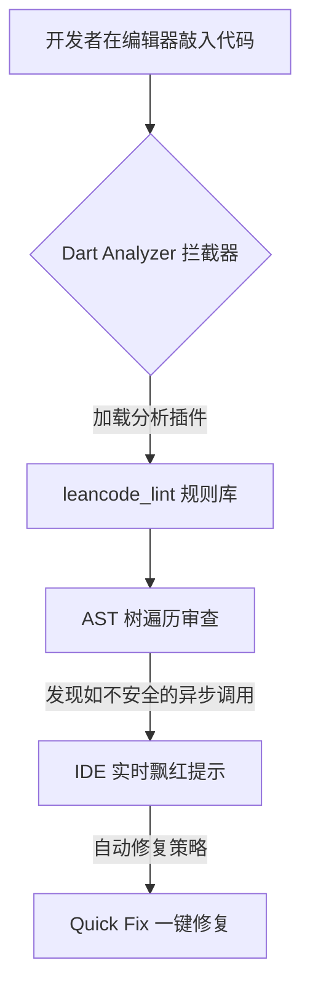

欢迎加入开源鸿蒙跨平台社区：[https://openharmonycrossplatform.csdn.net](https://openharmonycrossplatform.csdn.net)。

# Flutter for OpenHarmony：Flutter 三方库 leancode_lint — 企业级 Dart 代码规范强制审查（规范治理引擎）

## 前言

在鸿蒙（OpenHarmony）大型应用开发过程中，团队协作最怕的就是代码风格不一、因为低级书写错误导致应用崩溃或是运行效率低下。如果你觉得 Dart 原生的 `flutter_lints` 过于温和，想要一套能涵盖异步死锁、状态泄露、以及架构反模式等更深层次的代码健康检查方案，那么你一定要试试企业级的 Lint 工具。

`leancode_lint` 是一套由 Leancode 团队沉淀出的极其严格的代码分析规则集。它通过与 Dart Analyzer 深度集成，能在你编写针对鸿蒙平台的 Dart 代码时，将那些潜伏在异步操作、Widget 重建中的隐患掐死在 IDE 阶段。在构建高可靠性的鸿蒙商业级 App 时，它是你的代码纪律委员。

## 一、原理展示 / 概念介绍

### 1.1 基础概念

本库不需要修改任何业务代码，它依托于 Dart 的分析服务器，在保存代码的瞬间给出警告。



### 1.2 进阶概念

- **Custom Architectural Rules**：它不仅仅是检查缩进，更能检查业务层级的错误（例如：禁止在 Widget 的 build 方法中直接实例化高消耗的业务对象）。
- **CI/CD Integration**：不仅能在编辑器中生效，在通过 DevEco Studio 或者自动化流水线编译鸿蒙 HAP 包之前，它能作为强制定制标准终止不规范的编译。

## 二、核心 API / 项目配置

### 2.1 依赖引入与配置

在鸿蒙工程的 `pubspec.yaml` 中，将其加入开发依赖：

```yaml
dev_dependencies:
  leancode_lint: ^12.0.0 # 建议确认适配的 Dart 版本
```

然后在工程根目录下的 `analysis_options.yaml` 中进行包含：

```yaml
include: package:leancode_lint/analysis_options.yaml

analyzer:
  errors:
    # 💡 技巧：可以根据鸿蒙团队的实际情况，将部分规则降级
    leancode_catch_errors: error
    leancode_avoid_unnecessary_setstate: warning
```

## 三、场景示例

### 3.1 场景一：防止在鸿蒙 UI 渲染循环中的资源浪费

当开发者在 `build` 方法中错误地创建了一个生命周期长久的对象时，`leancode_lint` 会立刻报警。

```dart
// ❌ 错误做法：每次页面重建都会重新创建 TextEditingController，导致内存泄漏
@override
Widget build(BuildContext context) {
  final controller = TextEditingController(); // Lint Warning 触发！
  return TextField(controller: controller);
}
```


## 四、OpenHarmony 平台适配挑战

### 4.1 NAPI / MethodChannel 的异步上下文保护

鸿蒙端通过 MethodChannel 通讯时，经常会跨越 `async` 并在 `await` 后使用 `BuildContext`，这是极其危险的操作。

✅ **适配策略建议**：
1. **严格的 BuildContext 校验**：`leancode_lint` 强行要求你在使用 `BuildContext` 之前必须通过 `if (!context.mounted) return;` 来校验。在频繁与鸿蒙底层通信的项目中，这能帮你挽回无数个由于页面跳走导致的 Crash 异常。
2. **渐进式改造**：如果是已有的中大型鸿蒙跨平台项目，建议先将 `leancode_lint` 的许多严苛规则配置为 `info`，在一个个迭代中逐步修复，以免初次全量飘红导致团队成员崩溃。

## 五、综合实战示例代码

这是一个修复前后的鸿蒙端业务代码规范对比演示：

```dart
import 'package:flutter/material.dart';
import 'package:flutter/services.dart';

class HarmonyCodeStandardLab extends StatefulWidget {
  const HarmonyCodeStandardLab({super.key});

  @override
  _HarmonyCodeStandardLabState createState() => _HarmonyCodeStandardLabState();
}

class _HarmonyCodeStandardLabState extends State<HarmonyCodeStandardLab> {
  static const _channel = MethodChannel('harmony_battery');
  String _level = "未知";

  Future<void> _fetchBattery() async {
    // 💡 重点：此为耗时的鸿蒙底层交互
    final int result = await _channel.invokeMethod('getBatteryLevel');
    
    // ✅ Leancode Lint 强制要求的规范：异步间隙检测
    if (!mounted) return;
    
    setState(() {
      _level = '电量：$result%';
    });
  }

  @override
  Widget build(BuildContext context) {
    return Scaffold(
      appBar: AppBar(title: const Text('Lint 规范实验室')),
      body: Center(
        child: Column(
          children: [
            Text(_level),
            ElevatedButton(
              onPressed: _fetchBattery,
              child: const Text('读取鸿蒙电量'),
            ),
          ],
        ),
      ),
    );
  }
}
```


## 六、总结

`leancode_lint` 并不直接提供鸿蒙上的某个具体功能，但它像一位极其严厉的代码架构师，无死角地逼迫开发者写出符合高质量标准的 Dart 代码。在鸿蒙这种高度成熟的商业系统上，它是抵御隐形 Bug 的第一道长城。

✅ **核心建议**：
1. 涉及超过 3 名开发者协作的鸿蒙项目，尽早引入并配置。
2. 在 CI (如 Jenkins/Gitlab) 流程中强制拦截不合规的代码。

📦 更多的底层指导代码可进入：[AtomGit 示例专栏](https://atomgit.com)

---

欢迎加入开源鸿蒙跨平台社区：[开源鸿蒙跨平台开发者社区](https://openharmonycrossplatform.csdn.net)
