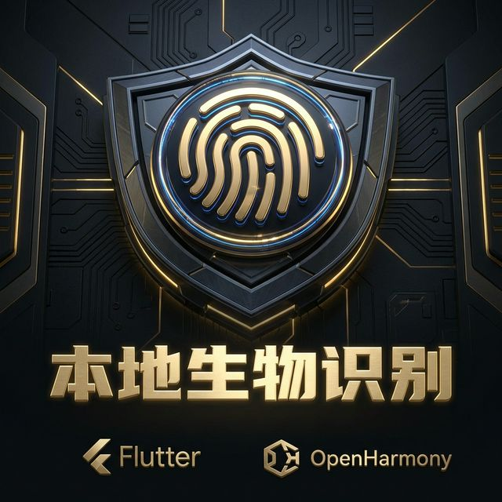
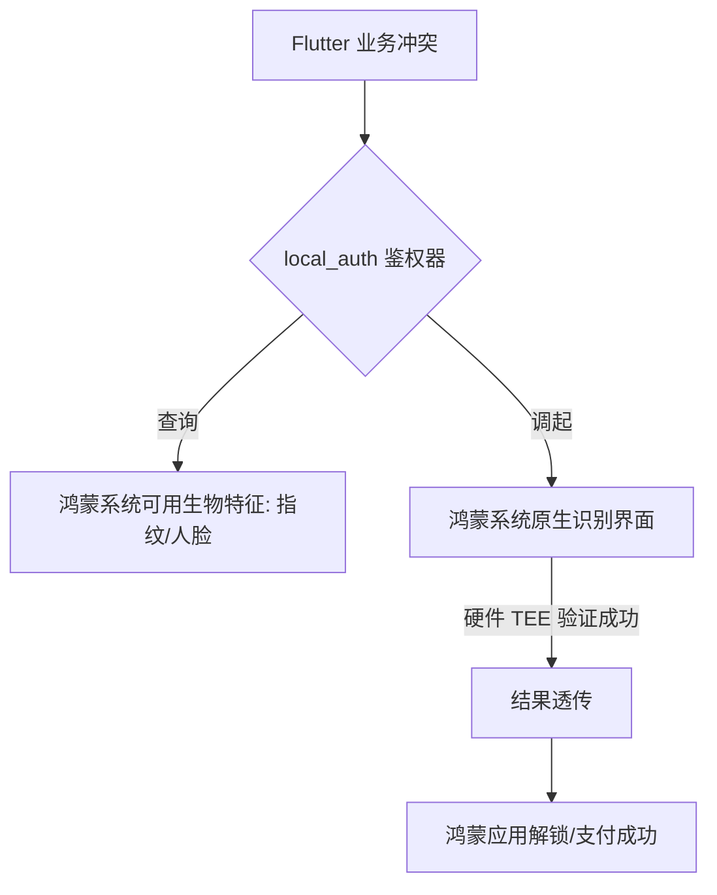

欢迎加入开源鸿蒙跨平台社区：[https://openharmonycrossplatform.csdn.net](https://openharmonycrossplatform.csdn.net)。

# Flutter for OpenHarmony：Flutter 三方库 local_auth — 集成指纹与人脸解锁的安全堡垒（生物核身引擎）




## 前言

在鸿蒙（OpenHarmony）金、金融或者是含有极端私密属性的应用中，确保“操作者本人”是业务安全的底线。你是否想要让用户在点击“支付”或“查看私密便签”时，极其优雅地唤起鸿蒙系统原生的指纹录入或人脸识别界面？

`local_auth` 是官方维护的一套成熟的生物识别抽象。它巧妙地封装了鸿蒙底层的生物核身接口（User Authentication），让开发者能以极其简洁的逻辑，调用世界上最安全的硬件级防护。在构建鸿蒙“数字资产保护”应用时，它是你的安全铁闸。

## 一、原理展示 / 概念介绍

### 1.1 基础概念

`local_auth` 为生物识别定义了统一的查询与验证流程。



### 1.2 进阶概念

- **Can Check Biometrics (探测性)**：在调起界面前，先静默判定当前鸿蒙设备是否具备硬件支持，或者是用户是否已经录入了生物特征。
- **Sticky Auth (粘性鉴权)**：处理应用在识别中由于外部电话打入等中断后的自动恢复逻辑。

## 二、核心 API / 组件详解

### 2.1 依赖引入与权限配置

在鸿蒙项目的 `module.json5` 中，通常需要确申对应的权限（如 `ohos.permission.ACCESS_BIOMETRIC`）：

```yaml
dependencies:
  local_auth: ^2.2.0 # 建议检查鸿蒙适配分支
```

### 2.2 核心核身逻辑

在鸿蒙工程中执行指纹挑战：

```dart
import 'package:local_auth/local_auth.dart';

Future<void> authHarmonyUser() async {
  final LocalAuthentication auth = LocalAuthentication();
  
  // 1. ✅ 推荐做法：先探测硬件可用性
  final bool canAuthenticateWithBiometrics = await auth.canCheckBiometrics;
  
  // 2. 发起挑战
  final bool didAuthenticate = await auth.authenticate(
    localizedReason: '请通过鸿蒙生物验证以继续操作',
    options: const AuthenticationOptions(stickyAuth: true),
  );
  
  if (didAuthenticate) {
    print('🔓 恭喜，鸿蒙核身通过！');
  }
}
```

## 三、场景示例

### 3.1 场景一：鸿蒙级应用的“免密快速登录”

当用户重新打开已登录的应用时，直接通过指纹恢复会话。

```dart
import 'package:local_auth/local_auth.dart';

void onAppResume() async {
  final auth = LocalAuthentication();
  final availableBiometrics = await auth.getAvailableBiometrics();

  if (availableBiometrics.contains(BiometricType.fingerprint)) {
     // 💡 优先推行指纹核身
  }
}
```


## 四、OpenHarmony 平台适配挑战

### 4.1 错误码的精细化处理

鸿蒙系统可能会返回多种异常状态：如“尝试次数过多已锁定”、“用户取消”、“硬件损坏”等。

✅ **适配策略建议**：
1. **捕获 PlatformException**：通过 `PlatformException.code` 精准判定失败原因，给予鸿蒙用户不仅是“失败”，而是“请 1 分钟后再试”的精准建议。
2. **UI 补偿**：如果生物识别连续失败，务必提供 Fallback 方案（如鸿蒙系统的图案密码或 PIN 码）。

## 五、综合实战示例代码

这是一个包含了完整生命周期探测的鸿蒙安全实验室 Demo：

```dart
import 'package:flutter/material.dart';
import 'package:local_auth/local_auth.dart';

class HarmonyAuthLab extends StatefulWidget {
  const HarmonyAuthLab({super.key});

  @override
  _HarmonyAuthLabState createState() => _HarmonyAuthLabState();
}

class _HarmonyAuthLabState extends State<HarmonyAuthLab> {
  String _status = "等待核身挑战...";

  Future<void> _runAuth() async {
    final auth = LocalAuthentication();
    try {
      final success = await auth.authenticate(localizedReason: '验证鸿蒙权限');
      setState(() => _status = success ? "🎉 验证成功" : "❌ 验证未通过");
    } catch (e) {
      setState(() => _status = "⚠️ 系统异常: $e");
    }
  }

  @override
  Widget build(BuildContext context) {
    return Scaffold(
      appBar: AppBar(title: const Text('生物核身技术实战')),
      body: Center(
        child: Column(
          children: [
            const Icon(Icons.security, size: 80, color: Colors.blueAccent),
            Text(_status, style: const TextStyle(fontSize: 22)),
            const Spacer(),
            ElevatedButton(onPressed: _runAuth, child: const Text('发起鸿蒙指纹核身')),
            const SizedBox(height: 50),
          ],
        ),
      ),
    );
  }
}
```


## 六、总结

`local_auth` 确保了鸿蒙跨平台应用能直接站在系统硬件防护的高度。它让繁琐的核身交互变得极其廉价且稳健，是构建高安全级鸿蒙应用的核心拼图。

✅ **核心建议**：
1. 始终使用 `AuthenticationOptions` 并开启 `stickyAuth` 以防中断。
2. 针对鸿蒙设备的不同特性（如只有面部的设备），合理配置 UI 上的引导文字。

📦 更多的底层指导代码可进入：[AtomGit 示例专栏](https://atomgit.com)

---

欢迎加入开源鸿蒙跨平台社区：[开源鸿蒙跨平台开发者社区](https://openharmonycrossplatform.csdn.net)
