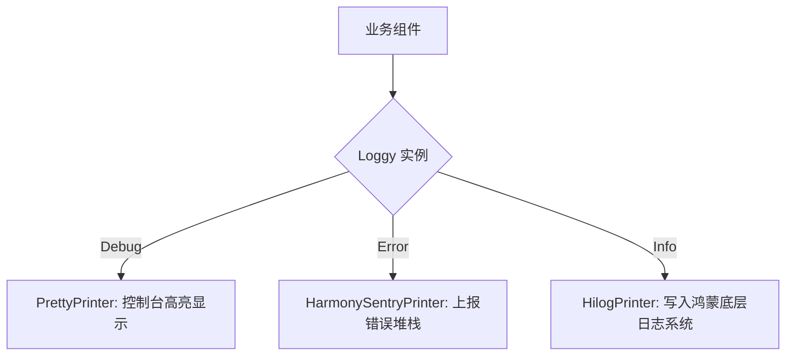

欢迎加入开源鸿蒙跨平台社区：[https://openharmonycrossplatform.csdn.net](https://openharmonycrossplatform.csdn.net)。

# Flutter for OpenHarmony：loggy — 优雅的日志分级管理实践


## 前言

在鸿蒙（OpenHarmony）大型工程中，杂乱的调试信息往往会降低开发效率。`loggy` 是一款轻量且可扩展的分级日志库，允许开发者根据业务逻辑（如网络、数据库等）对日志进行标签化处理，并能根据运行环境自动切换输出策略，是专业调试的得力助手。

## 一、核心价值

### 1.1 基础概念

`loggy` 采用了“装饰器”模式，它不直接操作底层 IO，而是通过一系列 Printer 将日志分发出去。



### 1.2 进阶概念

- **Mixins (混入支持)**：通过 `with UiLoggy` 或 `with NetworkLoggy` 让你的类自带日志能力，无需到处 new 实例。
- **Global Filters (全局过滤)**：在生产环境下，一行代码关闭所有 Debug 级别的日志隐私泄露风险。

## 二、核心 API / 组件详解

### 2.1 全局配置

在鸿蒙应用的主入口进行初始化：

```dart
import 'package:loggy/loggy.dart';

void setupHarmonyLoggy() {
  Loggy.initLoggy(
    logPrinter: const PrettyPrinter(), // ✅ 推荐做法：开发时使用带色彩的精美打印
    logOptions: const LogOptions(
      LogLevel.all, // 设置显示的最低级别
      stackTraceLevel: LogLevel.error, // 只在错误时打印堆栈
    ),
  );
}
```

### 2.2 使用 Mixin 打印日志

```dart
import 'package:loggy/loggy.dart';

class HarmonyDataRepo with Loggy {
  void fetchData() {
    loggy.info('🚀 正在从鸿蒙分布式总线获取数据...');
    try {
      // 业务逻辑...
    } catch (e) {
      loggy.error('❌ 获取失败！', e);
    }
  }
}
```

## 三、场景示例

### 3.1 场景一：针对不同业务模块自定义“领域日志”

我们可以通过定义自定义 Loggy 标签，让网络请求日志和 UI 点击日志在控制台中一目了然。

```dart
import 'package:loggy/loggy.dart';

// 定义网络专属日志
mixin NetworkLoggy implements LoggyType {
  @override
  Loggy<NetworkLoggy> get loggy => Loggy<NetworkLoggy>('🌐 鸿蒙网络层');
}

class ApiClient with NetworkLoggy {
  void callApi() {
    loggy.debug('发送 POST 请求至 /v1/auth');
  }
}
```


## 四、OpenHarmony 平台适配挑战

### 4.1 如何融入鸿蒙原生的 Hilog 体系

鸿蒙原生的 `Hilog` 拥有 domain 和 tag 的分级过滤能力。`loggy` 的默认打印是 `print`，在商业分发版中可能被截断。

✅ **适配策略**：
1. **自定义 Printer**：实现自己的 `LoggyPrinter`，在内部调用鸿蒙原生的 Hilog 通道（通常通过 FFI 或 Platform Channel）。
2. **性能优化**：在大批量日志输出时，开启 `LogOptions` 的局部静默模式，防止鸿蒙主线程因文本格式化而掉帧。

```dart
// 💡 技巧：对接鸿蒙 Hilog 的伪代码
class HarmonyHiLogPrinter extends LoggyPrinter {
  @override
  void onLog(LogRecord record) {
    // 调用鸿蒙底层 Native 代码的 HiLog_Info / HiLog_Error
  }
}
```

## 五、综合实战示例代码

下面是一个完整的鸿蒙环境适配 Demo：

```dart
import 'package:flutter/material.dart';
import 'package:loggy/loggy.dart';

void main() {
  Loggy.initLoggy(logPrinter: const PrettyPrinter());
  runApp(const HarmonyLogApp());
}

class HarmonyLogApp extends StatelessWidget {
  const HarmonyLogApp({super.key});

  @override
  Widget build(BuildContext context) {
    return MaterialApp(home: const LogDemoPage());
  }
}

class LogDemoPage extends StatefulWidget with Loggy {
  const LogDemoPage({super.key});

  @override
  _LogDemoPageState createState() => _LogDemoPageState();
}

class _LogDemoPageState extends State<LogDemoPage> {
  void _triggerLogs() {
    loggy.debug('这也是一条调试信息');
    loggy.info('用户点击了按钮，开始执行任务');
    loggy.warning('鸿蒙设备剩余电量不足 20%');
    loggy.error('系统资源锁定：无法加载当前模型');
  }

  @override
  Widget build(BuildContext context) {
    return Scaffold(
      appBar: AppBar(title: const Text('loggy 专业日志实战')),
      body: Center(
        child: ElevatedButton(
          onPressed: _triggerLogs,
          child: const Text('生成多级日志（观察控制台）'),
        ),
      ),
    );
  }
}
```


## 六、总结

在鸿蒙开发的“马拉松”中，一份清晰的日志就是你的地图。`loggy` 帮助你用最少的代码（Mixins 模式）实现了极其规范化的日志资产管理。

✅ **核心建议**：
1. 不要直接使用 `print`。
2. 为你的“网络”、“数据库”、“业务逻辑”分别定义不同的 `LoggyType`。

📦 更多的底层指导代码可进入：[AtomGit 示例专栏](https://atomgit.com)

---

欢迎加入开源鸿蒙跨平台社区：[开源鸿蒙跨平台开发者社区](https://openharmonycrossplatform.csdn.net)
