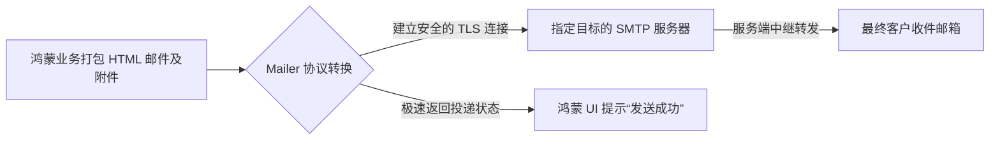

欢迎加入开源鸿蒙跨平台社区：[https://openharmonycrossplatform.csdn.net](https://openharmonycrossplatform.csdn.net)。

# Flutter for OpenHarmony：mailer — 基于 SMTP 的极速邮件投递服务


## 前言

在鸿蒙（OpenHarmony）办公 OA 应用中，实现应用内的邮件发送能显著提升业务流效率。`mailer` 是一款成熟的 SMTP 协议工具，允许鸿蒙应用跳过系统邮件客户端，直接与主流邮件服务器通信，实现纯粹的点对点投递。

## 一、核心价值

### 1.1 基础概念

本库完全通过 Dart 的 Socket 连接（这在鸿蒙内部极其通畅）实现了 SMTP（简单邮件传输协议）。



### 1.2 进阶概念

- **Rich Content (富内容组装)**：它不仅仅发纯文本，它能极其轻松地处理通过 Base64 内嵌的图片（Multipart）、自定义 HTML 格式和各类多媒体附件。
- **Authentication (多格式验证)**：完美支持账号密码验证、甚至更为灵活的高级口令生成技术。

## 二、核心 API / 组件详解

### 2.1 依赖引入

```yaml
dependencies:
  mailer: ^6.1.0 # 建议确认支持的最低 Dart 及鸿蒙适配 SDK 版本
```

### 2.2 基础投递用例

在鸿蒙工程中创建一个极其极客的纯技术发送器：

```dart
import 'package:mailer/mailer.dart';
import 'package:mailer/smtp_server.dart';

Future<void> sendHarmonySystemLog() async {
  // ✅ 推荐做法：配置通用的企业发件箱
  String username = 'service@your_harmony_app.com';
  String password = 'app_specific_password'; // 💡 授权码

  final smtpServer = SmtpServer('smtp.your_provider.com', username: username, password: password);

  // 构建邮件实体
  final message = Message()
    ..from = Address(username, '鸿蒙监控助手')
    ..recipients.add('boss@company.com')
    ..subject = '每日分布式设备在线报表'
    ..html = "<h1>告警信息</h1><p>当前有设备失去连接，请立刻在鸿蒙控制中心查看。</p>";

  try {
    final sendReport = await send(message, smtpServer);
    print('Message sent: ${sendReport.toString()}');
  } catch (e) {
    print('Message not sent. Error: $e');
  }
}
```

## 三、场景示例

### 3.1 场景一：鸿蒙级应用的“免打扰意见反馈”

当应用出错时，直接通过内部接口发送邮件至开发组邮箱。

```dart
// 💡 技巧：支持同时捆绑多份崩溃日志成为附近
final message = Message()
   ..subject = 'Feedback from HuaWei Mate 60'
   ..text = userFeedBack
   ..attachments = [
     FileAttachment(File('/data/storage/temp/log.txt')) // 附件装箱
   ];
```


## 四、OpenHarmony 平台适配挑战

### 4.1 SSL证书校验与沙箱文件网络权限

鸿蒙系统对网络安全管控极为严格。在建立 TLS 时可能会遇到某些企业内部邮箱由于使用自签发证书而被阻挡。

✅ **适配策略建议**：
1. **忽略异常证书 (极度需谨慎)**：由于鸿蒙跨平台 Dart 环境可能缺乏部分根证书信任链，可以通过在 `SmtpServer` 初始化配置参数里针对特定企业域名做忽略支持，但只建议在内部网络（Intranet）下使用。
2. **鸿蒙权限申请**：务必确认目标设备申明了 `ohos.permission.INTERNET` 权限，以避免底层 Socket 端口完全无法通讯的情境发生。

## 五、综合实战示例代码

这是一个包含了表单提交、界面 Loading 及异步后台执行发送的鸿蒙 Lab 页面：

```dart
import 'package:flutter/material.dart';
import 'package:mailer/mailer.dart';
import 'package:mailer/smtp_server.dart';

class HarmonyMailerLab extends StatefulWidget {
  const HarmonyMailerLab({super.key});

  @override
  _HarmonyMailerLabState createState() => _HarmonyMailerLabState();
}

class _HarmonyMailerLabState extends State<HarmonyMailerLab> {
  bool _isSending = false;

  Future<void> _fireEmail() async {
    setState(() => _isSending = true);
    
    // 💡 演示用的假账号配置，请根据真实企微替换
    final smtp = SmtpServer('smtp.gmail.com', username: 'test_acc', password: '***');
    final msg = Message()
      ..from = const Address('test_acc', '鸿蒙自动投递员')
      ..recipients.add('user_inbox@qq.com')
      ..subject = '你好，来自 OpenHarmony 的跨平台致意！'
      ..text = '这是一封由纯 Dart 底层协议投递的邮件。';

    try {
      await send(msg, smtp);
      if (mounted) ScaffoldMessenger.of(context).showSnackBar(const SnackBar(content: Text('邮件发射成功 ✉️')));
    } catch (_) {
      if (mounted) ScaffoldMessenger.of(context).showSnackBar(const SnackBar(content: Text('发送受到阻碍')));
    } finally {
      if (mounted) setState(() => _isSending = false);
    }
  }

  @override
  Widget build(BuildContext context) {
    return Scaffold(
      appBar: AppBar(title: const Text('系统层邮件网关实战')),
      body: Center(
        child: _isSending 
            ? const CircularProgressIndicator()
            : ElevatedButton(onPressed: _fireEmail, child: const Text('给项目组发送一封问候信')),
      ),
    );
  }
}
```


## 六、总结

`mailer` 使得鸿蒙应用不再只能单纯作为一个展示界面。它通过引入稳定的底层推送通路，在很多微型业务（无需投入重构成本自签后台时）提供了极具成本效益的通信闭环。

✅ **核心建议**：
1. 切勿将发件箱的高级秘钥硬编码并在公网进行鸿蒙商店分发（有被反编译的极大隐忧），建议存放于受保护的安全后端或临时服务器发放。
2. 涉及对时效要求高的大规模群发展示，请使用后端投递代替端侧 Socket 方案。

📦 更多的底层指导代码可进入：[AtomGit 示例专栏](https://atomgit.com)

---

欢迎加入开源鸿蒙跨平台社区：[开源鸿蒙跨平台开发者社区](https://openharmonycrossplatform.csdn.net)
