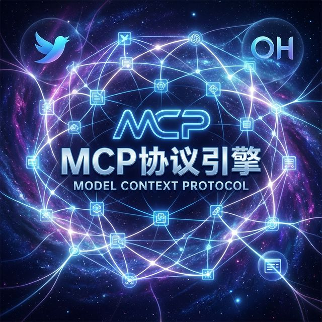
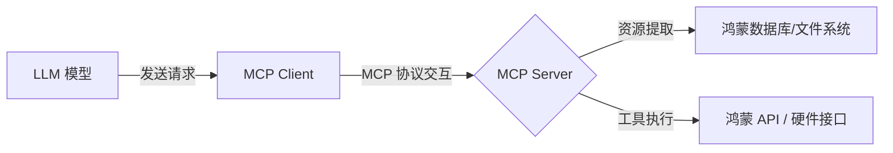

欢迎加入开源鸿蒙跨平台社区：[https://openharmonycrossplatform.csdn.net](https://openharmonycrossplatform.csdn.net)。

# Flutter for OpenHarmony：mcp_dart — 接入模型上下文协议实战



## 前言

随着 AI 大模型时代的到来，鸿蒙（OpenHarmony）应用正逐步向智能代理转型。`mcp_dart` 实现了模型上下文协议（MCP）的客户端封装，使得鸿蒙开发者能为 LLM 提供结构化的本地连接，让应用秒变深度集成的 AI Agent 助手。

## 一、核心价值

### 1.1 基础概念

MCP 协议像是一条高速公路，连接了 LLM 控制台和本地的数据孤岛。



### 1.2 进阶概念

- **Resources (资源)**：指的是鸿蒙应用内特定的 JSON 片段、日志文件或配置信息，供 AI 读取。
- **Tools (工具)**：指 AI 可以“调用”的动作，比如：在鸿蒙系统上创建一个提醒日程。
- **Prompts (提示词模板)**：预设的对话模式，引导 AI 更好地理解鸿蒙业务逻辑。

## 二、核心 API / 组件详解

### 2.1 建立连接

在鸿蒙工程中，这通常涉及一个支持 JSON-RPC 的通信通道。

```dart
import 'package:mcp_dart/mcp_dart.dart';

void initHarmonyMcp(McpTransport transport) async {
  // 1. 创建客户端
  final client = McpClient(
    transport, 
    capabilities: ClientCapabilities(
      sampling: SamplingCapability(), // ✅ 推荐开启：允许 AI 生成样本
    ),
  );

  // 2. 初始化握手
  await client.initialize();
  print('🤖 鸿蒙 MCP 客户端已就绪！');
}
```

### 2.2 资源与工具列表获取

```dart
final resources = await client.listResources();
for (final res in resources.resources) {
  print('发现资源: ${res.name} (URI: ${res.uri})');
}
```

## 三、场景示例

### 3.1 场景一：鸿蒙智能记账助手的本地账目分析

让 AI 获取应用内的数据库内容。

```dart
// 🎨 实战技巧：向 AI 提供应用内消费资源的读取能力
final content = await client.readResource(
  Uri.parse('harmony://app/finance/daily_summary')
);
print('AI 获取到的上下文: ${content.contents.first.text}');
```


## 四、OpenHarmony 平台适配挑战

### 4.1 传输层 (Transport) 的原生适配

`mcp_dart` 默认支持 Stdio 和 WebSocket 传输。但在鸿蒙应用内，可能需要通过 **Platform Channel** 调用鸿蒙原生的数据管道。

✅ **适配策略**：
1. **自定义 Transport**：实现 `McpTransport` 接口，将 `send` 和 `stream` 桥接到鸿蒙的 `CommonEvent` 或 `IPC` 通信机制上。
2. **跨进程安全**：确保 AI 的 MCP 连接请求遵循鸿蒙的隐私权限框架，尤其是访问用户日历或健康数据时。

```dart
// 💡 技巧：自定义鸿蒙总线传输层
class HarmonyBusTransport extends McpTransport {
  // 桥接逻辑实现...
}
```

## 五、综合实战示例代码

这是一个模拟在鸿蒙上列出 AI 可用工具的页面：

```dart
import 'package:flutter/material.dart';
import 'package:mcp_dart/mcp_dart.dart';

class McpDashboard extends StatefulWidget {
  const McpDashboard({super.key});

  @override
  State<McpDashboard> createState() => _McpDashboardState();
}

class _McpDashboardState extends State<McpDashboard> {
  List<McpTool> _tools = [];

  Future<void> _fetchTools() async {
    // 假设通过 WebSocket 连接到一个运行在鸿蒙后台的智能中枢
    final client = McpClient(WebSocketTransport(Uri.parse('ws://localhost:9001')));
    await client.initialize();
    
    final result = await client.listTools();
    setState(() => _tools = result.tools);
  }

  @override
  Widget build(BuildContext context) {
    return Scaffold(
      appBar: AppBar(title: const Text('鸿蒙 MCP 智能代理监控')),
      body: Column(
        children: [
          ElevatedButton(onPressed: _fetchTools, child: const Text('同步本地 AI 工具')),
          Expanded(
            child: ListView.builder(
              itemCount: _tools.length,
              itemBuilder: (context, index) => ListTile(
                leading: const Icon(Icons.bolt, color: Colors.orange),
                title: Text(_tools[index].name),
                subtitle: Text(_tools[index].description ?? '无描述'),
              ),
            ),
          )
        ],
      ),
    );
  }
}
```


## 六、总结

`mcp_dart` 是通往鸿蒙未来“原生智能”的入场券。通过引入 MCP 协议，你的应用将不再仅仅是一个工具，而是一个能被大模型理解和调度的“智能数据节点”。

✅ **核心建议**：
1. 及早规划应用内的 **Resources** URI 体系。
2. 为高频调用的鸿蒙 API 封装 **McpTool**。

📦 更多的底层指导代码可进入：[AtomGit 示例专栏](https://atomgit.com)

---

欢迎加入开源鸿蒙跨平台社区：[开源鸿蒙跨平台开发者社区](https://openharmonycrossplatform.csdn.net)
