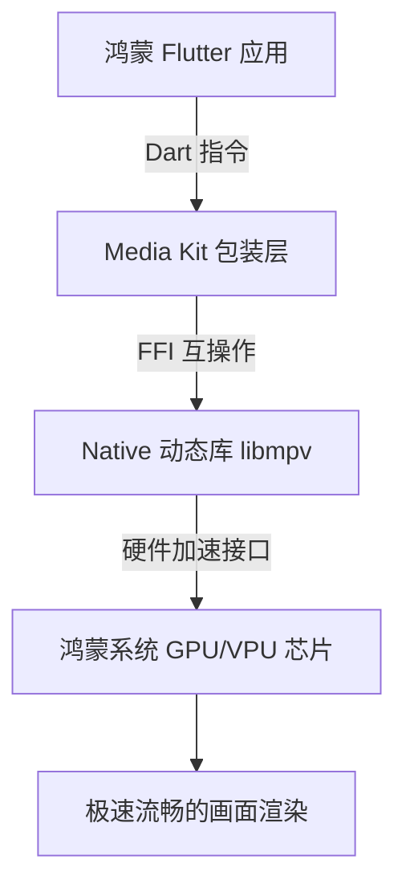

欢迎加入开源鸿蒙跨平台社区：[https://openharmonycrossplatform.csdn.net](https://openharmonycrossplatform.csdn.net)。

# Flutter for OpenHarmony：Flutter 三方库 media_kit 极致视听的全能播放器内核（音视频旗舰引擎）

## 前言

在鸿蒙（OpenHarmony）应用中，音视频播放是最常见也最“吃性能”的功能。如果你的应用需要极其强大的解码能力（比如秒开 4K 蓝光、支持 RTMP/UDP 流、甚至是支持外挂字幕和倍速播放），系统原生的播放器组件往往显得力不从心。

`media_kit` 是一款顶级的跨平台多媒体框架，它基于强大的 **libmpv** 核心搭建，提供了行业领先的硬件加速、极致的格式支持和极其灵活的渲染接口。在鸿蒙设备上接入 `media_kit`，意味着你的应用将拥有一颗专业级“播放器心脏”。

## 一、原理解析 / 概念介绍

### 1.1 基础概念

`media_kit` 采用了“前店后厂”的架构。前端是优雅的 Dart API，后端则是极其强悍的底层动态库。



### 1.2 进阶概念

- **Texture 渲染 (纹理机制)**：视频帧不再存放在传统的像素缓冲区，而是直接作为 GPU 纹理传递，极大降低了 CPU 占用。
- **GAV 策略 (Global Audio/Video)**：支持极致精细的音轨切换、自动字幕搜索渲染等高级功能。

## 二、核心 API / 组件详解

### 2.1 依赖与初始化

在鸿蒙侧，我们需要提前声明对音视频硬件的访问。

```dart
import 'package:media_kit/media_kit.dart';
import 'package:media_kit_video/media_kit_video.dart';

void initHarmonyMedia() {
  // ✅ 推荐做法：在使用前必须调用初始化，确保 native 库加载成功
  MediaKit.ensureInitialized();
}
```

### 2.2 创建播放控制器

```dart
final player = Player();
final controller = VideoController(player);

// 开始播放鸿蒙资源或在线流
player.open(Media('https://harmonyos.com/promo.mp4'));
```

## 三、场景示例

### 3.1 场景一：鸿蒙高清直播间——超低延迟推流

针对 RTMP 这种对延迟极度敏感的直播场景，`media_kit` 的缓冲策略极其精准。

```dart
// 💡 技巧：针对直播场景优化
await player.open(
  Media('rtmp://your-stream-server/live'),
  play: true,
);
// 设置低延迟缓冲
player.setRate(1.0); 
```


## 四、OpenHarmony 平台适配挑战

### 4.1 动态库 (.so) 的跨平台编译

由于 `media_kit` 极其依赖底层的二进制库。

✅ **适配策略建议**：
1. **构建适配**：在鸿蒙 HAP 工程的 `libs/` 目录下，确保提供了针对 `arm64-v8a`（真机）和 `x86_64`（模拟器）优化的对应的库文件。
2. **硬件解码权限**：在鸿蒙 `module.json5` 中确保申请了 `ohos.permission.INTERNET` 和 `ohos.permission.KEEP_RUNNING` 权限。

```json
// 💡 module.json5 配置建议
{
  "requestPermissions": [
    {"name": "ohos.permission.INTERNET"},
    {"name": "ohos.permission.MEDIA_LOCATION"}
  ]
}
```

## 五、综合实战示例代码

这是一个包含了基础播放控制的鸿蒙专业播放器页面：

```dart
import 'package:flutter/material.dart';
import 'package:media_kit/media_kit.dart';
import 'package:media_kit_video/media_kit_video.dart';

class HarmonyProPlayerPage extends StatefulWidget {
  const HarmonyProPlayerPage({super.key});

  @override
  State<HarmonyProPlayerPage> createState() => _HarmonyProPlayerPageState();
}

class _HarmonyProPlayerPageState extends State<HarmonyProPlayerPage> {
  late final player = Player();
  late final controller = VideoController(player);

  @override
  void initState() {
    super.initState();
    // 🎨 开启播放
    player.open(Media('https://user-images.githubusercontent.com/28951144/229373695-22f88f13-d18f-4288-9bf1-c3e088d8af6d.mp4'));
  }

  @override
  void dispose() {
    player.dispose(); // ✅ 极其重要：务必释放底层 native 内存
    super.dispose();
  }

  @override
  Widget build(BuildContext context) {
    return Scaffold(
      appBar: AppBar(title: const Text('media_kit 鸿蒙极致视听')),
      body: Center(
        child: Column(
          children: [
            // 播放器内容区
            SizedBox(
              width: MediaQuery.of(context).size.width,
              height: MediaQuery.of(context).size.width * 9 / 16,
              child: Video(controller: controller),
            ),
            // 控制台
            Row(
              mainAxisAlignment: MainAxisAlignment.center,
              children: [
                IconButton(onPressed: () => player.playOrPause(), icon: const Icon(Icons.play_arrow)),
                IconButton(onPressed: () => player.seek(Duration.zero), icon: const Icon(Icons.replay)),
                DropdownButton<double>(
                  value: 1.0,
                  items: [0.5, 1.0, 2.0].map((e) => DropdownMenuItem(value: e, child: Text('${e}x'))).toList(),
                  onChanged: (v) => player.setRate(v!),
                )
              ],
            )
          ],
        ),
      ),
    );
  }
}
```


## 六、总结

`media_kit` 是目前鸿蒙生态中**天花板级**的播放器解决方案。它不仅仅是一个 UI 组件，更是一套极其完整的音视频链路。如果你在构建视频会议、高清点播或是车载娱乐系统。

✅ **核心建议**：
1. 大屏设备务必开启硬件加速。
2. 处理多个列表播放时，控制好底层 `Player` 实例的数量，防止显存溢出。

📦 更多的底层指导代码可进入：[AtomGit 示例专栏](https://atomgit.com)

---

欢迎加入开源鸿蒙跨平台社区：[开源鸿蒙跨平台开发者社区](https://openharmonycrossplatform.csdn.net)
