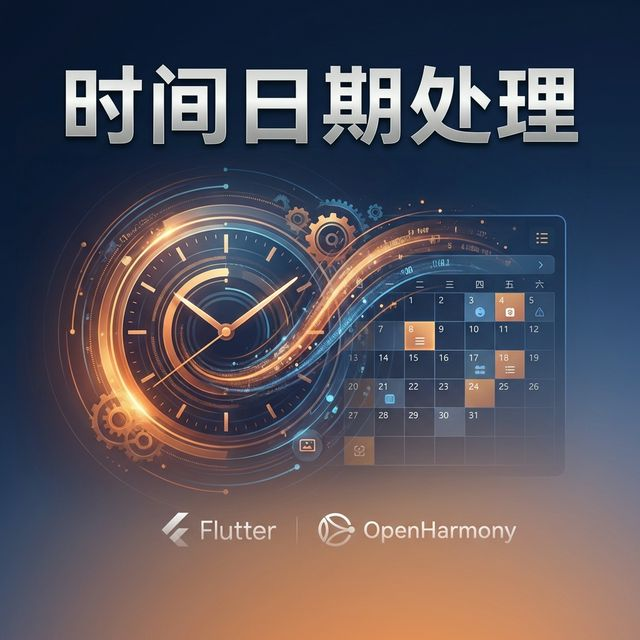

欢迎加入开源鸿蒙跨平台社区：[https://openharmonycrossplatform.csdn.net](https://openharmonycrossplatform.csdn.net)。

# Flutter for OpenHarmony：moment_dart — 复刻级极简时间处理经验



## 前言

怀念 Moment.js 丝滑的链式调用？`moment_dart` 将其体验完美复刻至鸿蒙（OpenHarmony）开发。它不仅增强了原生 DateTime 的操作能力，更针对人性化的相对时间展示和复杂的日期偏移提供了极简的一行式方案。

## 一、核心价值

### 1.1 基础概念

`moment_dart` 将 `DateTime` 包装成了威力加强版的 `Moment` 对象。

```mermaid
graph LR
    A[DateTime 对象] --> B{Moment 包装器}
    B --> C[add(days: 3): 增加 3 天]
    B --> D[startOf(Unit.month): 获取月初时间]
    B --> E[fromNow(): 计算距离现在的相对时间]
    B --> F[calendar(): 智能显示“今天/明天/上周”]
```

### 1.2 进阶概念

- **Localization (i18n)**：内置了对中文在内的全球多种语言的支持。
- **Immutable (不可变性)**：操作返回的是新实例，不会副作用修改原始日期，这在鸿蒙复杂的状态管理中非常关键。

## 二、核心 API / 组件详解

### 2.1 依赖引入

在后端的 `pubspec.yaml` 中添加以下代码：

```yaml
dependencies:
  moment_dart: ^2.0.0
```

### 2.2 核心链式调用示例

```dart
import 'package:moment_dart/moment_dart.dart';

void harmonyMomentDemo() {
  // ✅ 推荐做法：通过扩展方法直接使用
  final m = DateTime.now().toMoment();
  
  // 🎨 获取下周一早上的九点整
  final nextMondayMorning = m.nextMonday().startOf(Unit.day).add(hours: 9);
  print('🕒 鸿蒙应用下周一打卡时间: $nextMondayMorning');
}
```

## 三、场景示例

### 3.1 场景一：鸿蒙社交动态的“人性化”时间轴

显示“2小时前”、“昨天 14:30”或“3天前”。

```dart
import 'package:moment_dart/moment_dart.dart';

void showFriendlyTime() {
  final postTime = DateTime.parse("2026-02-20 10:00:00").toMoment();
  
  // 💡 技巧：自动根据当前语言环境显示
  print("💬 动态发布于: ${postTime.fromNow()}"); 
  // 结果示例: "2 天前"
}
```


## 四、OpenHarmony 平台适配挑战

### 4.1 国际化语言包注入

虽然库自带中文，但为了确保在鸿蒙系统层面完美契合用户当前的语言设置。

✅ **适配策略建议**：
1. **全局 Locale 绑定**：在应用根部获取鸿蒙系统的 `Locale`。
2. **初始化 Moment**：使用 `Moment.setGlobalLocalization(MomentLocalizations.zhCn())` 全局一键汉化。

```dart
// 💡 适配提示：启动时一键汉化
void initHarmonyMomentLocale() {
  Moment.setGlobalLocalization(MomentLocalizations.zhCn());
}
```

## 五、综合实战示例代码

这是一个针对鸿蒙日历任务管理的逻辑展示页：

```dart
import 'package:flutter/material.dart';
import 'package:moment_dart/moment_dart.dart';

class HarmonyTaskTimerPage extends StatelessWidget {
  const HarmonyTaskTimerPage({super.key});

  @override
  Widget build(BuildContext context) {
    final now = DateTime.now().toMoment();
    
    // 💡 演示几种极其实用的 Moment 转换
    final tasks = [
      {'title': '鸿蒙项目启动', 'time': now.subtract(days: 10)},
      {'title': '代码评审', 'time': now},
      {'title': '版本发布', 'time': now.add(months: 1).endOf(Unit.month)}
    ];

    return Scaffold(
      appBar: AppBar(title: const Text('moment_dart 鸿蒙时间魔法')),
      body: ListView.separated(
        itemCount: tasks.length,
        separatorBuilder: (_, __) => const Divider(),
        itemBuilder: (context, index) {
          final t = tasks[index]['time'] as Moment;
          return ListTile(
            title: Text(tasks[index]['title'] as String),
            subtitle: Text('格式化时间: ${t.format('YYYY年MM月DD日')}'),
            trailing: Text(t.fromNow(), style: const TextStyle(color: Colors.blue)),
          );
        },
      ),
    );
  }
}
```


## 六、总结

`moment_dart` 以及其简练的 API，终结了我们在鸿蒙开发中拼接字符串或手动计算 `Duration` 的痛苦。如果你需要一个处理时间逻辑的“专家”。

✅ **核心建议**：
1. 在涉及日历计算、相对时间展示的场景，无脑首选。
2. 相比原生的 `intl`，它的 API 让逻辑代码的可读性提升了 300%。

📦 更多的底层指导代码可进入：[AtomGit 示例专栏](https://atomgit.com)

---

欢迎加入开源鸿蒙跨平台社区：[开源鸿蒙跨平台开发者社区](https://openharmonycrossplatform.csdn.net)
