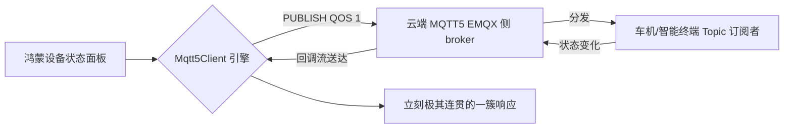

欢迎加入开源鸿蒙跨平台社区：[https://openharmonycrossplatform.csdn.net](https://openharmonycrossplatform.csdn.net)。

# Flutter for OpenHarmony：Flutter 三方库 mqtt5_client — 极速物联网设备状态同步（MQTT 5.0 引擎）


## 前言

在鸿蒙（OpenHarmony）万物互联的战略中，设备与设备之间、应用与传感器之间的高效低延迟通讯是第一要务。如果你还在用缓慢且沉重的 HTTP 轮询来获知智能插座是否被打开，那极大浪费了手机终端的电池。

`mqtt5_client` 带来了最新的物联网黄金标准协议。它不仅继承了轻量级别的 Pub/Sub 分发模型，更是为大规模车联网、智能家居应用带来了极强的双向容错机制以及对于 Shared Subscriptions (共享订阅) 的支持。在构建鸿蒙底色下的 IoT 中控级 App 时，它是你的网络中枢大动脉。

## 一、原理展示 / 概念介绍

### 1.1 基础概念

为了榨取网络的最后一丝效率，此协议仅需极其微弱的字节封包格式即可承载业务意图。



### 1.2 进阶概念

- **User Properties (用户属性流)**：相对于 v3，它引入了可包含特定极简 Header 业务标示的传递手段，鸿蒙端开发者可快速用于分布式跨设备追踪（TraceId）。
- **Reason Codes (错误深究)**：当网络断开连接时，再也不会出现黑箱情况了。极其完备的失败原因代码让你立刻能在日志中洞察是网络不可用还是服务器拒绝了握手。

## 二、核心 API / 组件详解

### 2.1 依赖引入

```yaml
dependencies:
  mqtt5_client: ^3.2.0 # 请选用最新且已兼容鸿蒙环境基础 Socket 的稳定版
```

### 2.2 构建高性能消息中继

在鸿蒙工程中建立一条长久且持续心跳的极强链接：

```dart
import 'package:mqtt5_client/mqtt5_client.dart';
import 'package:mqtt5_client/mqtt5_server_client.dart';

Future<void> connectHarmonyIoT() async {
  // ✅ 推荐做法：极其干净利落的配置
  final client = MqttServerClient('test.mosquitto.org', 'harmony_device_888');
  client.port = 1883;
  client.keepAlivePeriod = 60; // 维持极其节能的保活心跳
  
  // 提供连接回调的强阻断拦截
  client.onConnected = () => print('📡 鸿蒙跨平台终端已成功接入 IoT 核心层');
  
  try {
    await client.connect();
    // 💡 可以在此时极其迅捷地完成主 Topic 的侦听
  } catch (e) {
    print('IoT 集成受到阻断：$e');
  }
}
```

## 三、场景示例

### 3.1 场景一：鸿蒙级应用的“全屋智能灯光”极速操控

当用户在一个包含了灯光状态、空调温控的集合页面拉动 Slider 时，每一次的微调都在底层的通过毫秒级别的延迟将调整包通过 Broker 打向了所有设备的接收端。

```dart
// 💡 技巧：利用极其轻量的 Builder 进行高频封包
final builder = MqttPayloadBuilder();
builder.addString('{"intensity": 85}'); 
client.publishMessage('harmony/livingRoom/light', MqttQos.atLeastOnce, builder.payload!);
```


## 四、OpenHarmony 平台适配挑战

### 4.1 SSL 安全连带配置及证书载入根茎挑战

在要求极其严格的商用物联网（金融/汽车级别层级）场景，普通的 TCP Socket 往往不被允许，必须采用 TLS 强加密传输（MQTTS）。

✅ **适配策略建议**：
1. **安全配置加载 (SecurityContext)**：由于跨平台环境 Dart 在鸿蒙设备里对于不同 CA 根证书读取路径的存在壁垒，建议将公司专用的客户端根证书随 HAP 静态资源包一起下发并打包，并于执行 `client.connect()` 前从 `rootBundle` 读入构建 `SecurityContext`。
2. **应用休眠断连**：由于鸿蒙系统后台对极客类的死循环休眠有严格管制，一旦应用切至后台导致 Socket 失活，须配置好 `autoReconnect` 回退重新拉手机制，以保证用户一旦切回来状态立马能最新复刻。

## 五、综合实战示例代码

这是一个针对某开源测试网络的监听实战型鸿蒙 Lab：

```dart
import 'dart:convert';
import 'package:flutter/material.dart';
import 'package:mqtt5_client/mqtt5_client.dart';
import 'package:mqtt5_client/mqtt5_server_client.dart';

class HarmonyIoTTestLab extends StatefulWidget {
  const HarmonyIoTTestLab({super.key});

  @override
  _HarmonyIoTTestLabState createState() => _HarmonyIoTTestLabState();
}

class _HarmonyIoTTestLabState extends State<HarmonyIoTTestLab> {
  String _msg = "正在搭建 Mqtt5 矩阵...";
  final client = MqttServerClient('test.mosquitto.org', 'hm_usr_${DateTime.now().second}');

  void _startup() async {
    try {
      await client.connect();
      client.subscribe('harmonyos/open_source', MqttQos.atLeastOnce);
      
      client.updates?.listen((List<MqttReceivedMessage<MqttMessage>> event) {
        final recMess = event[0].payload as MqttPublishMessage;
        final payloadData = utf8.decode(recMess.payload.message);
        
        if(mounted) {
           setState(() => _msg = "📦 最新指令抵达: $payloadData");
        }
      });
      
    } catch (_) {
      // 网络无法通行
    }
  }

  @override
  void initState() {
    super.initState();
    _startup();
  }

  @override
  Widget build(BuildContext context) {
    return Scaffold(
      appBar: AppBar(title: const Text('设备流转及实时通信实战')),
      body: Center(
        child: Column(
          children: [
            const Padding(padding: EdgeInsets.all(20), child: Text('🌍 侦听鸿蒙专属开源控制管道的消息流：')),
            Text(_msg, style: const TextStyle(fontSize: 18, color: Colors.blueAccent)),
            ElevatedButton(
               onPressed: () {
                 final b = MqttPayloadBuilder(); b.addString('Hello IoT From Harmony NEXT!');
                 client.publishMessage('harmonyos/open_source', MqttQos.atMostOnce, b.payload!);
               },
               child: const Text('广播回音'),
            )
          ],
        ),
      ),
    );
  }
}
```


## 六、总结

`mqtt5_client` 在这个由于各种设备极度复杂交错的环境下，给了开发者一条最高效率与吞吐量的主路。使用最干净的核心概念解决万物连接的各种设备问题，不愧是真正工业极客之选。

✅ **核心建议**：
1. 涉及车联网控制终端、所有带硬件实体的鸿蒙中控必选项。
2. QOS (Quality of Service) 层级由于性能消耗成正比，非极其重大且具有财务属性等数据的确认环境，优先推荐使用 0 级分发模式以节约带宽。

📦 更多的底层指导代码可进入：[AtomGit 示例专栏](https://atomgit.com)

---

欢迎加入开源鸿蒙跨平台社区：[开源鸿蒙跨平台开发者社区](https://openharmonycrossplatform.csdn.net)
