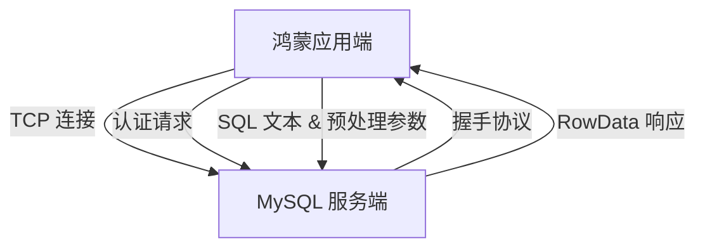

欢迎加入开源鸿蒙跨平台社区：[https://openharmonycrossplatform.csdn.net](https://openharmonycrossplatform.csdn.net)。

# Flutter for OpenHarmony：Flutter 三方库 mysql_client 高性能原生连接 MySQL（数据直连引擎）


## 前言

在一些鸿蒙（OpenHarmony）特殊的内网系统、物联网采集网关或特定的桌面化应用场景中，我们可能需要绕过繁琐的 Web 中间件，直接在鸿蒙设备侧与远端的 **MySQL/MariaDB** 数据库进行交互。

`mysql_client` 是一款纯 Dart 编写、具备高性能协议解析能力的客户端。它支持全功能的 SQL 语句执行、参数化查询和事务管理。虽然在普通公网 App 中不建议直连，但在鸿蒙可控的内网环境下，它能提供及其快速、低延迟的数据读写体验。

## 一、原理解析 / 概念介绍

### 1.1 基础概念

本库实现了 MySQL 的二进制协议（Binary Protocol），让鸿蒙 Flutter 应用能像真正的数据库连接池一样与服务端对话。



### 1.2 进阶概念

- **Prepared Statements (预处理语句)**：极其重要的安全机制，能防止 SQL 注入攻击，并在鸿蒙端大量重复执行相同语句时提升解析性能。
- **Streaming (流式获取)**：对于极大量级的数据集，无需一次性加载进鸿蒙内存，而是按行流动处理。

## 二、核心 API / 组件详解

### 2.1 建立连接

在鸿蒙适配中，请确保设备的网络权限已完全开启。

```dart
import 'package:mysql_client/mysql_client.dart';

Future<void> initHarmonyMysql() async {
  // 1. 设置连接配置
  final conn = await MySQLConnection.createConnection(
    host: '192.168.1.100',
    port: 3306,
    userName: 'harmony_user',
    password: 'password',
    databaseName: 'log_db',
  );

  // 2. 正式开启连接
  await conn.connect();
  print('💾 鸿蒙数据直连通道已就绪！');
}
```

### 2.2 执行查询并解析结果

```dart
var result = await conn.execute("SELECT * FROM users WHERE id = :id", {"id": 1});

for (final row in result.rows) {
  print('用户姓名: ${row.colAt(0)}');
}
```

## 三、场景示例

### 3.1 场景一：鸿蒙工控屏的“工业物料监控系统”

在工厂内网，直接将采集器读到的传感器结果存入 MySQL 数据库。

```dart
import 'package:mysql_client/mysql_client.dart';

void logSensorData(MySQLConnection conn, double temperature) async {
  // 💡 实战技巧：使用占位符，防止特殊字符导致崩溃
  await conn.execute(
    "INSERT INTO logs (val, time) VALUES (:val, :time)",
    {"val": temperature, "time": DateTime.now().toIso8601String()}
  );
}
```


## 四、OpenHarmony 平台适配挑战

### 4.1 网络超时与心跳机制

鸿蒙设备在无线环境下，TCP 链接极易被路由器或系统回收。

✅ **适配策略建议**：
1. **存活判定**：在每次执行前调用 `conn.connected` 检查。若断开多重试几次。
2. **连接池思想**：不要在每次按钮点击时都 create/connect。建议在鸿蒙应用级别维护一个长连接单例。

```dart
// 💡 适配提示：严格控制超时
await conn.connect(timeout: const Duration(seconds: 10));
```

## 五、综合实战示例代码

这是一个完整的鸿蒙库存管理直连 Demo：

```dart
import 'package:flutter/material.dart';
import 'package:mysql_client/mysql_client.dart';

class HarmonyDbExplorer extends StatefulWidget {
  const HarmonyDbExplorer({super.key});

  @override
  _HarmonyDbExplorerState createState() => _HarmonyDbExplorerState();
}

class _HarmonyDbExplorerState extends State<HarmonyDbExplorer> {
  late MySQLConnection _conn;
  List<String> _items = [];

  Future<void> _connect() async {
    _conn = await MySQLConnection.createConnection(
      host: 'your_ip', port: 3306,
      userName: 'root', password: '', databaseName: 'test'
    );
    await _conn.connect();
    _fetch();
  }

  Future<void> _fetch() async {
    final res = await _conn.execute("SELECT name FROM storage LIMIT 10");
    setState(() {
      _items = res.rows.map((r) => r.assoc()['name']!).toList();
    });
  }

  @override
  Widget build(BuildContext context) {
    return Scaffold(
      appBar: AppBar(title: const Text('MySQL 鸿蒙直连探索')),
      body: Center(
        child: Column(
          children: [
            ElevatedButton(onPressed: _connect, child: const Text('建立数据库握手')),
            Expanded(
              child: ListView(
                children: _items.map((i) => ListTile(title: Text(i))).toList(),
              ),
            )
          ],
        ),
      ),
    );
  }
}
```


## 六、总结

`mysql_client` 是一把“重型武器”。它让鸿蒙应用跨过了后端接口，真正具备了与大型数据库“交流”的能力。

✅ **核心建议**：
1. 在生产环境的公网 App 中，务必使用 HTTPS API 代替直连，以防数据库密码在鸿蒙客户端泄露。
2. 内部局域网辅助系统是该库的最佳舞台。

📦 更多的底层指导代码可进入：[AtomGit 示例专栏](https://atomgit.com)

---

欢迎加入开源鸿蒙跨平台社区：[开源鸿蒙跨平台开发者社区](https://openharmonycrossplatform.csdn.net)
