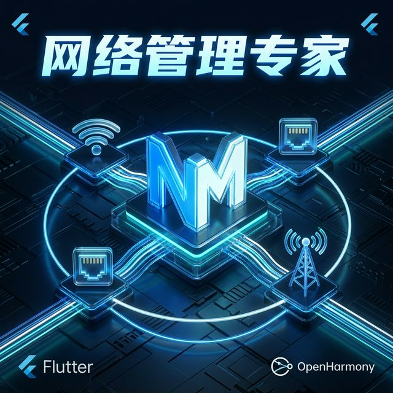
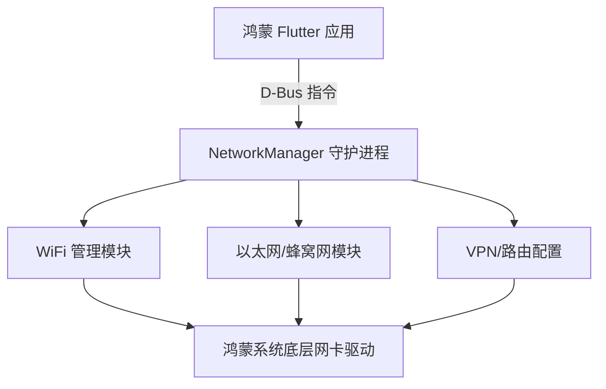

欢迎加入开源鸿蒙跨平台社区：[https://openharmonycrossplatform.csdn.net](https://openharmonycrossplatform.csdn.net)。

# Flutter for OpenHarmony：nm — Linux 风格的网络底层管控实践



## 前言

在鸿蒙（OpenHarmony）桌面版或车载系统中，底层常沿用 NetworkManager 架构。`nm` 库通过 D-Bus 总线与系统守护进程交互，为开发者提供了切换 WiFi、配置 IP 及监控网卡状态等工业级网络管控能力。

## 一、核心价值

### 1.1 基础概念

`nm` 库是一个 D-Bus 客户端包装，它实现了 NetworkManager 的对象映射。



### 1.2 进阶概念

- **ActiveConnection (活动连接)**：指当前正在使用的动态网络链路。
- **Device (设备)**：代表物理硬件，如 `wlan0` 或 `eth0`。
- **Settings (配置)**：持久化的连接定义，包含 SSID、密码和加密方式等。

## 二、核心 API / 组件详解

### 2.1 获取网络管理器

这是所有操作的总开关：

```dart
import 'package:nm/nm.dart';

Future<void> initHarmonyNetwork() async {
  final client = NetworkManagerClient();
  
  // ✅ 推荐做法：检查 NetworkManager 是否正在运行
  if (client.version.isNotEmpty) {
    print('🌐 鸿蒙底层 NetworkManager 版本: ${client.version}');
  }
}
```

### 2.2 扫描可用设备

```dart
void listDevices(NetworkManagerClient client) {
  for (final device in client.devices) {
    print('🔌 发现物理设备: ${device.interface} (类型: ${device.deviceType})');
    if (device is NetworkManagerDeviceWifi) {
      print('📶 该设备支持无线扫描');
    }
  }
}
```

## 三、场景示例

### 3.1 场景一：工业鸿蒙板的主备路由自动切换

当检测到有线网络断开时，通过 `nm` 极其快速地拉起备用的 WiFi 链路。

```dart
import 'package:nm/nm.dart';

void monitorEthConnectivity(NetworkManagerDeviceEthernet eth) {
  eth.propertiesChanged.listen((props) {
    // 💡 技巧：监听底层属性变化
    if (eth.state == NetworkManagerDeviceState.disconnected) {
       print('⚠️ 有线网断开，正在激活鸿蒙预设备用链路...');
       // 执行连接逻辑...
    }
  });
}
```


## 四、OpenHarmony 平台适配挑战

### 4.1 D-Bus 权限与运行环境

普通的鸿蒙手机应用（HAP）通常被沙箱包围，无法访问系统级的 D-Bus 总线。

✅ **适配策略建议**：
1. **目标系统确认**：该库仅适用于预装了 `NetworkManager` 且开放了 D-Bus 访问权限的 OpenHarmony 版本。
2. **权限配置**：确保你的应用在鸿蒙系统中具有访问 `org.freedesktop.NetworkManager` 地址的权限（通常需要在系统镜像层进行策略放行）。

```dart
// 💡 适配提示：在使用前做一次总线连接测试
try {
  final client = NetworkManagerClient();
} catch (e) {
  print('❌ 当前鸿蒙系统不支持 NetworkManager 互操作');
}
```

## 五、综合实战示例代码

这是一个包含了基础 WiFi 设备探测功能的鸿蒙控制台页面：

```dart
import 'package:flutter/material.dart';
import 'package:nm/nm.dart';

class HarmonyNetworkInspector extends StatefulWidget {
  const HarmonyNetworkInspector({super.key});

  @override
  _HarmonyNetworkInspectorState createState() => _HarmonyNetworkInspectorState();
}

class _HarmonyNetworkInspectorState extends State<HarmonyNetworkInspector> {
  final _client = NetworkManagerClient();
  List<NetworkManagerDevice> _devices = [];

  void _refresh() {
    setState(() {
      _devices = _client.devices;
    });
  }

  @override
  Widget build(BuildContext context) {
    return Scaffold(
      appBar: AppBar(title: const Text('NM 鸿蒙底层网络观察者')),
      body: Column(
        children: [
          Row(
            mainAxisAlignment: MainAxisAlignment.spaceAround,
            children: [
               Text('全局状态: ${_client.state}'),
               ElevatedButton(onPressed: _refresh, child: const Text('扫描硬件层'))
            ],
          ),
          const Divider(),
          Expanded(
            child: ListView.builder(
              itemCount: _devices.length,
              itemBuilder: (context, index) {
                 final d = _devices[index];
                 return ListTile(
                   leading: const Icon(Icons.router, color: Colors.indigo),
                   title: Text(d.interface),
                   subtitle: Text('状态码: ${d.state}'),
                   trailing: Text('MTU: ${d.mtu}'),
                 );
              },
            ),
          )
        ],
      ),
    );
  }
}
```


## 六、总结

`nm` 库是为**鸿蒙垂直行业开发者**量身定制的利器。它赋予了你直接操控系统底层“网线”和“无线信号”的能力，是构建网络监控、自动化路由切换系统的核心支柱。

✅ **核心建议**：
1. 涉及底层网络安全策略或多链路聚合时，它是唯一选择。
2. 请配合 `bluez` 库共同使用，以打造完整的鸿蒙极客互联体验。

📦 更多的底层指导代码可进入：[AtomGit 示例专栏](https://atomgit.com)

---

欢迎加入开源鸿蒙跨平台社区：[开源鸿蒙跨平台开发者社区](https://openharmonycrossplatform.csdn.net)
