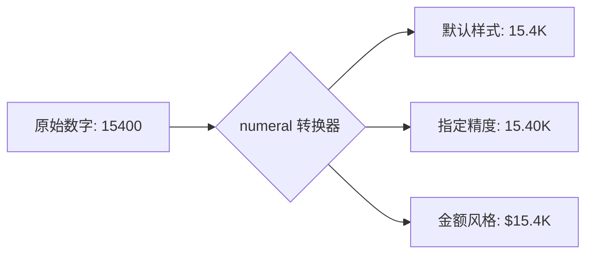

欢迎加入开源鸿蒙跨平台社区：[https://openharmonycrossplatform.csdn.net](https://openharmonycrossplatform.csdn.net)。

# Flutter for OpenHarmony：numeral — 简约的数字格式化与缩写工具


## 前言

在鸿蒙（OpenHarmony）应用中，优雅的数字展示（如 1.2M 或 10万+）是提升 UI 感的关键。`numeral` 借鉴了经典库的设计，为开发者提供了直观的数字缩写与精度控制方案，特别适用于空间受限的手表端或金融统计页面。

## 一、核心价值

### 1.1 基础概念

`numeral` 通过阶梯式的进位算法，将庞大的原始数字转换为带有字母后缀的易读形式。



### 1.2 进阶概念

- **Fractional Digits (小数位数)**：支持灵活控制缩写后保留的精度。
- **Suffix Mapping (后缀转换)**：除了 K/M/B，它还能根据语境提供不同的后缀支持。

## 二、核心 API / 组件详解

### 2.1 依赖引入

在鸿蒙工程的 `pubspec.yaml` 中增加以下项目：

```yaml
dependencies:
  numeral: ^2.1.0
```

### 2.2 核心格式化

```dart
import 'package:numeral/numeral.dart';

void harmonyNumberDemo() {
  // ✅ 推荐做法：通过对 num 的扩展直接调用
  num fansCount = 896752;
  
  print('📊 粉丝数简写: ${fansCount.numeral()}'); // 默认输出: 896.8K
  
  // 🎨 指定精确到小数点后 2 位
  print('📊 精确简写: ${numeral(fansCount, fractionDigits: 2)}'); // 输出: 896.75K
}
```

## 三、场景示例

### 3.1 场景一：鸿蒙内容社区的点赞/阅读量展示

在资讯流中，为了不让过长的数字撑破布局，我们统一使用缩写。

```dart
import 'package:numeral/numeral.dart';

Widget _buildStatItem(num count) {
  // 💡 实战技巧：超过一万时自动缩写
  String display = count > 9999 ? count.numeral() : count.toString();
  
  return Text("❤️ 点赞 $display");
}
```


## 四、OpenHarmony 平台适配挑战

### 4.1 本地化后缀语言偏好

国际标准的后缀是 `K/M/B`。但在纯中文语境的鸿蒙应用中，用户更希望能看到“万/亿”。

✅ **适配策略建议**：
1. **二次包装**：由于 `numeral` 极其轻量，你可以写一个简单的映射函数，将 `K` 替换为 `万` 并调整量级。或者在使用该库时侧重于其格式化的“精度控制”，后缀展示则自行定制。
2. **多终端自适应**：在鸿蒙智能穿戴（手表）平台上，由于宽度极其有限，无脑开启缩写是最佳实践。

```dart
// 💡 适配提示：处理超大数值
num bigData = 1000000000;
String res = bigData.numeral(); // 输出: 1.0B (Billion)
```

## 五、综合实战示例代码

这是一个包含了不同量级数字展示的鸿蒙监控中心页面：

```dart
import 'package:flutter/material.dart';
import 'package:numeral/numeral.dart';

class HarmonyStatDash extends StatelessWidget {
  const HarmonyStatDash({super.key});

  @override
  Widget build(BuildContext context) {
    // 模拟从鸿蒙分布式总线采集到的系统数据
    final Map<String, num> sysMetrics = {
      'CPU 每秒指令': 560000000,
      '网络入站流量': 12500,
      '存储剩余空间': 18900000000,
      '连接设备数': 5
    };

    return Scaffold(
      appBar: AppBar(title: const Text('numeral 鸿蒙数据可视化')),
      body: Center(
        child: Wrap(
          spacing: 20, runSpacing: 20,
          children: sysMetrics.entries.map((entry) {
             return _StatTile(label: entry.key, value: entry.value);
          }).toList(),
        ),
      ),
    );
  }
}

class _StatTile extends StatelessWidget {
  final String label;
  final num value;
  const _StatTile({required this.label, required this.value});

  @override
  Widget build(BuildContext context) {
     return Container(
       width: 140, height: 100,
       decoration: BoxDecoration(color: Colors.blue[50], borderRadius: BorderRadius.circular(15)),
       child: Column(
         mainAxisAlignment: MainAxisAlignment.center,
         children: [
           Text(label, style: const TextStyle(fontSize: 12, color: Colors.blueGrey)),
           // 💡 核心展示逻辑：统一缩写
           Text(value.numeral(), style: const TextStyle(fontSize: 22, fontWeight: FontWeight.bold)),
         ],
       ),
     );
  }
}
```


## 六、总结

`numeral` 虽小封装却极其细腻。在鸿蒙这种注重“元服务”和“微体验”的系统中，将庞杂的原始数字优美地缩放，能让你的界面瞬间从“新手入门”提升到“商业旗舰”。

✅ **核心建议**：
1. 涉及大数据展示的仪表盘页面，它是必需品。
2. 在 UI 布局因数字过长发生溢出时，它是成本最低、效果最好的修复方案。

📦 更多的底层指导代码可进入：[AtomGit 示例专栏](https://atomgit.com)

---

欢迎加入开源鸿蒙跨平台社区：[开源鸿蒙跨平台开发者社区](https://openharmonycrossplatform.csdn.net)
