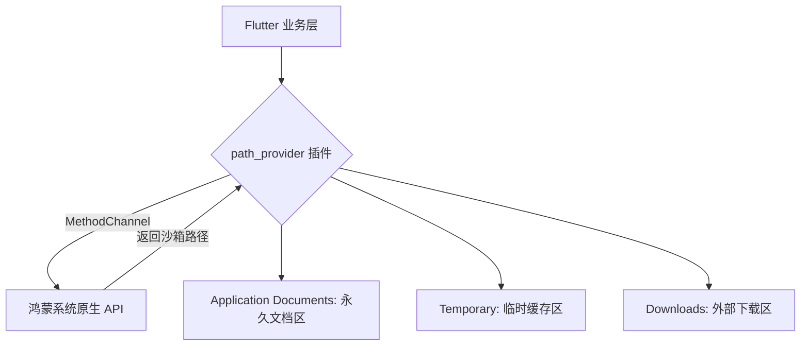

欢迎加入开源鸿蒙跨平台社区：[https://openharmonycrossplatform.csdn.net](https://openharmonycrossplatform.csdn.net)。

# Flutter for OpenHarmony：Flutter 三方库 path_provider — 精准获取系统标准目录（存储导航专家）

## 前言

在鸿蒙（OpenHarmony）应用开发中，数据存放在哪儿是一个极其严肃的问题。你是应该把私有配置存在系统的 `ApplicationSupport` 目录下？还是把用户的离线视频缓存存在 `Cache` 目录？

由于鸿蒙系统有着极其严格的沙箱隔离机制（每一个应用都有自己专属的、外人不可见的目录空间），硬编码路径（如 `/data/app/...`）几乎是 100% 会失败的。`path_provider` 是官方出品的核心库，它能帮你动态发现当前鸿蒙系统环境下那些合法、标准的存储路径。

## 一、原理展示 / 概念介绍

### 1.1 基础概念

`path_provider` 不负责读写文件，它只负责告诉你“哪儿能写”。



### 1.2 进阶概念

- **App Documents Directory**：应用用来存放不能由系统自动删除、且必须随应用备份的数据（如用户本地数据库）。
- **Temporary Directory**：应用可以存放那些可以被系统随时清理的缓存文件。

## 二、核心 API / 组件详解

### 2.1 依赖引入

在鸿蒙工程的 `pubspec.yaml` 中添加：

```yaml
dependencies:
  path_provider: ^2.1.0
```

### 2.2 获取各类核心目录

```dart
import 'package:path_provider/path_provider.dart';

void exploreHarmonyPaths() async {
  // 1. 获取应用专属的文档存储目录（鸿蒙沙箱内）
  final Directory docDir = await getApplicationDocumentsDirectory();
  print('📂 文档存放地: ${docDir.path}');

  // 2. 获取临时缓存目录
  final Directory tempDir = await getTemporaryDirectory();
  print('⚡ 缓存存放地: ${tempDir.path}');
}
```

## 三、场景示例

### 3.1 场景一：鸿蒙级应用的“本地数据库”初始化

在启动鸿蒙应用时，确定 SQLite 数据库文件的存放位置。

```dart
import 'package:path_provider/path_provider.dart';
import 'dart:io';

Future<File> getHarmonyDbFile() async {
  final directory = await getApplicationDocumentsDirectory();
  // 💡 技巧：拼接近似于 "/data/storage/el2/base/haps/..." 的安全路径
  return File('${directory.path}/main.db');
}
```


## 四、OpenHarmony 平台适配挑战

### 4.1 不同 API 版本下的存储差异

从鸿蒙 NEXT 到后续版本，系统对于“外部存储（External Storage）”的访问控制越来越严，某些原本公开的目录（如 `/sdcard/`）在 Flutter 中可能不再能通过该插件获取到绝对路径。

✅ **适配策略建议**：
1. **优先内部存储**：尽量只使用 `getApplicationDocumentsDirectory()`，这样无需在鸿蒙配置文件中申请复杂的外部存储读写权限。
2. **异步等待**：注意这些方法全是 `Future`。在鸿蒙应用启动初期加载配置时，务必先 `await` 拿到路径，再执行后续 IO 逻辑。

## 五、综合实战示例代码

这是一个包含了路径检测与简单文件写入演示的鸿蒙 Lab 页面：

```dart
import 'package:flutter/material.dart';
import 'package:path_provider/path_provider.dart';
import 'dart:io';

class HarmonyStorageLab extends StatefulWidget {
  const HarmonyStorageLab({super.key});

  @override
  _HarmonyStorageLabState createState() => _HarmonyStorageLabState();
}

class _HarmonyStorageLabState extends State<HarmonyStorageLab> {
  String _info = "正在探测系统路径...";

  void _getPaths() async {
    final doc = await getApplicationDocumentsDirectory();
    final cache = await getTemporaryDirectory();
    
    setState(() {
      _info = "📄 文档目录: ${doc.path}\n\n"
              "🛁 缓存目录: ${cache.path}";
    });
  }

  @override
  Widget build(BuildContext context) {
    return Scaffold(
      appBar: AppBar(title: const Text('path_provider 鸿蒙路径专家')),
      body: Center(
        child: Column(
          children: [
            const Padding(padding: EdgeInsets.all(20), child: Icon(Icons.folder_shared, size: 80, color: Colors.blue)),
            Padding(padding: const EdgeInsets.symmetric(horizontal: 20), child: SelectableText(_info)),
            const Spacer(),
            ElevatedButton(onPressed: _getPaths, child: const Text('立即探测鸿蒙存储布局')),
            const SizedBox(height: 50),
          ],
        ),
      ),
    );
  }
}
```


## 六、总结

`path_provider` 是进行鸿蒙文件操作的“入场券”。它确保了无论鸿蒙底层的目录结构如何变迁，你的应用始终能投递到最正确、最安全的存储位置。

✅ **核心建议**：
1. 全局不要出现硬编码的字符串路径。
2. 在鸿蒙正式发布前，务必检查你的文件是否存放在了会被系统误删的 `Temporary` 目录下。

📦 更多的底层指导代码可进入：[AtomGit 示例专栏](https://atomgit.com)

---

欢迎加入开源鸿蒙跨平台社区：[开源鸿蒙跨平台开发者社区](https://openharmonycrossplatform.csdn.net)
