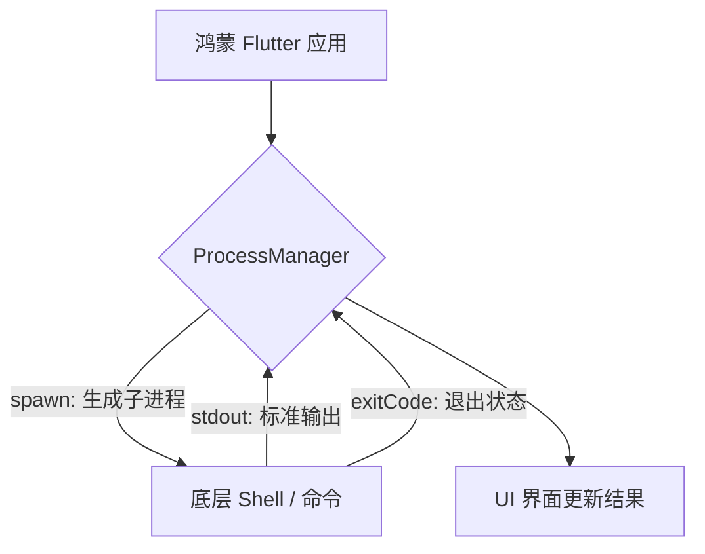

欢迎加入开源鸿蒙跨平台社区：[https://openharmonycrossplatform.csdn.net](https://openharmonycrossplatform.csdn.net)。

# Flutter for OpenHarmony：Flutter 三方库 process — 极其强大的外部进程操作（系统命令引擎）

## 前言

在鸿蒙（OpenHarmony）桌面级应用、自动化脚本或者是需要与鸿蒙底层 Shell 通信的工具类 App 开发中，我们需要一种极其稳健的方式来调用外部可执行程序。你是想在鸿蒙侧运行一段 `git` 命令？还是想执行一段 `python` 脚本并将结果实时拉回到 Flutter UI 中展示？

`process` 库是一个基于 `dart:io` 进程管理的增强抽象。它允许你极其轻松地执行命令、捕获输出（Stdout/Stderr）并管理进程的生命周期。在涉及鸿蒙系统底层互操作的场景下，它是不可或缺的指挥官。

## 一、原理展示 / 概念介绍

### 1.1 基础概念

`process` 核心是围绕 `ProcessManager` 展开的，它支持模拟（Mocking）以便于测试，同时也支持极其真实的系统调用。



### 1.2 进阶概念

- **ProcessManager**：核心工厂类，负责创建进程。它支持 `LocalProcessManager`（真实环境）和 `MockProcessManager`（测试环境）。
- **Shell Parsing**：库支持极其方便地将长字符串命令解析为 `List<String>` 数组以满足系统调用规范。

## 二、核心 API / 组件详解

### 2.1 执行同步与异步命令

在鸿蒙环境中，通常在异步函数中调用：

```dart
import 'package:process/process.dart';

void runHarmonyShell() async {
  const manager = LocalProcessManager();
  
  // ✅ 推荐做法：异步运行命令并捕获完整输出
  final result = await manager.run(['uname', '-a']);
  
  print('💻 鸿蒙内核信息: ${result.stdout}');
}
```

### 2.2 启动交互式进程 (Spawn)

如果你需要向进程持续写入数据（Stdin）：

```dart
final process = await manager.spawn(['cat']);
process.stdin.writeln('Hello OpenHarmony');
```

## 三、场景示例

### 3.1 场景一：鸿蒙级“系统健康诊断工具”

执行一段脚本获取系统的电量、内存使用情况，并实时刷新。

```dart
import 'package:process/process.dart';

Future<String> getMemoryInfo() async {
  // 💡 技巧：通过 manager.run 极其快捷地获取 Shell 结果
  final res = await const LocalProcessManager().run(['free', '-h']);
  return res.stdout as String;
}
```


## 四、OpenHarmony 平台适配挑战

### 4.1 权限限制与沙箱屏蔽

鸿蒙正式的 HAP 应用在手机端处于极其严格的沙箱模式，通常无法执行 `ls` 或 `git` 等外部命令。

✅ **适配策略建议**：
1. **开发者模式/系统预置**：该库最完美的舞台是鸿蒙桌面版（如 DevEcho 或特定的工业发行版）。
2. **命令白名单**：如果必须在受限环境下运行，请确保鸿蒙系统的权限列表（`privileged`）中已加入该命令路径。

```dart
// 💡 适配提示：处理找不到命令的情况
if (!manager.canRun('python3')) {
  print('⚠️ 警告：当前鸿蒙环境未安装 Python 运行时');
}
```

## 五、综合实战示例代码

这是一个包含了实时输出流读取的鸿蒙“编译监控仪”演示：

```dart
import 'package:flutter/material.dart';
import 'package:process/process.dart';
import 'dart:convert';

class HarmonyShellConsole extends StatefulWidget {
  const HarmonyShellConsole({super.key});

  @override
  _HarmonyShellConsoleState createState() => _HarmonyShellConsoleState();
}

class _HarmonyShellConsoleState extends State<HarmonyShellConsole> {
  final _manager = const LocalProcessManager();
  String _output = "点击按钮开始执行...";

  void _runCommand() async {
    // 模拟执行一个耗时命令: ping 鸿蒙官网
    final proc = await _manager.spawn(['ping', '-c', '4', 'harmonyos.com']);
    
    // 💡 重点：利用 stream 实时更新 UI
    proc.stdout.transform(utf8.decoder).listen((data) {
      if (mounted) setState(() => _output += "\n$data");
    });
  }

  @override
  Widget build(BuildContext context) {
    return Scaffold(
      appBar: AppBar(title: const Text('process 鸿蒙进程互操作')),
      body: SingleChildScrollView(
        child: Padding(
          padding: const EdgeInsets.all(16),
          child: Column(
            children: [
              ElevatedButton(onPressed: _runCommand, child: const Text('启动底层 Ping 任务')),
              const SizedBox(height: 20),
              Container(
                width: double.infinity,
                padding: const EdgeInsets.all(10),
                color: Colors.black,
                child: Text(_output, style: const TextStyle(color: Colors.greenAccent, fontFamily: 'monospace')),
              )
            ],
          ),
        ),
      ),
    );
  }
}
```


## 六、总结

`process` 为鸿蒙应用注入了“系统之力”。它让 Flutter 应用不再局限于 UI 层面，而是能够极其深度地参与到系统的自动化运维和工具链构建中。

✅ **核心建议**：
1. 始终使用 `LocalProcessManager` 的抽象，以便未来由于鸿蒙系统变迁需要切换底层模拟时更方便。
2. 务必处理 `exitCode != 0` 的情况，鸿蒙系统命令执行失败是常态。

📦 更多的底层指导代码可进入：[AtomGit 示例专栏](https://atomgit.com)

---

欢迎加入开源鸿蒙跨平台社区：[开源鸿蒙跨平台开发者社区](https://openharmonycrossplatform.csdn.net)
