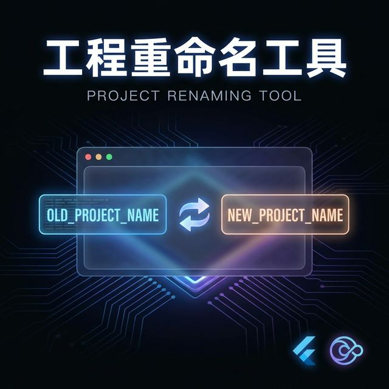
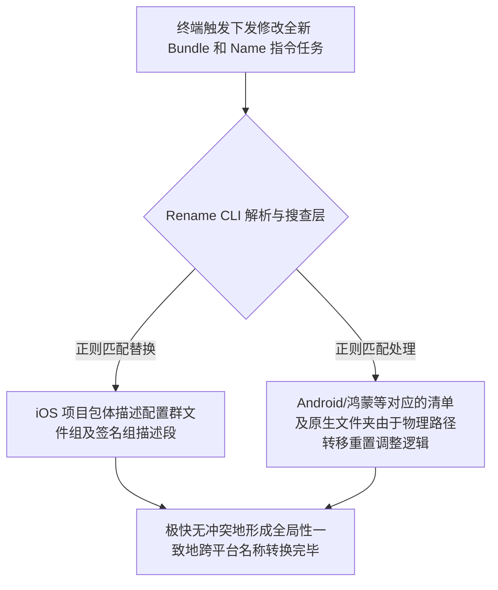

欢迎加入开源鸿蒙跨平台社区：[https://openharmonycrossplatform.csdn.net](https://openharmonycrossplatform.csdn.net)。

# Flutter for OpenHarmony：Flutter 三方库 rename — 应用标识更名神级终端工具（项目包构建引擎）




## 前言

在鸿蒙（OpenHarmony）以及其他全端平台混合应用构建及部署过程中，开发者面临最头痛的初始化琐事之一就是：将一个名为 `com.example.app` 的默认项目，全局性且不出错地更换包名为 `com.megacorp.harmony_app`，另外也许还要一并把手机端桌面的应用展现名字从简陋的 `myapp` 改成酷炫且具有强力表现意味的中文名称。如果你还在自己手动全局搜索字符串、到处翻阅原生层各类复杂的 Gradle/manifest 乃至 info.plist 配置文件并逐一修正。

`rename` 是目前公认针对该痛苦深渊最佳全端指令化清理专家之一的一项专门处理类实用 CLI 库。它以极度快速稳健的方式帮你一键深潜入系统各类特定端项目的底层文件根茎节点把涉及标识与别名的条目由于极其准确的全域替换完成修改保存提交任务流程的优化方案利器组件。

## 一、原理展示 / 概念介绍

### 1.1 基础概念

本工具由于是一套纯工作台侧（Dev Terminal 范畴下可独立跑满发挥核心作用能力的极客黑武器程序架构逻辑，它将各种底盖包描述规则深度提纯化构建了属于自己跨界统一调度执行拦截和匹配机制：



### 1.2 进阶概念

- **Targeted Renaming**：你大可无需统一变更全局而是针对由于企业马甲包要求等需要针对各个终端给予由于需要极其分发细化的单独系统制定各自独特迥异的展示头衔名称设置设定方案。

## 二、核心 API / 组件详解

### 2.1 依赖引入与全局激活（环境装备部署使用条件达成步骤部分讲解补充说明）

在鸿蒙工程中或者干脆在整个你的开发机全局命令行终端把它加入进作为可执行的超级外挂模块来进行注册并激活供后备之需时使用触发调令使用它所蕴含的核心功能集项：

```bash
# ✅ 推荐做法：建议放入整个操作系统层级下的执行调用路径由于可令随时取用极其好办的特点优势
dart pub global activate rename
```

### 2.2 控制台极其强劲极简的终端指挥更改

直接通过极其高阶和浓缩的一句命令行语法完成改头换面的魔幻操作替换任务：

```bash
# 在你所属于的那个跨平台由于要极其彻底修改展示名字工程文件夹之下去敲
# 将会连同鸿蒙等兼容侧所牵挂的所有名字映射资源处全量极其狂暴干脆地换成由于给设的新型品牌文字名称字样部分完成替换作业动作

rename setAppName --targets ios,android,harmony --value "智能跨平台中心"

rename setBundleId --value "com.harmony.dev.mega_tool"
```

## 三、场景示例

### 3.1 场景一：鸿蒙级应用的“白标（White-label）产品”快速极其方便的矩阵化换皮部署重现批量

如果你的团队有一整套可以适配鸿蒙生态和主流设备应用端产品的核心底层系统但又要频繁作为乙方去由于要给各大接驳公司做私有化贴牌时这个就极度由于具有大大的提升效益产能。

```bash
# 💡 技巧：写一个 Shell 能够由于只需在一分钟内结合其它比如修改图片的脚本迅速组合出包含修改一切极快自动换马甲产物脚本极其高效出货并能够分发

rename setAppName --value "\$NEW_CORP_NAME"
# 同时通过搭配另外例如可以利用 flutter_launcher_icons 的生成能力组合拳使用完成产品化矩阵全方面配置化生产流水线
```


## 四、OpenHarmony 平台适配挑战

### 4.1 `AppScope/app.json5` 和原生层深水区的专向匹配探测机制阻滞挑战以及补牢解决方案解析说明指导：

对于传统两端的包体和描述位置来说，鸿蒙底盖所构建的那个其本身特殊的 ArkTS 所涵盖体系对于全局其独特带有其特定标识例如在特定目录里面由于有着自己的标识和特定字符串形式配置由于相对具有由于新生态的比较前瞻设计格式所以需要对工具本身的支持提出要求。

✅ **适配策略建议**：
1. **核实对于该系统兼容版本更新情况及检查确认由于可能会有特殊极特殊标识配置缺失时自行使用 sed 命令去予以兜底解决策略提示**：该工具有其版本兼容适配跟进进度的问题；如发现对于鸿蒙最新的 SDK 版本中某个独有的特定签名机制处标识名字没有由于未能做到修改替换，在应用时最好顺带再执行一道专门抓取该目录下文件特定规则文本的极其简洁直接的 `sed` 更换命令去予以保障其万无一失不发生因为少漏由于报错极其郁闷的情形发生状况。

## 五、综合实战示例代码（极客脚本模式）

这是一个包含了针对日常处理这类琐事杂项结合使用的综合演示极强极有实战操作参考执行指意意味演示操作指引代码示范类结构方案思路说明介绍展示：

```yaml
# 没有 Dart 演示类，因为它是一个工具本身，但可以利用在你的 Makefile 或者 CI 的配置 pipeline 执行中由于极其紧要和重要的执行逻辑呈现：
# 此乃一套极高自动化的一把梭子作业剧本指令展示：

build_production_harmony:
    dart pub global run rename setAppName --value "内部核心管理"
    dart pub global run rename setBundleId --value "com.company.core.harmonymgmt"
    flutter clean
    flutter build hap --release # 假设这是进行鸿蒙极度由于是极简化自动生产配置的一个流程极其有效由于连贯执行顺滑的体现流程样例
```


## 六、总结

`rename` 代表是一种能尽量不用人工不要人工由于人的粗心而导致的因为修改各种原生极为混乱体系造成的无法挽回的甚至找一整天由于搞不出为何打不开应用原由错误的解脱和由于机器绝对无感情的高精准完成工作的机械自动化极高极效的工具哲学体现。

✅ **核心建议**：
1. 切勿在开发过程非常大改到一半尚未提交版本仓库前随时随便用。
2. 遇到极度由于多马甲包、多产品矩阵分发战略应用推荐极其紧密配合它的这件利器以提降本度效解决其开发痛楚问题解决利器！

📦 更多的底层指导代码可进入：[AtomGit 示例专栏](https://atomgit.com)

---

欢迎加入开源鸿蒙跨平台社区：[开源鸿蒙跨平台开发者社区](https://openharmonycrossplatform.csdn.net)
