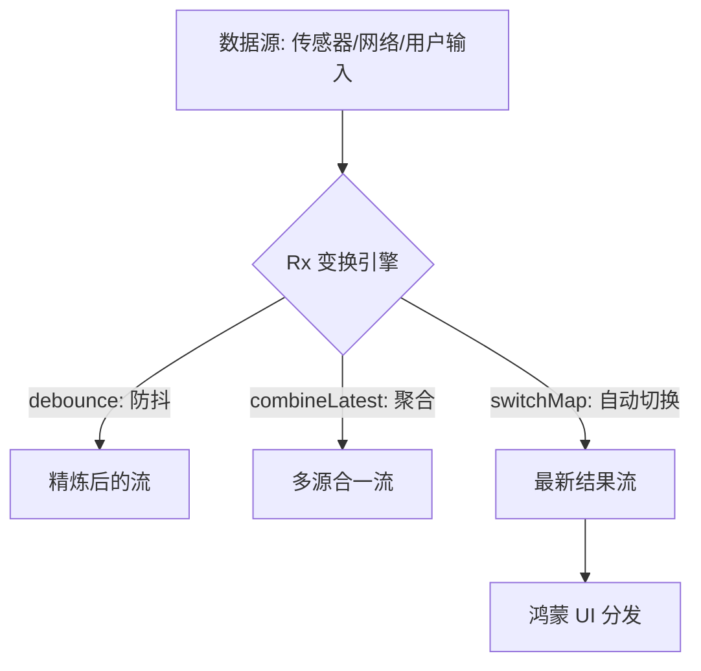

欢迎加入开源鸿蒙跨平台社区：[https://openharmonycrossplatform.csdn.net](https://openharmonycrossplatform.csdn.net)。

# Flutter for OpenHarmony：Flutter 三方库 rxdart 极致掌控响应式数据流（异步编程引擎）

## 前言

在鸿蒙（OpenHarmony）复杂的业务场景中——比如：实时变化的股票行情、多个传感器聚合的运动数据、或者是需要极其灵敏的防抖搜索——单纯使用 Dart 原生的 `Stream` 可能显得捉襟见肘。

`rxdart` 是一款基于 ReactiveX 标准的响应式扩展库。它为鸿蒙开发者提供了极其丰富的操作符（Operators）和更强大的 `Subject`，让原本逻辑如乱麻般的异步代码流，瞬间变得像自来水管般清晰有序。

## 一、原理解析 / 概念介绍

### 1.1 基础概念

`rxdart` 不会替换原生 Stream，而是通过封装使其具备了类似“乐高积木”般的拼装能力。



### 1.2 进阶概念

- **BehaviorSubject**：一种极其特殊的流，它会记住“最后一次发出的值”。这非常适合鸿蒙应用中的全局状态管理。
- **PublishSubject**：标准的广播流，新订阅者只能看到订阅之后发生的消息。
- **ReplaySubject**：能让新订阅者“穿越”回去，看到过去发生过的所有事件。

## 二、核心 API / 组件详解

### 2.1 创建增强流

```dart
import 'package:rxdart/rxdart.dart';

void harmonyRxSample() {
  // ✅ 推荐做法：使用 BehaviorSubject 存储鸿蒙系统配置
  final themeSubject = BehaviorSubject<bool>.seeded(true); // 默认开启深色模式
  
  themeSubject.stream.listen((isDark) {
    print('🌓 鸿蒙主题已切换: ${isDark ? "深色" : "浅色"}');
  });
}
```

### 2.2 强大的 Combine 操作符

```dart
// 🎨 实战：将用户名和密码两个流聚合，实现登录按钮的实时启用
Stream<bool> get isFormValid => Rx.combineLatest2(
  usernameStream, 
  passwordStream, 
  (u, p) => u.isNotEmpty && p.length >= 6
);
```

## 三、场景示例

### 3.1 场景一：鸿蒙级应用的“极致防抖”搜索

当用户在搜索框疯狂打字，我们只需在停顿 500ms 后才发一次请求。

```dart
import 'package:rxdart/rxdart.dart';

final searchController = PublishSubject<String>();

void initSearch() {
  searchController
    .debounceTime(const Duration(milliseconds: 500)) // 💡 核心：防抖
    .distinctUntilChanged() // 💡 只有内容变了才搜
    .switchMap((term) => _callHarmonyApi(term)) // 💡 旧请求自动废弃，只看最新的
    .listen((results) => _updateUI(results));
}
```


## 四、OpenHarmony 平台适配挑战

### 4.1 内存泄漏与订阅管理

在鸿蒙页面的声明周期（Life Cycle）中，如果 `Subject` 没有被手动关闭，会导致严重的内存堆积。

✅ **适配策略建议**：
1. **统一销毁**：在 `dispose()` 方法中务必调用 `subject.close()`。
2. **CompositeSubscription**：利用该工具类包圆管理多个 `StreamSubscription`，一键取消。

```dart
// 💡 适配提示：鸿蒙生命周期保护
final _bag = CompositeSubscription();

@override
void dispose() {
  _bag.dispose(); // 极其重要：一键清空所有 Rx 订阅
  super.dispose();
}
```

## 五、综合实战示例代码

这是一个包含了多数据源同步采集的鸿蒙健康监测 Demo：

```dart
import 'package:flutter/material.dart';
import 'package:rxdart/rxdart.dart';

class HarmonyHealthMonitor extends StatefulWidget {
  const HarmonyHealthMonitor({super.key});

  @override
  _HarmonyHealthMonitorState createState() => _HarmonyHealthMonitorState();
}

class _HarmonyHealthMonitorState extends State<HarmonyHealthMonitor> {
  // 模拟两个异步传感器流
  final _heartRate = BehaviorSubject<int>.seeded(75);
  final _steps = BehaviorSubject<int>.seeded(0);

  @override
  Widget build(BuildContext context) {
    return Scaffold(
      appBar: AppBar(title: const Text('RxDart 鸿蒙响应式中心')),
      body: StreamBuilder<String>(
        // 💡 核心实战：聚合展示
        stream: Rx.combineLatest2(_heartRate, _steps, (hr, s) => '心率: $hr | 步数: $s'),
        builder: (context, snapshot) {
          return Center(
            child: Text(snapshot.data ?? '正在同步传感器...', style: const TextStyle(fontSize: 24)),
          );
        },
      ),
      floatingActionButton: FloatingActionButton(
        onPressed: () {
          _heartRate.add(85); // 模拟心率突变
          _steps.add(_steps.value + 10); // 模拟跨步
        },
        child: const Icon(Icons.add),
      ),
    );
  }
}
```


## 六、总结

`rxdart` 是每一位追求“代码优雅”的鸿蒙开发者必须掌握的进阶技能。它将杂乱无章的时间异步事件提升到了“可组合、可管理”的维度。

✅ **核心建议**：
1. 涉及多个异步源同步的场景，无脑选 `rxdart`。
2. 每一个全局持久化的数据状态，都建议用 `BehaviorSubject` 封装。

📦 更多的底层指导代码可进入：[AtomGit 示例专栏](https://atomgit.com)

---

欢迎加入开源鸿蒙跨平台社区：[开源鸿蒙跨平台开发者社区](https://openharmonycrossplatform.csdn.net)
