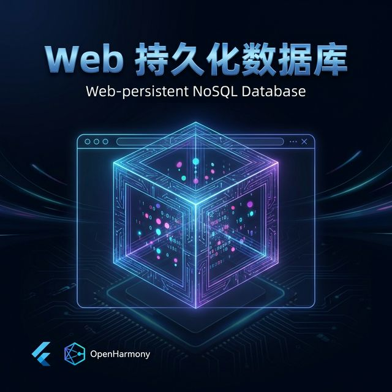
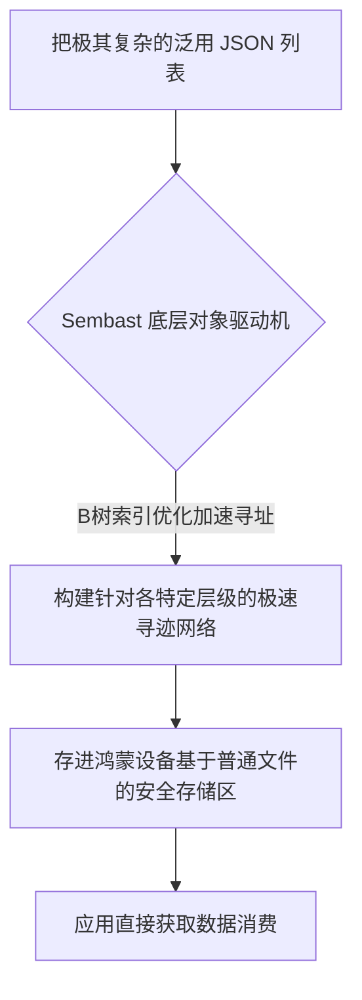

欢迎加入开源鸿蒙跨平台社区：[https://openharmonycrossplatform.csdn.net](https://openharmonycrossplatform.csdn.net)。

# Flutter for OpenHarmony：Flutter 三方库 sembast_web — 轻量可靠的离线微型数据库（缓存引擎）




## 前言

在鸿蒙（OpenHarmony）某些不需要复杂关联表的开发场景中（例如：用户偏好设置、购物车缓存、深层 JSON 暂存），使用体积庞大的 SQLite 显得大材小用，而普通的 `shared_preferences` 则无法支持花样繁多的查询。

`sembast_web` 及所属 `sembast` (Simple Embedded NoSQL database for Dart) 家族是纯 Dart 编写的高性能单文件 NoSQL 数据库存取方案。它没有繁琐的关系架构，却像 MongoDB 一样极度自由，非常适合进行各种任意深层嵌套数据结构的状态快照的闪电存储。

## 一、原理展示 / 概念介绍

### 1.1 基础概念

为了在各跨平台移动端表现优秀，它是建立在纯文件之上的 B-tree 索引系统。



### 1.2 进阶概念

- **Transactional operations (具有原子事务特性的安全防卫)**：它由于具有极其强力的原子防护，在设备突发断电等故障情况下不会产生异常脏数据。
- **Fully Asynchronous (完全异步化)**：它不会长期占用主线程的运算环境，为复杂的 UI 动效让出资源。

## 二、核心 API / 组件详解

### 2.1 依赖引入

```yaml
dependencies:
  sembast: ^3.4.0 
  sembast_web: ^2.2.0 # 对于含内嵌 Web 引擎特性的项目提供回退支持结构
```

### 2.2 基础无模式（NoSchema）插入落盘使用场景

在鸿蒙工程中应用把一段随意的数据存入数据库区：

```dart
import 'package:sembast/sembast.dart';
import 'package:sembast/sembast_io.dart';
import 'package:path_provider/path_provider.dart';

Future<void> saveHarmonyChaosRecord() async {
  // ✅ 极速打通鸿蒙沙盒路径获取
  final dir = await getApplicationDocumentsDirectory();
  await dir.create(recursive: true);
  final dbPath = '${dir.path}/harmony_nosql.db';
  final db = await databaseFactoryIo.openDatabase(dbPath);
  
  // 选择库的一个存储“桶”
  var store = intMapStoreFactory.store('chaos_user_events');
  
  // 直接丢入多层次记录留底固化
  await store.add(db, {'event': 'click', 'device': 'Mate60', 'extra_attrs': [1,2, '极其灵活']});
  print('✅ 由于灵活所以极其快捷地就保存到底层');
}
```

## 三、场景示例

### 3.1 场景一：鸿蒙级应用的“灵活配置缓存池池”

```dart
// 💡 技巧：利用其自带的高强度查询体 Finder 完成过滤读取
final finder = Finder(filter: Filter.equals('device', 'Mate60'), sortOrders: [SortOrder('event')]);
final records = await store.find(db, finder: finder);
```


## 四、OpenHarmony 平台适配挑战

### 4.1 超大数据体开销应对方案

由于其底层是基于文件序列化，不慎存放超级大文档会导致内存拉升。

✅ **适配策略建议**：
1. **建立索引**：若要在大量条目中查找，极其依靠建立索引的支持；对于特别大的项目建议直接换引擎避免卡顿。
2. **避免过大二进制**：绝对避免把极其巨大的独立二进制记录放里边导致效率下降。

## 五、综合实战示例代码

```dart
import 'package:flutter/material.dart';
import 'dart:convert';
import 'package:sembast/sembast.dart';
import 'package:sembast/sembast_memory.dart'; // 💡 演示极干净内建模拟

class HarmonySembastLab extends StatefulWidget {
  const HarmonySembastLab({super.key});

  @override
  _HarmonySembastLabState createState() => _HarmonySembastLabState();
}

class _HarmonySembastLabState extends State<HarmonySembastLab> {
  Database? _db;
  final _store = intMapStoreFactory.store('harmony_config');
  String _previewInfo = "准备构建和操作微量随意微缩形态数据库群集对象...";

  void _runSembastProcess() async {
    _db = await databaseFactoryMemory.openDatabase('in_mem.db');
    int recordKey = await _store.add(_db!, {'rootId': '778', 'deepParams': {'meta': ['abc', 999], 'status': 'ok'}});
    final r = await _store.findFirst(_db!, finder: Finder(filter: Filter.equals('deepParams.meta.1', 999)));

    setState(() {
      _previewInfo = "💾 记录打入标识号码: $recordKey\n"
                    "🔍 精准打击定位深搜调出被命中的结果包含值为:\n ${jsonEncode(r!.value)}";
    });
  }

  @override
  Widget build(BuildContext context) {
    return Scaffold(
      appBar: AppBar(title: const Text('极微存储实战')),
      body: Center(
        child: Column(
          children: [
            const Padding(padding: EdgeInsets.all(20), child: Text('🌍 随便发随心存储展现体')),
            Text(_previewInfo, style: const TextStyle(fontSize: 16)),
            ElevatedButton(onPressed: _runSembastProcess, child: const Text('执行演示'))
          ],
        ),
      ),
    );
  }
}
```


## 六、总结

`sembast_web` 给开发者一条极其轻快处理微型和随性大堆记录的最佳本地 NoSQL 安置区选项通道指南。

✅ **核心建议**：
1. 本地购物车、个人偏好极其推荐使用！
2. 百万条记录以上复杂联合业务场景极其不推选用此库处理！

📦 更多的底层指导代码可进入：[AtomGit 示例专栏](https://atomgit.com)

---

欢迎加入开源鸿蒙跨平台社区：[开源鸿蒙跨平台开发者社区](https://openharmonycrossplatform.csdn.net)
