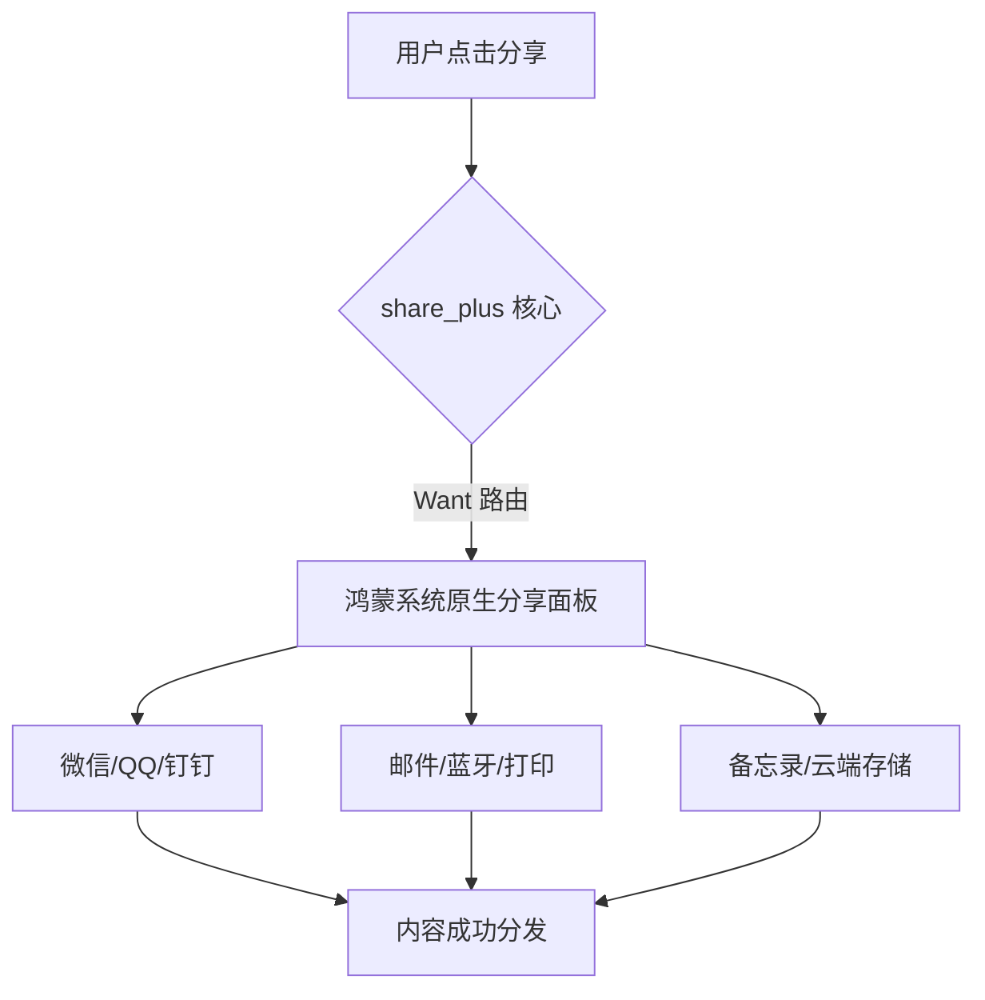

欢迎加入开源鸿蒙跨平台社区：[https://openharmonycrossplatform.csdn.net](https://openharmonycrossplatform.csdn.net)。

# Flutter for OpenHarmony：Flutter 三方库 share_plus — 一键系统级内容共享（社交分发引擎）

## 前言

在鸿蒙（OpenHarmony）应用的信息交互循环中，让用户将精彩的内容刷到朋友圈、发送给通讯录好友或是通过蓝牙/碰一碰共享，是提升应用活跃度的利器。手动对接各个社交平台的 SDK 极其痛苦，且不符合鸿蒙“去中心化”的共享理念。

`share_plus` 是官方 Plus 系列的核心成员。它能极其优雅地拉起鸿蒙系统的原生分享面框（Share Sheet）。你可以分享纯文字、网页链接或是多张高清大图。在构建鸿蒙“全场景内容流转”时，它是你的社交扩音器。

## 一、原理展示 / 概念介绍

### 1.1 基础概念

`share_plus` 通过 MethodChannel 与鸿蒙原生的“隐式意图（Implicit Intent / Want）”对接。



### 1.2 进阶概念

- **Share Result (状态反馈)**：支持监听分享结果（如用户是否真正点击了发送，还是中途取消），方便鸿蒙开发者进行业务统计。
- **Subject Definition**：在分享到邮件等特定渠道时，支持注入精准的主题头。

## 二、核心 API / 组件详解

### 2.1 依赖引入

```yaml
dependencies:
  share_plus: ^10.0.0 # 建议检查鸿蒙适配版本
```

### 2.2 基础分享用例

在鸿蒙工程中触发一段促销文案分享：

```dart
import 'package:share_plus/share_plus.dart';

void shareHarmonyContent() {
  // ✅ 推荐做法：使用静态方法触发系统级逻辑
  Share.share(
    '🚀 鸿蒙开发者大会倒计时结束！快来体验全新的跨平台应用吧：https://harmony.dev',
    subject: '重要赛事邀请码',
  );
}
```

### 2.3 分享本地文件（如：图片/HAP）

```dart
Share.shareXFiles([XFile('/path/to/screenshot.png')], text: '快看我的鸿蒙运行截图！');
```

## 三、场景示例

### 3.1 场景一：鸿蒙级应用的“资讯海报”分发

当用户生成了一张带二维码的精美战报，一键调用系统面板保存或发给好友。

```dart
Future<void> dispatchPoster(String filePath) async {
  // 💡 技巧：利用 shareXFiles 处理大容量高清图
  await Share.shareXFiles([XFile(filePath)]);
}
```


## 四、OpenHarmony 平台适配挑战

### 4.1 分享内容的隐私过滤与沙箱权限

鸿蒙系统对于跨应用（Ability）的文件流转有严格的 URI 映射要求。

✅ **适配策略建议**：
1. **URI 转换**：`share_plus` 内部已处理了大部分路径映射。但如果你的文件位于极其特殊的沙箱深处，建议先利用 `path_provider` 将其移动至临时目录（Temporary）再执行分享。
2. **平板/折叠屏弹窗位置 (Origin)**：在鸿蒙支架式平板或大屏上，分享面板需要指向点击区域。如果不指定 `sharePositionOrigin`，面板可能会在屏幕中央弹出显得有些突兀。

```dart
// 💡 适配提示：指定在大屏设备上的弹出锚点
Share.share('内容', sharePositionOrigin: box.localToGlobal(Offset.zero) & box.size);
```

## 五、综合实战示例代码

这是一个包含了反馈监听的鸿蒙分享逻辑 Demo：

```dart
import 'package:flutter/material.dart';
import 'package:share_plus/share_plus.dart';

class HarmonyShareLab extends StatelessWidget {
  const HarmonyShareLab({super.key});

  @override
  Widget build(BuildContext context) {
    return Scaffold(
      appBar: AppBar(title: const Text('内容流转 - 鸿蒙实战')),
      body: Center(
        child: ElevatedButton(
          onPressed: () async {
            // 💡 重点：可以获取分享的最终状态
            final result = await Share.shareWithResult('探索开源鸿蒙的无限可能 🚀');
            
            if (result.status == ShareResultStatus.success) {
              ScaffoldMessenger.of(context).showSnackBar(const SnackBar(content: Text('🎉 鸿蒙分享成功！')));
            }
          },
          child: const Text('立即拉起鸿蒙分享中心'),
        ),
      ),
    );
  }
}
```


## 六、总结

`share_plus` 去除了多端接入 SDK 的烦恼，让内容的流转真正回归到了系统最原始、最通用的路径上。它让每一个鸿蒙应用都能瞬间具备与整个社交生态联网的能力。

✅ **核心建议**：
1. 请务必处理分享文件不存在时的异常捕获。
2. 涉及多图分享，建议图片总数控制在 9 张以内，以保证鸿蒙面板的流畅度。

📦 更多的底层指导代码可进入：[AtomGit 示例专栏](https://atomgit.com)

---

欢迎加入开源鸿蒙跨平台社区：[开源鸿蒙跨平台开发者社区](https://openharmonycrossplatform.csdn.net)
