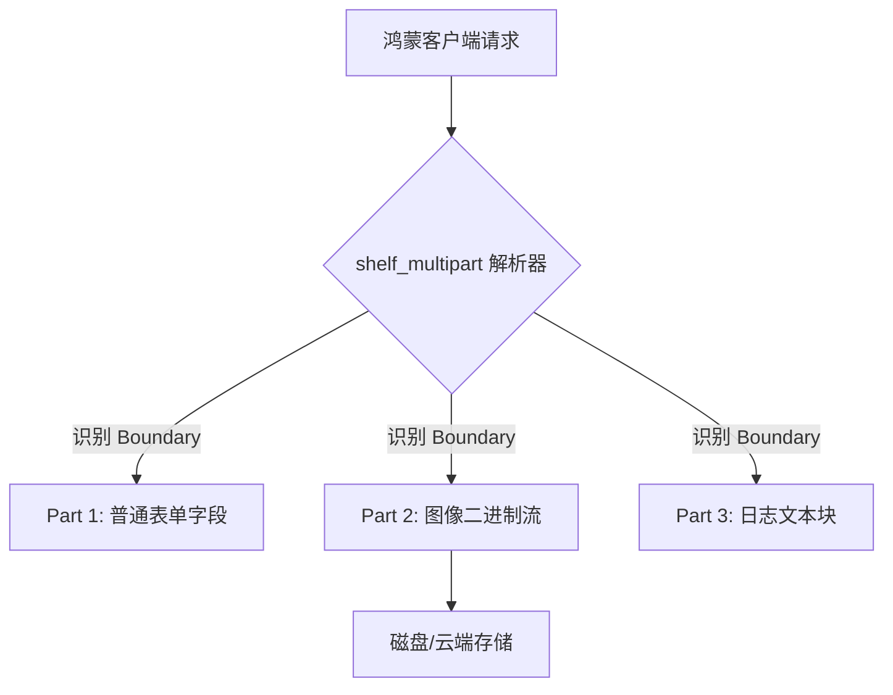

欢迎加入开源鸿蒙跨平台社区：[https://openharmonycrossplatform.csdn.net](https://openharmonycrossplatform.csdn.net)。

# Flutter for OpenHarmony：shelf_multipart — 稳健的多段请求处理


## 前言

在为鸿蒙（OpenHarmony）应用构建 Dart 后端（基于 `shelf`）时，处理文件上传常涉及 `multipart/form-data` 协议。`shelf_multipart` 提供了高效的流式解析方案，能有效管理内存开销，是在后端实现大文件上传与复杂表单提交的核心组件。

## 一、核心价值

### 1.1 基础概念

Multipart 请求将不同类型的数据分段包装。解析器的核心工作是识别这些“分界线（Boundary）”并分离内容。



### 1.2 进阶概念

- **Streaming Processing**：它允许你在数据还在传输时就开始读取内容块，这对于鸿蒙大文件上传场景（如 100MB 固件包备份）极其关键。
- **Mime Typing**：自动识别每个 Part 的 Content-Type，方便后端决定如何处理（保存为图片还是解析为 JSON）。

## 二、核心 API / 组件详解

### 2.1 引入依赖

```yaml
dependencies:
  shelf_multipart: ^1.1.0
```

### 2.2 核心解析逻辑

在 shelf 的 `Handler` 中使用：

```dart
import 'package:shelf_multipart/shelf_multipart.dart';

Future<Response> uploadHandler(Request request) async {
  // 1. 判断是否为 multipart 请求
  if (!request.isMultipart) return Response.forbidden('非法的请求格式');

  // 2. 获取极其高效的字节流迭代器
  await for (final part in request.multipartParts) {
    final filename = part.filename; // 💡 技巧：如果是文件，能直接拿到文件名
    if (filename != null) {
      print('📂 正在接收来自鸿蒙的文件: $filename');
      // 可以将 part 直接 pipe 到本地文件系统
    }
  }
  
  return Response.ok('✅ 所有资源上传成功');
}
```

## 三、场景示例

### 3.1 场景一：鸿蒙级项目的“多资源同步”后端

当鸿蒙端侧需要同时提交“用户信息 JSON”和“用户签名图片”时。

```dart
import 'package:shelf_multipart/shelf_multipart.dart';

void processMixedUpload(Request request) async {
  final parts = request.multipartParts;
  
  await for (final part in parts) {
    if (part.name == 'meta_data') {
       final jsonStr = await part.readString(); // 💡 快速读取文本
       print('解析出的元数据: $jsonStr');
    } else if (part.name == 'file_content') {
       // 处理二进制图片数据...
    }
  }
}
```


## 四、OpenHarmony 平台适配挑战

### 4.1 传输中继与超时处理

在鸿蒙系统连接不稳定的环境下，Multipart 长链接容易中断。

✅ **适配策略建议**：
1. **分块验证**：建议配合 `Content-Length` 校验每一个 Part 的完整性。
2. **内存阈值保护**：虽然 `shelf_multipart` 是流式的，但在调用 `readBytes()` 或 `readString()` 时，数据会加载进内存。对于鸿蒙传输的海量日志，务必直接使用 `part.listen()` 写入磁盘，而非一次性读取。

```dart
// 💡 适配提示：直接流写入文件
final file = File('harmony_upload.tmp');
await part.pipe(file.openWrite());
```

## 五、综合实战示例代码

这是一个包含了基础报错拦截的鸿蒙文件中转站逻辑：

```dart
import 'package:shelf/shelf.dart';
import 'package:shelf_multipart/form_data.dart';
import 'package:shelf_multipart/multipart.dart';

Future<Response> harmonyProxyHandler(Request request) async {
  try {
    // 💡 推荐做法：使用 readFormData 获取更上层、更方便的 Map 模型
    final formData = await request.readFormData();
    
    // 遍历所有表单数据
    await for (final entry in formData.formData) {
       print('字段名: ${entry.name}');
       if (entry is FormDataBytePart) {
          print('收到二进制文件片段，长度: ${entry.bytes.length}');
       }
    }

    return Response.ok('存储就绪');
  } catch (e) {
    return Response.internalServerError(body: '解析失败: $e');
  }
}
```


## 六、总结

`shelf_multipart` 使得基于 Dart 的鸿蒙后端工程能够极其体面地处理“富媒体”数据。它是构建鸿蒙私有网盘、分布式同步工具以及 API 网关中不可或缺的底层协议解析件。

✅ **核心建议**：
1. 处理大文件时，千万不要调用 `readString()`，请使用 `Stream` 模式。
2. 结合 `shelf_plus` 使用，可以让路由和文件处理逻辑更加紧凑。

📦 更多的底层指导代码可进入：[AtomGit 示例专栏](https://atomgit.com)

---

欢迎加入开源鸿蒙跨平台社区：[开源鸿蒙跨平台开发者社区](https://openharmonycrossplatform.csdn.net)
