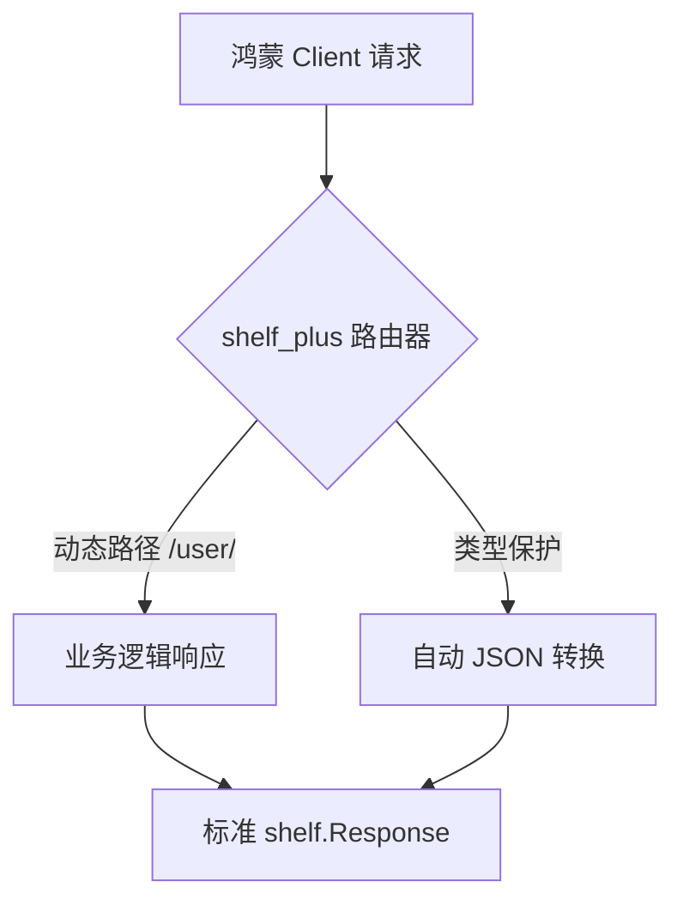

欢迎加入开源鸿蒙跨平台社区：[https://openharmonycrossplatform.csdn.net](https://openharmonycrossplatform.csdn.net)。

# Flutter for OpenHarmony：Flutter 三方库 shelf_plus 让服务端开发更具 Dart 范儿（后端增强引擎）


## 前言

在鸿蒙（OpenHarmony）开发者转向全栈开发的过程中，`shelf` 是生态中最底层的 Web 服务标准。虽然它极其稳定，但原生的 `shelf` 往往显得过于“原始”——你需要手动处理路由映射、繁琐的 JSON 序列化以及复杂的错误捕捉。

`shelf_plus` 是一款针对 shelf 的全功能增强库。它引入了更加优雅的路由语法、类型安全的响应处理和极简的 JSON 支持。如果你在为鸿蒙应用构建中转网关或是本地 HTTP 调试服务器，`shelf_plus` 能让你感觉到像写 Flutter UI 一样顺滑。

## 一、原理解析 / 概念介绍

### 1.1 基础概念

`shelf_plus` 不改变 shelf 的中间件（Middleware）与处理器（Handler）模型，但它通过 **Extension Methods (扩展方法)** 极大简化了代码复杂度。



### 1.2 进阶概念

- **Router DSL**：使用 `get()`, `post()`, `put()` 等极其语义化的方法定义接口。
- **Auto Serialization**：你可以直接返回一个 `Map` 或对象，库会自动帮你包装成 `200 OK` 的 JSON 响应。

## 二、核心 API / 组件详解

### 2.1 依赖引入

在后端的 `pubspec.yaml` 中添加以下代码：

```yaml
dependencies:
  shelf_plus: ^1.4.0
```

### 2.2 极简服务启动

```dart
import 'package:shelf_plus/shelf_plus.dart';

void startHarmonyGateway() async {
  // ✅ 推荐做法：通过扩展直接定义服务
  var app = shelf_run((Request request) {
    var router = RouterPlus();
    
    // 🎨 定义路由
    router.get('/v1/status', () {
      return {'status': 'active', 'os': 'OpenHarmony NEXT'}; 
    });
    
    return router;
  });
}
```

## 三、场景示例

### 3.1 场景一：鸿蒙端侧“本地资源代理服务”

当鸿蒙端侧需要将一些私有目录的资源通过 HTTP 暴露给 Webview 时。

```dart
import 'package:shelf_plus/shelf_plus.dart';

void setupLocalFileProxy() {
  final router = RouterPlus();

  // 💡 技巧：根据 ID 动态返回资源元数据
  router.get('/assets/<fileId>', (Request request, String fileId) {
    if (fileId == 'logo') {
      return {'url': 'harmony_assets://logo.png', 'type': 'image'};
    }
    return 404; // 极其简单的 HTTP 状态码回传
  });
}
```


## 四、OpenHarmony 平台适配挑战

### 4.1 异步并发与资源锁

鸿蒙系统对后台进程的 CPU 占用有严格策略。如果后端服务正在高并发处理数据，可能会被鸿蒙系统降频。

✅ **适配策略建议**：
1. **池化处理**：限制并发连接数，防止瞬间撑爆鸿蒙设备的内存。
2. **信号量控制**：利用 `shelf_plus` 的异常拦截器，当触发鸿蒙内存警告时，优雅地返回 `503 Service Unavailable`。

```dart
// 💡 适配提示：自定义全局异常处理器
router.all('/<ignored|.*>', (Request request) {
  try {
     // 业务分发...
  } catch (e) {
     return Response.internalServerError(body: '鸿蒙后端服务繁忙');
  }
});
```

## 五、综合实战示例代码

这是一个完整的鸿蒙设备管理器 API 示例：

```dart
import 'package:shelf_plus/shelf_plus.dart';

void main() => shelf_run(init);

Handler init() {
  var router = RouterPlus();

  // 1. 全局身份验证中间件扩展
  // router.use(customMiddleware);

  // 2. 获取设备信息列表
  router.get('/devices', () => [
    {'name': 'Mate 60 Pro', 'status': 'Online'},
    {'name': 'Harmony Router AX3', 'status': 'Offline'}
  ]);

  // 3. 提交设备命令
  router.post('/command/<action>', (Request request, String action) async {
    final body = await request.body.asJson; // 极其简洁的 JSON 提取
    print('📦 执行鸿蒙指令: $action, 数据: $body');
    return {'result': 'success', 'processed_at': DateTime.now().toIso8601String()};
  });

  return router;
}
```


## 六、总结

`shelf_plus` 填补了 `shelf` 过于底层的坑，让鸿蒙后端的逻辑编写变得极其接近现代框架的体验。它是你在构建鸿蒙私有云、智能网关或全栈原型时的得力助手。

✅ **核心建议**：
1. 始终使用 `RouterPlus` 代替原生的 `Router`。
2. 利用其内置的 `shelf_run` 简化服务的启动与自动重启配置。

📦 更多的底层指导代码可进入：[AtomGit 示例专栏](https://atomgit.com)

---

欢迎加入开源鸿蒙跨平台社区：[开源鸿蒙跨平台开发者社区](https://openharmonycrossplatform.csdn.net)
