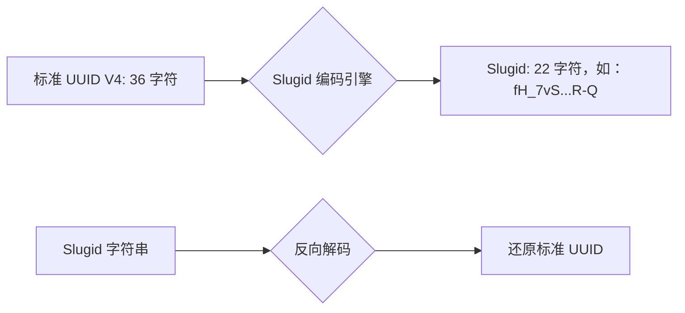

欢迎加入开源鸿蒙跨平台社区：[https://openharmonycrossplatform.csdn.net](https://openharmonycrossplatform.csdn.net)。

# Flutter for OpenHarmony：Flutter 三方库 slugid 紧凑型极短唯一 ID 生成器（极简标识引擎）


## 前言

在鸿蒙（OpenHarmony）应用开发中，唯一标识符（ID）无处不在：日志 Trace ID、分布式文件系统中的临时节点名、或者是用户分享内容的短链接。标准的 UUID（如 `550e8400-e29b-41d4-a716-446655440000`）虽然极其稳定，但它太长了，在移动端屏幕展示或存储时显得十分累赘。

`slugid` 提供了一种精妙的方案：它将 128 位的 UUID 压缩成了一种更短、URL 安全的 Base64 字符串（仅 22 个字符）。在鸿蒙应用追求极致交互与极简审美的今天，`slugid` 是你优雅解决 ID 展示的最佳拍档。

## 一、原理解析 / 概念介绍

### 1.1 基础概念

`slugid` 实质上是对 V4 版 UUID 的一种编码压缩。



### 1.2 进阶概念

- **URL 安全**：编码时自动处理了 `+` 与 `/`，确保 ID 可以直接放在鸿蒙应用的跳转链接中而无需额外 Encode。
- **Nice Slugid**：一种专门生成的、极其友好的短 ID，特别去除了首字符为短横线等可能引起某些解析器误选的问题。

## 二、核心 API / 组件详解

### 2.1 依赖引入

```yaml
dependencies:
  slugid: ^2.0.1
```

### 2.2 核心生成方法

```dart
import 'package:slugid/slugid.dart';

void harmonyIdDemo() {
  // ✅ 推荐做法：快速生成一个极短 ID
  String id = Slugid.v4().toString();
  print('🆔 鸿蒙应用新任务 ID: $id');
  
  // 💡 生成更“美观”的 ID
  String niceId = Slugid.nice().toString();
  print('🆔 自定义美化 ID: $niceId');
}
```

## 三、场景示例

### 3.1 场景一：鸿蒙级内容的“分享短码”

当用户生成一个分享海报，我们需要将数据库的长 ID 转换成短 ID 附在二维码链接中。

```dart
import 'package:slugid/slugid.dart';

String generateSharePath(String dbUuid) {
  // 💡 技巧：将现有的大 UUID 压缩为 Slugid
  final slug = Slugid.decode(dbUuid);
  return 'harmony://share/${slug.toString()}';
}
```


## 四、OpenHarmony 平台适配挑战

### 4.1 字符串长度的布局适配

在鸿蒙的通知栏通知（Notification）或小组件中，字符宽度寸土寸金。

✅ **适配策略建议**：
1. **UI 预留**：Slugid 的 22 字符长度是固定的。在设计鸿蒙 UI 时，可以放心地按照固定长度预留空间。
2. **唯一性信任**：由于它底层就是完整的 UUID V4，所以你完全不需要担心在海量鸿蒙终端中会出现 ID 冲突。

## 五、综合实战示例代码

这是一个包含了 ID 生成与反向还原的鸿蒙调试页：

```dart
import 'package:flutter/material.dart';
import 'package:slugid/slugid.dart';

class HarmonyIdLab extends StatefulWidget {
  const HarmonyIdLab({super.key});

  @override
  _HarmonyIdLabState createState() => _HarmonyIdLabState();
}

class _HarmonyIdLabState extends State<HarmonyIdLab> {
  String _currentSlug = "...";
  String _uuidBack = "...";

  void _generate() {
    final slug = Slugid.v4();
    setState(() {
      _currentSlug = slug.toString();
      // 💡 演示：随时可以还原回标准的 36 位 ID
      _uuidBack = slug.toUuid();
    });
  }

  @override
  Widget build(BuildContext context) {
    return Scaffold(
      appBar: AppBar(title: const Text('slugid 鸿蒙短标识实战')),
      body: Padding(
        padding: const EdgeInsets.all(24),
        child: Column(
          children: [
            const Icon(Icons.fingerprint, size: 80, color: Colors.blueAccent),
            const SizedBox(height: 20),
            Text('生成的短 ID (22位):', style: TextStyle(color: Colors.grey)),
            SelectableText(_currentSlug, style: const TextStyle(fontSize: 22, fontWeight: FontWeight.bold)),
            const Divider(height: 40),
            Text('对应的标准 UUID (36位):', style: TextStyle(color: Colors.grey)),
            SelectableText(_uuidBack, style: const TextStyle(fontSize: 14, fontFamily: 'monospace')),
            const Spacer(),
            ElevatedButton(onPressed: _generate, child: const Text('随机生成一个极简 ID')),
          ],
        ),
      ),
    );
  }
}
```


## 六、总结

`slugid` 遵循了“少即是多”的设计哲学。它在保留了 UUID 强大碰撞安全性的同时，给予了鸿蒙应用前端极其优雅的展示形式。

✅ **核心建议**：
1. 涉及对外展示的业务 ID，全面弃用长 UUID，改用 `Slugid`。
2. 在鸿蒙系统的本地日志打标中，它能帮你节省大约 40% 的文本存储空间。

📦 更多的底层指导代码可进入：[AtomGit 示例专栏](https://atomgit.com)

---

欢迎加入开源鸿蒙跨平台社区：[开源鸿蒙跨平台开发者社区](https://openharmonycrossplatform.csdn.net)
