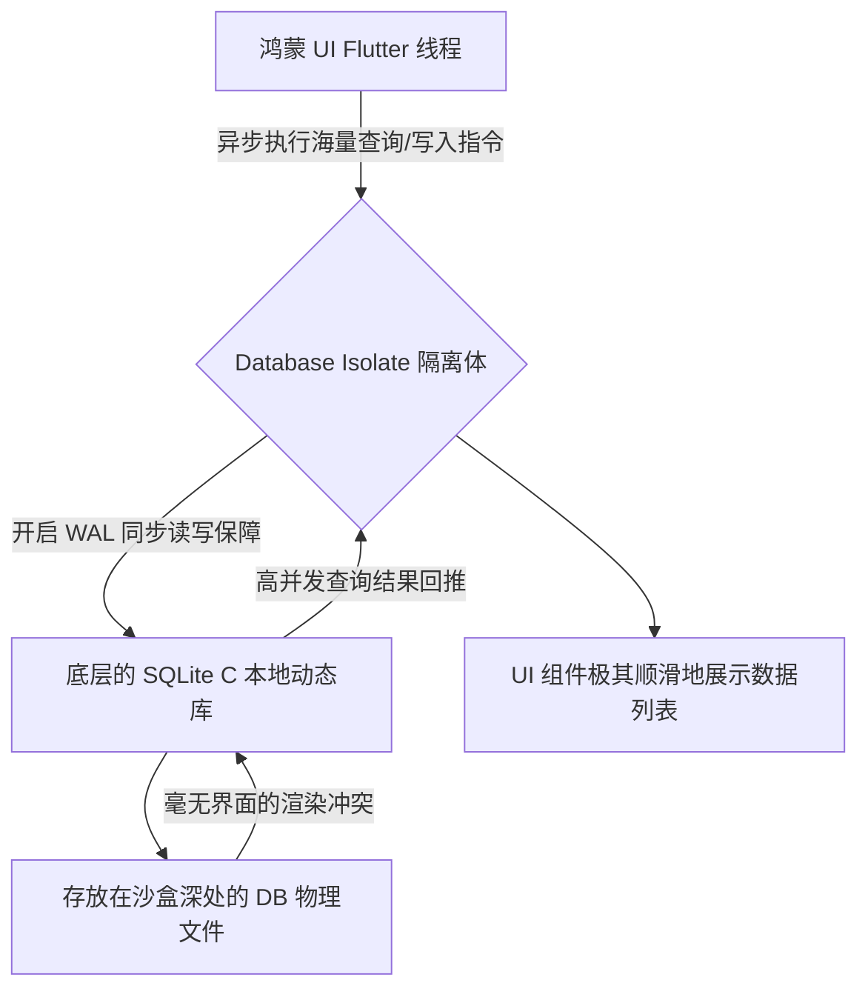

欢迎加入开源鸿蒙跨平台社区：[https://openharmonycrossplatform.csdn.net](https://openharmonycrossplatform.csdn.net)。

# Flutter for OpenHarmony：Flutter 三方库 sqlite_async — 无阻塞异步高性能存储（本地数据库引擎）

## 前言

在鸿蒙（OpenHarmony）大体量应用开发（如离线数据采集、复杂金融对账终端、重度社交）中，本地数据往往占据着应用最核心的架构位置。如果你已经对 `sqflite` 遇到复杂高并发读写时界面出现卡顿甚至线程死锁感到痛苦。

`sqlite_async` 将直接颠覆这一维度。它是在底层重新设计的、基于 Isolate 工作的现代 SQLite 数据库管理插件。它利用 WAL（Write-Ahead Logging 预写日志）模式实现了同一文件的高速多线程访问，在多事务高频读写的极端鸿蒙业务挑战下，它甚至连主界面的刷新都不打扰一丝一毫。

## 一、原理展示 / 概念介绍

### 1.1 基础概念

本库跳出了普通的 MethodChannel，通过 Dart 的 Isolate/FFI 在完全独立的纯后台环境中运行数据库指令。



### 1.2 进阶概念

- **Write-Ahead Logging (WAL)**：最能发挥现代手机性能的极客化技术。在一个线程持续执行数万级 `INSERT` 的高危状态下，另一个线程依然可以飞快地执行 `SELECT` 且毫无死锁。
- **Batched Transactions (批量聚合)**：它能极其聪明地收集零散的操作，并合并抛向底层执行，大幅度减弱鸿蒙操作系统的磁盘 IO 调用。

## 二、核心 API / 组件详解

### 2.1 依赖引入

```yaml
dependencies:
  sqlite_async: ^3.0.0 # 建议确认适配鸿蒙系统的 C 库动态挂接
```

### 2.2 构建高性能数据库管家

在鸿蒙工程中初始化数据库连接池：

```dart
import 'package:sqlite_async/sqlite_async.dart';
import 'package:path/path.dart' as p;

Future<SqliteDatabase> bootstrapHarmonyDB(String dirPath) async {
  // ✅ 推荐做法：极其干净利落的路径控制
  final path = p.join(dirPath, 'harmony_performance.db');
  
  // 💡 重点：它能聪明地自动处理数据库的迭代升级表结构逻辑
  final db = SqliteDatabase(path: path);
  
  await db.initialize(); // 会自动启动后台 Isolate 伺服
  return db;
}
```

## 三、场景示例

### 3.1 场景一：鸿蒙级应用的“万级流水同步”快速落盘

当应用开机时需要从服务器获取 50,000 条极其复杂的聊天记录离线存档。

```dart
// 💡 技巧：利用批处理模式，其极端的落盘性能甚至可以超过原始的异步 IO 速度
await db.writeTransaction((tx) async {
  for (var record in messages) {
    await tx.execute('INSERT INTO chat (msg) VALUES (?)', [record.text]);
  }
});
```


## 四、OpenHarmony 平台适配挑战

### 4.1 FFI C 语言层库文件的装载绑定

该库之所以如此狂暴，是因为其底图部分通常采用原生的 `libsqlite3.so` 通过 Dart FFI 工具（或者是系统库调用）工作。

✅ **适配策略建议**：
1. **确认 C/C++ 支持度**：部分极速定制底层的存储方案对于跨操作系统的 FFI 依赖较重。部署在鸿蒙环境时，必须由构建工具（如 Flutter 鸿蒙版的 CMake 或 DevEco 构建流水线）确保 SQLite 底层库被正确链接进了应用的包体内部。
2. **生命周期彻底切断**：这是由于使用了独立进程模型导致的特性。在进入应用后台乃至退出前，务必谨慎处理 `db.close()` 断魂指令，防止鸿蒙系统的系统管家直接杀死僵尸进程导致数据未能来得及落盘。

## 五、综合实战示例代码

这是一个包含了极其高级的 Watch（监听查询流）与写入演示的鸿蒙 Lab：

```dart
import 'package:flutter/material.dart';
import 'package:sqlite_async/sqlite_async.dart';

class HarmonyDataAsyncLab extends StatefulWidget {
  final SqliteDatabase db;
  const HarmonyDataAsyncLab(this.db, {super.key});

  @override
  _HarmonyDataAsyncLabState createState() => _HarmonyDataAsyncLabState();
}

class _HarmonyDataAsyncLabState extends State<HarmonyDataAsyncLab> {
  // 💡 采用最新异步监听流体系（与 StreamBuilder 极其绝配）
  late Stream<List<String>> _dataStream;

  @override
  void initState() {
    super.initState();
    _dataStream = widget.db.watch('SELECT * FROM user_records', mapper: (row) => row['name'] as String);
  }

  void _addRandomData() async {
    // 💡 执行这行时，因为底层架构优势，界面的 ListView 滚动将毫无卡顿
    await widget.db.execute('INSERT INTO user_records(name) VALUES (?)', ['鸿蒙体验者 ${DateTime.now().second}']);
  }

  @override
  Widget build(BuildContext context) {
    return Scaffold(
      appBar: AppBar(title: const Text('异步数据性能实战')),
      floatingActionButton: FloatingActionButton(onPressed: _addRandomData, child: const Icon(Icons.add)),
      body: StreamBuilder<List<String>>(
        stream: _dataStream,
        builder: (c, snap) {
           if (!snap.hasData) return const Center(child: Text('无记录'));
           return ListView.builder(
              itemCount: snap.data!.length,
              itemBuilder: (c, i) => ListTile(title: Text(snap.data![i])),
           );
        },
      ),
    );
  }
}
```


## 六、总结

`sqlite_async` 将鸿蒙应用的离线数据库性能拉平到了桌面级服务器才有的高度。通过隔离多线程的极致打磨，应用的“前台表现力”终于从底层的“落后沉重”解脱。

✅ **核心建议**：
1. 全新的鸿蒙应用中如果涉及复杂图表、大批量列表推荐全面优先选择此项机制。
2. 配合 `Riverpod` 等极具相应性的状态同步管家一起使用，简直可以称之为双神兵组合。

📦 更多的底层指导代码可进入：[AtomGit 示例专栏](https://atomgit.com)

---

欢迎加入开源鸿蒙跨平台社区：[开源鸿蒙跨平台开发者社区](https://openharmonycrossplatform.csdn.net)
