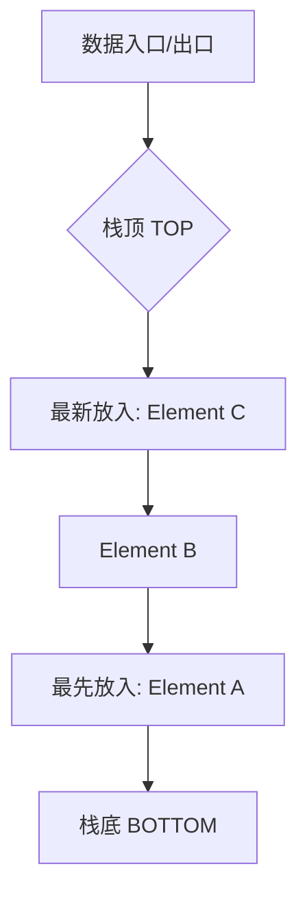

欢迎加入开源鸿蒙跨平台社区：[https://openharmonycrossplatform.csdn.net](https://openharmonycrossplatform.csdn.net)。

# Flutter for OpenHarmony：Flutter 三方库 stack — 轻量级实现 LIFO 栈数据结构（基础算法引擎）

## 前言

在鸿蒙（OpenHarmony）应用的基础逻辑开发中，我们常常需要用到“后进先出（LIFO）”的数据模型。比如：浏览器的历史记录回退、文本编辑器的“撤销/重做”功能、或者是解析极其复杂的嵌套 JSON/表达式。

虽然 Dart 的 `List` 也可以通过 `add` 和 `removeLast` 来模拟栈，但 `stack` 库提供了一个更加纯粹、语义极其明确、且带有类型保护的封装。在追求代码极致可读性的鸿蒙工程中，它是处理状态溯源的最佳选择。

## 一、原理展示 / 概念介绍

### 1.1 基础概念

栈（Stack）就像是一个“窄长的桶”，你只能从顶部放入或取出物品。



### 1.2 进阶概念

- **Push (入栈)**：向栈顶压入一条数据。
- **Pop (出栈)**：从栈顶弹回并移除一条数据。
- **Top/Peek (察看)**：只看一眼栈顶是什么，不破坏栈的结构。
- **Empty Check**：极其高效地判断当前鸿蒙业务流是否已溯源到头。

## 二、核心 API / 组件详解

### 2.1 创建并操作栈

```dart
import 'package:stack/stack.dart' as stack_lib; // ✅ 推荐做法：使用别名防止命名冲突

void harmonyStackDemo() {
  final historyStack = stack_lib.Stack<String>();

  // 1. 压入操作记录
  historyStack.push('首页');
  historyStack.push('详情页');
  
  // 2. 查看当前位置
  print('📍 鸿蒙当前所在页面: ${historyStack.top()}');

  // 3. 模拟“回退”
  if (historyStack.isNotEmpty) {
    historyStack.pop();
    print('🔙 退回到了: ${historyStack.top()}');
  }
}
```

## 三、场景示例

### 3.1 场景一：鸿蒙级应用的“万能撤销”管理器

在绘图或便签应用中，记录用户的每一步操作。

```dart
import 'package:stack/stack.dart' as s;

class UndoManager<T> {
  final _undoStack = s.Stack<T>();

  // 💡 技巧：保存状态快照
  void saveState(T state) => _undoStack.push(state);

  // 💡 技巧：执行撤销
  T? undo() {
    if (_undoStack.length > 1) {
       _undoStack.pop(); // 弹出当前状态
       return _undoStack.top(); // 返回上一步
    }
    return null;
  }
}
```


## 四、OpenHarmony 平台适配挑战

### 4.1 深度嵌套与 Stack Overflow（逻辑层面）

虽然该库操作的是堆内存，但在处理数万级深度的递归解析任务（如极其庞大的嵌套 JSON）时。

✅ **适配策略建议**：
1. **长度监控**：在鸿蒙侧的业务逻辑中，建议为栈设置一个“最大深度”阈值，防止极端的恶意循环导致内存占用失控。
2. **序列化支持**：该库本身不支持持久化。如果你希望鸿蒙应用重启后还能撤销，需要手动遍历栈的内容并存入数据库。

## 五、综合实战示例代码

这是一个包含了基础 UI 交互的“鸿蒙表达式括号匹配”检测器：

```dart
import 'package:flutter/material.dart';
import 'package:stack/stack.dart' as s;

class HarmonyBracketChecker extends StatefulWidget {
  const HarmonyBracketChecker({super.key});

  @override
  _HarmonyBracketCheckerState createState() => _HarmonyBracketCheckerState();
}

class _HarmonyBracketCheckerState extends State<HarmonyBracketChecker> {
  bool? _isValid;
  final _controller = TextEditingController();

  void _check(String text) {
    final stack = s.Stack<String>();
    bool valid = true;
    
    // 💡 核心算法：经典的栈式括号匹配
    for (int i = 0; i < text.length; i++) {
      String char = text[i];
      if (char == '(') {
        stack.push(char);
      } else if (char == ')') {
        if (stack.isEmpty) {
          valid = false;
          break;
        }
        stack.pop();
      }
    }
    
    setState(() => _isValid = valid && stack.isEmpty);
  }

  @override
  Widget build(BuildContext context) {
    return Scaffold(
      appBar: AppBar(title: const Text('stack 鸿蒙算法实战')),
      body: Padding(
        padding: const EdgeInsets.all(20),
        child: Column(
          children: [
            TextField(onChanged: _check, decoration: const InputDecoration(hintText: '输入带括号的表达式验证...')),
            const SizedBox(height: 40),
            Text(
              _isValid == null ? '待验证' : (_isValid! ? '✅ 括号完整' : '❌ 存在括号缺失'),
              style: const TextStyle(fontSize: 22, fontWeight: FontWeight.bold),
            )
          ],
        ),
      ),
    );
  }
}
```


## 六、总结

`stack` 库以一种极其克制的 API 设计，为鸿蒙开发者提供了一个纯净的数据结构工具。它让你的代码在处理“溯源”、“递归”和“回退”逻辑时，比直接操作 `List` 更加稳重、专业。

✅ **核心建议**：
1. 涉及简单的 LIFO 场景时，优先使用此库以提高代码语义。
2. 在处理涉及算法竞赛或编译器原理的鸿蒙应用时，它是你的基石。

📦 更多的底层指导代码可进入：[AtomGit 示例专栏](https://atomgit.com)

---

欢迎加入开源鸿蒙跨平台社区：[开源鸿蒙跨平台开发者社区](https://openharmonycrossplatform.csdn.net)
