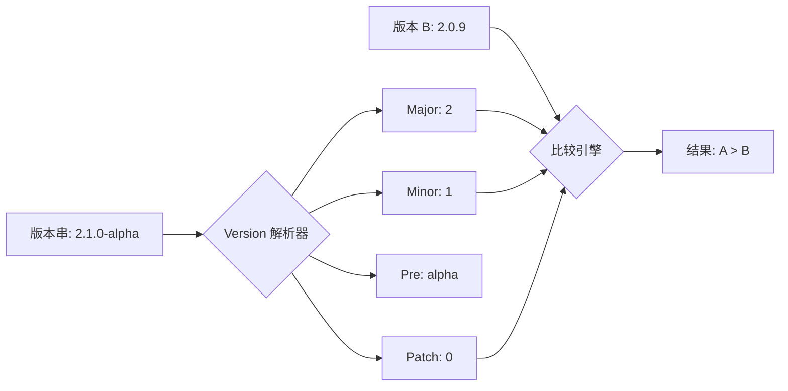

欢迎加入开源鸿蒙跨平台社区：[https://openharmonycrossplatform.csdn.net](https://openharmonycrossplatform.csdn.net)。

# Flutter for OpenHarmony：Flutter 三方库 version 语义化版本解析与比较（版本发布引擎）

## 前言

在鸿蒙（OpenHarmony）应用的生命周期管理中，应用版本升级（OTA）是不可或缺的环节。判定一个服务器下发的版本号（如 `1.2.0-beta.1`）是否高于本地固件版本，并不是简单的字符串比较（因为 `1.10.0` 字符序排在 `1.2.0` 前面）。

`version` 库遵循了严谨的 **SemVer (语义化版本)** 规范。它能帮你极其精准地解析主版本、次版本、修订号以及预发布标签。在构建鸿蒙专属的更新检测系统时，它是你的版本发布指挥官。

## 一、原原理性解析 / 概念介绍

### 1.1 基础概念

版本号的组成通常为 `MAJOR.MINOR.PATCH-PRE+BUILD`。`version` 库将复杂的解析正则封装在内。



### 1.2 进阶概念

- **严格模式 (Strict Mode)**：确保版本字符串完全符合 SemVer 规范，否则抛出异常。
- **预发布优先级**：逻辑上识别 `1.0.0-beta` 低于 `1.0.0`。

## 二、核心 API / 组件详解

### 2.1 依赖引入

```yaml
dependencies:
  version: ^3.0.1
```

### 2.2 核心解析与比较

```dart
import 'package:version/version.dart';

void harmonyVersionLogic() {
  Version currentVer = Version.parse('1.0.1+42');
  Version serverVer = Version.parse('1.2.0-rc.1');

  // ✅ 推荐做法：使用标准操作符
  if (serverVer > currentVer) {
    print('🚀 发现鸿蒙新版本：$serverVer，当前版本 $currentVer');
  }
}
```

## 三、场景示例

### 3.1 场景一：鸿蒙 App 灰度更新逻辑

我们需要根据版本号范围，决定是否开启特定的实验性功能。

```dart
import 'package:version/version.dart';

bool shouldEnableHarmonyNextFeatures(String appVersion) {
  final current = Version.parse(appVersion);
  final target = Version.parse('2.0.0');

  // 💡 技巧：仅针对 2.0.0 以上的大循环版本开启
  return current >= target;
}
```


## 四、OpenHarmony 平台适配挑战

### 4.1 鸿蒙系统特有的 SDK 版本号对齐

鸿蒙的 API Version (如 11, 12) 与应用版本号 (VersionName) 的混淆。

✅ **适配策略建议**：
1. **分级管理**：应用版本比较使用 `version` 库。而鸿蒙底层 API 等级比较，建议使用简单的 `int` 常量比对。
2. **构建号 (Build Number) 处理**：语义化版本中的 `+42` 这类构建号在 `version` 库中会被存储，但**默认不参与大小比较**（符合 SemVer 标准）。如果你的鸿蒙热修复机制依赖构建号，请手动通过 `record.build` 进行额外判定。

```dart
// 💡 适配提示：忽略预发布的小版本差异
bool isSameMajorVersion(Version v1, Version v2) {
  return v1.major == v2.major;
}
```

## 五、综合实战示例代码

这是一个包含了复杂版本排序的鸿蒙固件管理组件：

```dart
import 'package:flutter/material.dart';
import 'package:version/version.dart';

class HarmonyVersionManager extends StatelessWidget {
  const HarmonyVersionManager({super.key});

  @override
  Widget build(BuildContext context) {
    // 模拟从鸿蒙服务器拿到的版本列表，由于网络原因顺序是乱的
    List<String> rawList = ['1.0.5', '2.0.0-beta', '1.10.0', '1.0.2', '0.9.9'];
    
    // 💡 核心实战：将字符串转换为 Version 对象并排序
    List<Version> versions = rawList.map((v) => Version.parse(v)).toList();
    versions.sort(); // 升序排列

    return Scaffold(
      appBar: AppBar(title: const Text('Version 鸿蒙版本演进中心')),
      body: ListView.builder(
        itemCount: versions.length,
        itemBuilder: (context, index) {
          final v = versions[index];
          final isLatest = index == versions.length - 1;
          
          return ListTile(
             leading: CircleAvatar(child: Text('${v.major}')),
             title: Text(v.toString()),
             subtitle: Text(v.preRelease.isNotEmpty ? '🧪 预发布版' : '🛡️ 正式版'),
             trailing: isLatest ? const Chip(label: Text('最新')) : null,
          );
        },
      ),
    );
  }
}
```


## 六、总结

`version` 库是鸿蒙应用“工程化”的基石。在处理极其复杂的升级逻辑、依赖校验、插件版本匹配时，严谨的 SemVer 规则能帮你规避掉绝大多数的逻辑陷阱。

✅ **核心建议**：
1. 后端 API 返回版本号时，严格要求符合 SemVer 格式。
2. 比较版本时，信任 `>` 和 `<` 操作符，而不是字符串 `compareTo`。

📦 更多的底层指导代码可进入：[AtomGit 示例专栏](https://atomgit.com)

---

欢迎加入开源鸿蒙跨平台社区：[开源鸿蒙跨平台开发者社区](https://openharmonycrossplatform.csdn.net)
