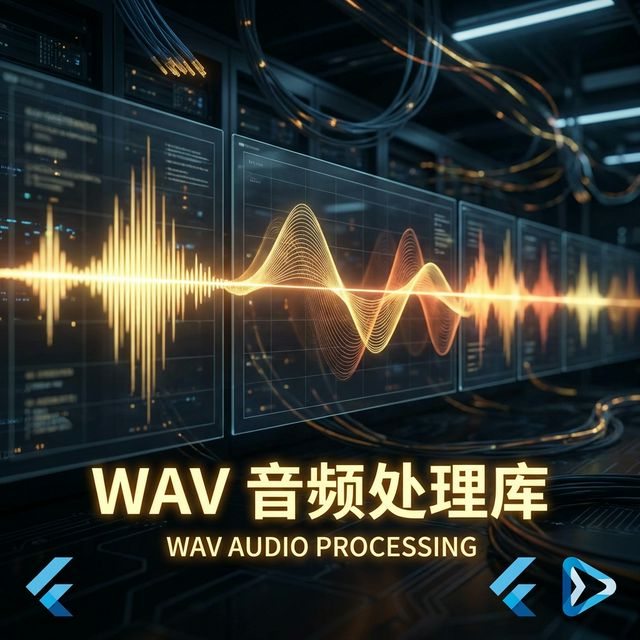
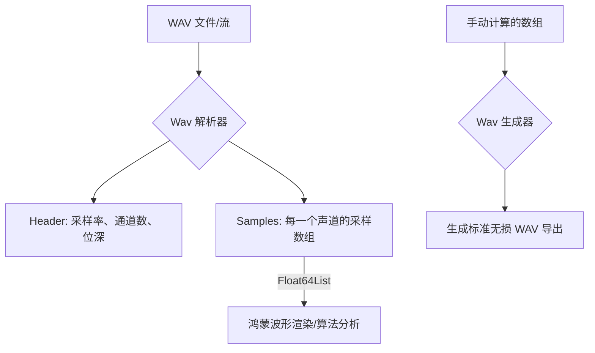

欢迎加入开源鸿蒙跨平台社区：[https://openharmonycrossplatform.csdn.net](https://openharmonycrossplatform.csdn.net)。

# Flutter for OpenHarmony：Flutter 三方库 wav 极简操作 WAV 无损音频（音频底层解析）




## 前言

在鸿蒙（OpenHarmony）音频处理、语音识别预处理或一些特定的音乐节奏类游戏中，我们需要对 WAV 这种原始无损音频格式进行深度解析。你是想要读取音频的每一帧采样值绘制波形图？还是想要根据算法生成一段极其纯净的正弦波音频并保存为文件？

`wav` 库是一款轻量级、不依赖任何平台 Native 接口的音频解析工具。它能让你在鸿蒙应用中以“数组”的形式访问音频数据，实现极其精准的比特级操控。

## 一、原理解析 / 概念介绍

### 1.1 基础概念

WAV 是一种容器格式，其内部核心多为 PCM 采样数据。



### 1.2 进阶概念

- **Sampling Rate (采样率)**：比如 44100Hz。
- **Normalization (归一化)**：库会将原始的 16位或 24位整型采样自动转换为 `-1.0 ~ 1.0` 的浮点数，极大地方便了鸿蒙数学算法的处理。

## 二、核心 API / 组件详解

### 2.1 读取 WAV 文件

在鸿蒙存储或 assets 中加载：

```dart
import 'package:wav/wav.dart';

Future<void> processHarmonyWav(Uint8List bytes) async {
  // 1. 极其简单的解析
  final wav = Wav.read(bytes);
  
  print('🎤 采样率: ${wav.samplesPerSecond} Hz');
  print('🔊 通道数: ${wav.channels.length}');
  
  // 2. 获取第一声道的原始数据
  final channelOneSamples = wav.channels[0];
  print('📊 第一个采样点能量值: ${channelOneSamples[0]}');
}
```

### 2.2 生成并写出音频

```dart
final wav = Wav(
  [Float64List.fromList([0.0, 0.5, 1.0, 0.5, 0.0])], // 单声道采样
  44100
);
final bytes = wav.write(); // 导出为 Uint8List，供鸿蒙保存
```

## 三、场景示例

### 3.1 场景一：鸿蒙“录音动态波形”实时绘制

我们需要获取 WAV 缓存中的采样值来驱动 UI 的线条起伏。

```dart
import 'package:wav/wav.dart';

// 🎨 实战技巧：提取特征值用于 UI
double calculateLoudness(Wav wav) {
  final samples = wav.channels[0];
  // 💡 简单的均方根算法计算响度
  return samples.fold(0.0, (p, c) => p + c * c) / samples.length;
}
```


## 四、OpenHarmony 平台适配挑战

### 4.1 大文件内存管理

由于该库将音频完整读入内存数组。如果处理 100MB 以上的超长 WAV。

✅ **适配策略建议**：
1. **采样跳读**：如果只是为了显示波形图，不要读全量数据。自己写一个流式读取器或分块解析。
2. **Float64 类型开销**：`Float64List` 占用的内存是原始数据的数倍。对于鸿蒙低内存设备，在处理完算法后及时将 `wav` 对象置为 `null` 触发垃圾回收。

```dart
// 💡 适配提示：处理完后手动释放
void done() {
  myWavObject = null;
}
```

## 五、综合实战示例代码

这是一个包含了“生成正弦波纯音”并在鸿蒙上展示基础信息的示例：

```dart
import 'package:flutter/material.dart';
import 'package:wav/wav.dart';
import 'dart:math' as math;

class HarmonyAudioLab extends StatefulWidget {
  const HarmonyAudioLab({super.key});

  @override
  _HarmonyAudioLabState createState() => _HarmonyAudioLabState();
}

class _HarmonyAudioLabState extends State<HarmonyAudioLab> {
  String _info = "点击生成测试音频...";

  void _generateTone() {
    const sr = 44100;
    const freq = 440.0; // 标准 A 音
    final samples = Float64List(sr); // 生成 1 秒
    
    for (int i = 0; i < sr; i++) {
      samples[i] = math.sin(2 * math.pi * freq * i / sr);
    }

    final wav = Wav([samples], sr);
    setState(() {
      _info = "✅ 生成成功！\n采样率：${wav.samplesPerSecond}\n样本总数：${wav.channels[0].length}";
    });
  }

  @override
  Widget build(BuildContext context) {
    return Scaffold(
      appBar: AppBar(title: const Text('wav 鸿蒙底层音频处理')),
      body: Center(
        child: Column(
          children: [
            const Icon(Icons.graphic_eq, size: 100, color: Colors.indigo),
            Padding(padding: const EdgeInsets.all(20), child: Text(_info)),
            ElevatedButton(onPressed: _generateTone, child: const Text('生成 440Hz 无损正弦波')),
          ],
        ),
      ),
    );
  }
}
```


## 六、总结

`wav` 库为鸿蒙开发者打开了音频信号处理的“黑盒”。它不涉及复杂的播放逻辑，只专注于极其纯粹的数据交换，是音频分析、编辑和合成类应用的基石。

✅ **核心建议**：
1. 涉及波形可视化时，它是解析数据源的第一选择。
2. 如果你的鸿蒙应用需要导出高保真音频录样，使用它构建文件内容。

📦 更多的底层指导代码可进入：[AtomGit 示例专栏](https://atomgit.com)

---

欢迎加入开源鸿蒙跨平台社区：[开源鸿蒙跨平台开发者社区](https://openharmonycrossplatform.csdn.net)
