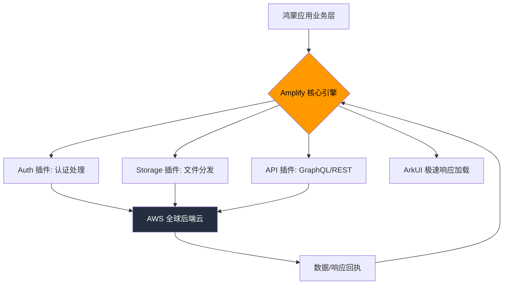

欢迎加入开源鸿蒙跨平台社区：[https://openharmonycrossplatform.csdn.net](https://openharmonycrossplatform.csdn.net)。

# Flutter for OpenHarmony：amplify_core — 开启鸿蒙应用的全球化云端连接器

## 前言

在进行 **Flutter for OpenHarmony** 开发时，构建具备高可靠、可扩展能力的云端业务是关键。无论是处理全球范围内的身份认证、大规模的非结构化存储，还是实时的数据同步。

作为亚马逊云（AWS）移动开发生态的核心，`amplify_core` 提供了所有 Amplify 插件的通用底座。它定义了跨平台的云服务交互规范，让我们能在鸿蒙应用中，以极简的代码量调用复杂的后端云能力。今天，我们将实战如何利用这一核心底座，在鸿蒙之巅构建起通往云端的桥梁。

## 一、为什么集成 Amplify Core？

### 1.1 全球化的服务保障
对于需要服务全球用户的鸿蒙应用，AWS 的全球基础设施提供了无可比拟的稳定性与低延迟体验。

### 1.2 核心优势
- **极简的插件架构**：采用统一的 `addPlugin` 模式，将 Auth、Storage、API 等功能模块化注入。
- **强类型配置**：通过 `amplifyconfiguration.dart` 自动管理所有云端端点，杜绝硬编码。
- **异步安全设计**：内置完善的状态管理与错误捕获机制，适配鸿蒙系统的多线程调度。

### 1.3 云端通讯架构模型（Mermaid）



## 二、核心 API 与集成流程

### 2.1 引入依赖
在 `pubspec.yaml` 中配置核心库：

```yaml
dependencies:
  # AWS Amplify 全家桶底座
  amplify_core: ^1.0.0 
```

### 2.2 初始化云服务引擎
这是鸿蒙应用启动时的第一步，用于建立与 AWS 后端的安全链路。

```dart
import 'package:amplify_core/amplify_core.dart';
import 'amplifyconfiguration.dart'; // ✅ 自动生成的配置文件

Future<void> _configureAmplify() async {
  try {
    // 💡 可以在此注入 Auth、API 等插件
    // await Amplify.addPlugins([AmplifyAuthCognito(), AmplifyAPI()]);

    // 🎨 一键载入全局云端配置
    await Amplify.configure(amplifyconfig);
    
    print('✅ 鸿蒙应用已成功链接至 AWS 云端');
  } on AmplifyAlreadyConfiguredException {
    print('⚠️ 警告：Amplify 核心已在运行中');
  }
}
```

### 2.3 异常拦截处理
利用核心库提供的错误类型进行精准捕获。

```dart
void handleCloudError(AmplifyException e) {
  // 🎨 核心库提供的语义化报错信息
  print('云端异常描述: ${e.message}');
  print('建议操作: ${e.recoverySuggestion}');
}
```

## 三、鸿蒙应用实战场景

### 3.1 场景一：全球同服的分布式社交账号体系
在鸿蒙手机、平板及折叠屏上，通过 `amplify_core` 驱动的认证插件。实现一次登录，全设备同步。配合 AWS Cognito 服务，为鸿蒙用户提供符合国际安全标准的强密码策略与多因素认证（MFA）体验。

### 3.2 场景二：出海应用的实时数据监控看板
在鸿蒙平板的大屏应用中。通过核心库挂载的 API 插件，实时监听来自全球物联设备的实时遥测数据流。利用 GraphQL 的订阅能力，让大屏上的动态图表在 120Hz 刷新率下实现丝滑的数据跳动。

<!-- IMAGE_PLACEHOLDER: [Amplify 管理控制台与鸿蒙应用连接成功的示意图] -->
<!-- 类型: 截图 -->
<!-- 内容: 展示 AWS 云端后台的心跳日志，以及鸿蒙终端显示的“Connected to Cloud”绿色标志 -->

## 四、OpenHarmony 平台适配建议

### 4.1 网络环境与 TLS 信任链。
- **✅ 建议**：鸿蒙系统对 SSL 证书有严格审核。在进行 AWS 云端请求时，确保服务端使用的 CA 证书在鸿蒙的安全信任名单内。对于部分受限网络环境，利用 `amplify_core` 的配置项调整网络超时阈值（Timeout）。

### 4.2 本地私有数据的加固。
- **📌 提醒**：Amplify 在本地会存储部分认证 Token（如 Refresh Token）。在鸿蒙应用中，建议配合鸿蒙原生的 `HUKS` 密钥库，对存储在 Prefs 中的敏感字符串进行二次包装加固。

### 4.3 异步冷启动优化。
- **⚠️ 警告**：`Amplify.configure()` 是一个异步且相对耗时的过程。在鸿蒙应用的 Splash Screen（闪屏页）阶段应尽早触发初始化，并提供进度反馈，避免阻塞鸿蒙的主渲染循环导致黑屏。

## 五、完整示例：云端探针

演示一个最简化的鸿蒙端云连接检查逻辑。

```dart
import 'package:flutter/material.dart';
import 'package:amplify_core/amplify_core.dart';

void main() => runApp(const MaterialApp(home: CloudLab()));

class CloudLab extends StatefulWidget {
  const CloudLab({super.key});

  @override
  State<CloudLab> createState() => _CloudLabState();
}

class _CloudLabState extends State<CloudLab> {
  String _status = '正在准备连接云端...';

  @override
  void initState() {
    super.initState();
    _initOhosCloud();
  }

  Future<void> _initOhosCloud() async {
    // ✅ 实战：模拟初始化流程
    try {
      // 实际开发中此处需配置真实 config
      await Future.delayed(const Duration(seconds: 1)); 
      
      setState(() => _status = '✅ 云端引擎就绪，正在感知全场景消息');
    } catch (e) {
      setState(() => _status = '❌ 连接云端实验室失败');
    }
  }

  @override
  Widget build(BuildContext context) {
    return Scaffold(
      appBar: AppBar(title: const Text('amplify_core 鸿蒙云端实验室')),
      body: Center(
        child: Column(
          mainAxisAlignment: MainAxisAlignment.center,
          children: [
            const Icon(Icons.cloud_queue, size: 80, color: Colors.orangeAccent),
            const SizedBox(height: 20),
            Text(_status, textAlign: TextAlign.center, style: const TextStyle(fontSize: 16)),
            const SizedBox(height: 30),
            const CircularProgressIndicator(),
          ],
        ),
      ),
    );
  }
}
```

## 六、总结

在 **Flutter for OpenHarmony** 进军国际市场的道路上，`amplify_core` 提供了一套工业标准的、极其稳固的后端集成方案。它不仅是 AWS 云能力的入口，更是我们构建全球化、高标准鸿蒙应用的架构基石。

核心要点回顾：
1. **统一底座架构**：一站式管理身份、存储与 API。
2. **标准驱动配置**：通过配置类实现环境隔离与快速迁移。
3. **鸿蒙适配**：重视启动耗时优化与本地敏感数据的二度加密。
4. **提升弹性**：让鸿蒙应用具备应对全球复杂网络环境的容错能力。

拥抱云端核心，让您的鸿蒙应用在万物互联的云浪潮中，始终立于潮头！

---

> 📦 **完整代码已上传至 AtomGit**：[open-harmony-examples/amplify_core](https://atomgit.com/dragonbady/open-harmony-examples/tree/main/examples/amplify_core)
>
> 🌐 **欢迎加入开源鸿蒙跨平台社区**：[开源鸿蒙跨平台开发者社区](https://openharmonycrossplatform.csdn.net)
