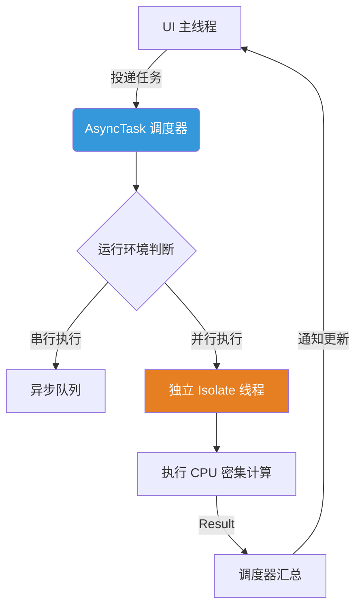

欢迎加入开源鸿蒙跨平台社区：[https://openharmonycrossplatform.csdn.net](https://openharmonycrossplatform.csdn.net)。

# Flutter for OpenHarmony：async_task — 驾驭鸿蒙并发异步任务流


## 前言

随着鸿蒙设备（OpenHarmony）性能的不断跃升，应用承载的业务逻辑也愈发沉重。从大规模数据解析、高质量图像处理，到复杂的 AI 算法模型，这些操作如果全部挤在主 UI 线程中，难免会导致掉帧和卡顿。

在 **Flutter for OpenHarmony** 开发中，虽然 Dart 提供了 `Future` 和 `Stream`，但在处理真正的 CPU 密集型任务时，我们通常需要借助 `Isolate` 来实现多核并行。`async_task` 库正是一个旨在简化异步流管理和并行任务执行的强大方案，它能帮助我们更优雅地调度鸿蒙系统资源。

## 一、异步任务的管理艺术

### 1.1 传统 Isolate 的痛点
直接使用原生 `Isolate` 接口时，开发者需要手动处理双向的 `ReceivePort` 和 `SendPort` 通信逻辑，代码极易变得混乱且难以调试。

### 1.2 async_task 的核心价值
- **任务封装化**：将逻辑包装成 `AsyncTask` 类，结构清晰。
- **自动化生命周期**：自动处理并行运行时的启动、执行与结果回调。
- **并发控制**：内置任务池的概念，防止因产生过多的并行任务而耗尽系统内存。

### 1.3 任务调度流程模型（Mermaid）



## 二、核心 API 与功能讲解

### 2.1 引入依赖
在 `pubspec.yaml` 中配置：

```yaml
dependencies:
  # 高级异步任务管理器
  async_task: ^1.2.0
```

### 2.2 定义任务类
我们需要继承 `AsyncTask` 并实现核心逻辑。

```dart
import 'package:async_task/async_task.dart';

// 💡 定义一个耗时的数学计算任务
class HeavyPhysicsTask extends AsyncTask<int, double> {
  final int iterations;
  HeavyPhysicsTask(this.iterations);

  @override
  int instantiateArguments() => iterations;

  @override
  FutureOr<double> run() {
    double result = 0.0;
    for (var i = 0; i < iterations; i++) {
      result += (i * 0.1); // 模拟耗时操作
    }
    return result;
  }
}
```

### 2.3 任务执行与结果接收
在 UI 层发起任务请求：

```dart
void triggerTask() {
  final task = HeavyPhysicsTask(1000000);
  
  // 🎨 在异步任务池中执行
  AsyncExecutor().execute(task).then((value) {
    print('任务执行完成，结果为: $value');
  });
}
```

## 三、鸿蒙应用实战场景

### 3.1 场景一：复杂数据报告生成
在鸿蒙办公类应用中，导出或解析一个含有数万行数据的 Excel 报告。通过 `async_task` 将解析过程放到后台，用户依然可以流畅地在 UI 上进行操作。

### 3.2 场景二：后台 AI 推理模拟
在一些轻量级的本地分类或推荐算法中，我们可以预先加载算法包，在后台周期性地计算推荐得分，保证鸿蒙设备运行时的冷启动效率。

## 四、OpenHarmony 平台适配建议

### 4.1 任务优先级适配
鸿蒙系统对不同类型任务的资源分配有严格管控。
- **✅ 建议**：对于需要即时反馈的任务（如 UI 点击后的简单请求），直接使用普通的 `Future` 即可；对于超过 200ms 的纯计算任务，务必使用 `async_task` 走并行通道。

### 4.2 内存阈值预警
鸿蒙设备的内存虽然在不断增加，但过度开启 `Isolate` 会导致显著的内存开销。
- **📌 提醒**：在使用 `async_task` 时，通过 `executor.parallelism` 来限制最大的并行线程数，建议设置为 `2` 或 `4`，以兼顾性能与功耗。

### 4.3 生命周期同步
鸿蒙应用在后台挂起时，任务可能会被系统冻结。
- **⚠️ 警告**：对于极长时间的持续任务，请结合鸿蒙系统的 `BackgroundTask`（后台任务中心）能力，确保逻辑不会被系统清理。

## 五、完整示例代码

此示例演示了一个带状态展示的并行任务实验室。

```dart
import 'package:flutter/material.dart';
import 'package:async_task/async_task.dart';

class MyComputeTask extends AsyncTask<int, String> {
  final int input;
  MyComputeTask(this.input);

  @override
  int instantiateArguments() => input;

  @override
  String run() {
    // 模拟一段漫长的计算
    var total = 0;
    for(var i=0; i<input; i++) total += i;
    return '计算结果: $total';
  }
}

void main() => runApp(const MaterialApp(home: AsyncTaskLab()));

class AsyncTaskLab extends StatefulWidget {
  const AsyncTaskLab({super.key});

  @override
  State<AsyncTaskLab> createState() => _AsyncTaskLabState();
}

class _AsyncTaskLabState extends State<AsyncTaskLab> {
  String _status = '就绪';
  final AsyncExecutor _executor = AsyncExecutor(parallelism: 2);

  void _runTasks() async {
    setState(() => _status = '正在跑 100 万次迭代并行计算...');
    
    // ✅ 实战：投递到并行任务池
    final task = MyComputeTask(1000000);
    final result = await _executor.execute(task);
    
    setState(() => _status = '完成！ $result');
  }

  @override
  Widget build(BuildContext context) {
    return Scaffold(
      appBar: AppBar(title: const Text('async_task 鸿蒙并发实验室')),
      body: Center(
        child: Column(
          mainAxisAlignment: MainAxisAlignment.center,
          children: [
            Text('任务状态：$_status', style: const TextStyle(fontSize: 18)),
            const SizedBox(height: 30),
            ElevatedButton(onPressed: _runTasks, child: const Text('启动并行任务')),
          ],
        ),
      ),
    );
  }
}
```

## 六、总结

`async_task` 通过提供高层级的异步抽象，降低了鸿蒙跨平台应用在处理复杂并发逻辑时的门槛。它让我们的代码在高性能与代码可读性之间找到了最佳平衡点。

核心要点回顾：
1. **AsyncTask 封装**：业务逻辑与调度分离。
2. **多核并行**：后台利用 Isolate 释放鸿蒙 CPU 潜力。
3. **并发限流**：通过并行度控制防止内存爆炸。
4. **鸿蒙适配**：合理分配优先级，结合后台机制。

让我们一起在鸿蒙平台上，打造响应如闪电、计算如风暴的高性能应用！

---

> 📦 **完整代码已上传至 AtomGit**：[open-harmony-examples/async_task](https://atomgit.com/dragonbady/open-harmony-examples/tree/main/examples/async_task)
>
> 🌐 **欢迎加入开源鸿蒙跨平台社区**：[开源鸿蒙跨平台开发者社区](https://openharmonycrossplatform.csdn.net)
