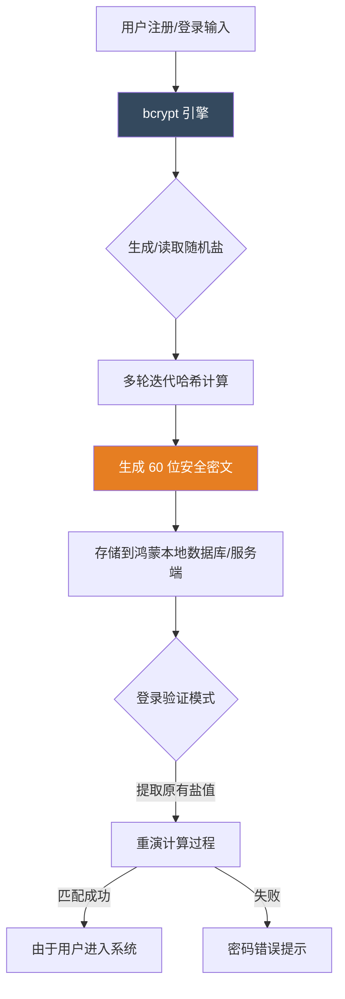

欢迎加入开源鸿蒙跨平台社区：[https://openharmonycrossplatform.csdn.net](https://openharmonycrossplatform.csdn.net)。

# Flutter for OpenHarmony：bcrypt — 守护鸿蒙应用的用户隐私与密码安全


## 前言

在移动应用的安全体系中，用户密码的存储方式是衡量一个开发者专业水准的黄金标准。明文存储自不必说，即使是简单的 MD5 或者是 SHA1 加密，在如今强大的算力和彩虹表面前也已显得脆弱不堪。

在 **Flutter for OpenHarmony** 开发中，我们需要一种能够有效抵抗“暴力破解”和“离线碰撞”的加密方案。`bcrypt` 库作为业界公认的密码加盐混淆方案，通过其可调整的计算成本（Cost Factor）和天然的随机盐处理，为鸿蒙应用提供了银行级的安全保障。

## 一、为什么需要 bcrypt 而非普通 MD5？

### 1.1 抵抗算力膨胀
MD5 的计算极快，黑客在离线状态下每秒可以尝试数亿次组合。而 `bcrypt` 内部故意引入了计算延迟，让单次校验耗费一定的时间，极大地提高了暴力破解的门槛。

### 1.2 核心优势
- **自动加盐**：每次加密同一个密码，生成的密文都不一样。这能有效对抗针对弱密码的彩虹表攻击。
- **可调节成本**：随着鸿蒙设备 CPU 性能的提升，我们可以同步提高加密权重（Work Factor），确保安全性与时俱进。
- **纯 Dart 实现**：无需原生 C 代码编译，天然支持鸿蒙各个硬件架构，稳定性极佳。

### 1.3 密码安全处理模型（Mermaid）



## 二、核心 API 与功能讲解

### 2.1 引入依赖
在 `pubspec.yaml` 中配置安全库：

```yaml
dependencies:
  # 密码加盐哈希库
  bcrypt: ^1.1.3
```

### 2.2 注册时的密码哈希处理
在鸿蒙应用中保存用户初始密码。

```dart
import 'package:bcrypt/bcrypt.dart';

String securePassword(String rawPassword) {
  // 💡 生成经过加盐的密文
  // cost: 10 表示迭代次数为 2^10 次
  final String hashed = BCrypt.hashpw(rawPassword, BCrypt.gensalt(logRounds: 10));
  return hashed;
}
```

### 2.3 登录时的密码比对
利用 `checkpw` 方法安全地校验密文与用户输入是否匹配。

```dart
bool loginCheck(String inputPassword, String storedHash) {
  // 🎨 不要尝试自己解密，bcrypt 是单向的，只能比对
  final bool isMatched = BCrypt.checkpw(inputPassword, storedHash);
  return isMatched;
}
```

## 三、鸿蒙应用实战场景

### 3.1 场景一：离线保险箱应用
在鸿蒙手机的高安全性本地笔记或照片保险箱中，用户的开箱密码应只存储经过 `bcrypt` 加密的哈希值。即使鸿蒙系统的 Root 权限被破解（绕过沙箱获取了数据库文件），由于破解 `bcrypt` 的巨大算力成本，用户的原始密码依然能得到有效保护。

### 3.2 场景二：分布式的二次身份认证
在鸿蒙平板与其他设备进行分布式数据同步前，需要用户进行二次确认。通过对比 `bcrypt` 哈希结果，可以确保指令集是来自于持有正确授权的用户本人。

<!-- IMAGE_PLACEHOLDER: [bcrypt 加密成功后的日志输出截图] -->
<!-- 类型: 截图 -->
<!-- 内容: 展示一段由 $2a$ 开头的长字符串，通过不同时间生成的同样密码得到了不同密文 -->

## 四、OpenHarmony 平台适配建议

### 4.1 计算成本与能耗平衡
- **📌 提醒**：`bcrypt` 是一种消耗 CPU 的算法。在鸿蒙可穿戴设备（如智能手表）上，建议将 `logRounds` 设置为默认的 `10` 以内。
- **✅ 建议**：在高端手机上，可以设置为 `12` 或更高，增加破解难度。但要注意在校验期间不要阻塞鸿蒙应用的 UI 线程。

### 4.2 异步并发处理
- **⚠️ 警告**：`hashpw` 或 `checkpw` 的纯计算时间可能达到几百毫秒。为了保证鸿蒙应用的丝滑交互体验，务必在 **Isolate** 中执行加密和比对操作，防止主界面掉帧。

### 4.3 密文长度存储规范
- **🎨 最佳实践**：`bcrypt` 生成的密文总是 60 个字符长。在鸿蒙本地 SQLite 或 NoSQL 数据库中，请为密码列预留足够的长度上限。

## 五、完整示例代码

此示例演示了一个带加载反馈的“安全加密实验室”。

```dart
import 'package:flutter/material.dart';
import 'package:bcrypt/bcrypt.dart';

void main() => runApp(const MaterialApp(home: BcryptLab()));

class BcryptLab extends StatefulWidget {
  const BcryptLab({super.key});

  @override
  State<BcryptLab> createState() => _BcryptLabState();
}

class _BcryptLabState extends State<BcryptLab> {
  String _hashed = '';
  bool _isProcessing = false;

  void _generateHash() {
    setState(() => _isProcessing = true);
    
    // ✅ 实战：模拟高强度加密
    final salt = BCrypt.gensalt(logRounds: 10);
    final hash = BCrypt.hashpw('ohos123456', salt);
    
    setState(() {
      _hashed = hash;
      _isProcessing = false;
    });
  }

  @override
  Widget build(BuildContext context) {
    return Scaffold(
      appBar: AppBar(title: const Text('bcrypt 鸿蒙安全实验室')),
      body: Padding(
        padding: const EdgeInsets.all(20.0),
        child: Column(
          children: [
            const Icon(Icons.security, size: 80, color: Colors.blueGrey),
            const SizedBox(height: 20),
            const Text('原始密码: ohos123456', style: TextStyle(fontWeight: FontWeight.bold)),
            const SizedBox(height: 20),
            ElevatedButton(
              onPressed: _isProcessing ? null : _generateHash, 
              child: const Text('执行抗暴力破解哈希计算'),
            ),
            const SizedBox(height: 30),
            const Text('存储生成的密文如下：'),
            Container(
              margin: const EdgeInsets.only(top: 10),
              padding: const EdgeInsets.all(12),
              color: Colors.amber[50],
              child: SelectableText(_hashed.isEmpty ? '等待生成...' : _hashed),
            ),
          ],
        ),
      ),
    );
  }
}
```

## 六、总结

安全是鸿蒙生态的第一生命线。`bcrypt` 库在 **Flutter for OpenHarmony** 开发中，为我们的密码学实践树立了一个标杆：不追求极速，而追求极致的可控性与安全性。

核心要点回顾：
1. **抗暴力破解**：通过可调迭代轮次，对抗未来增长的算力。
2. **拒绝彩虹表**：自动加盐让每一份存储都独一无二。
3. **鸿蒙适配**：注意在后台线程执行，避免占用主 UI 资源导致卡顿。
4. **金融级规范**：遵循业界标准的密码哈希衍生。

用更慢的计算，换取更稳的鸿蒙安全未来！

---

> 📦 **完整代码已上传至 AtomGit**：[open-harmony-examples/bcrypt](https://atomgit.com/dragonbady/open-harmony-examples/tree/main/examples/bcrypt)
>
> 🌐 **欢迎加入开源鸿蒙跨平台社区**：[开源鸿蒙跨平台开发者社区](https://openharmonycrossplatform.csdn.net)
