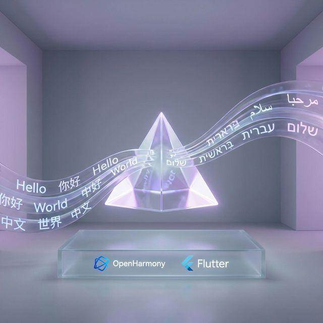
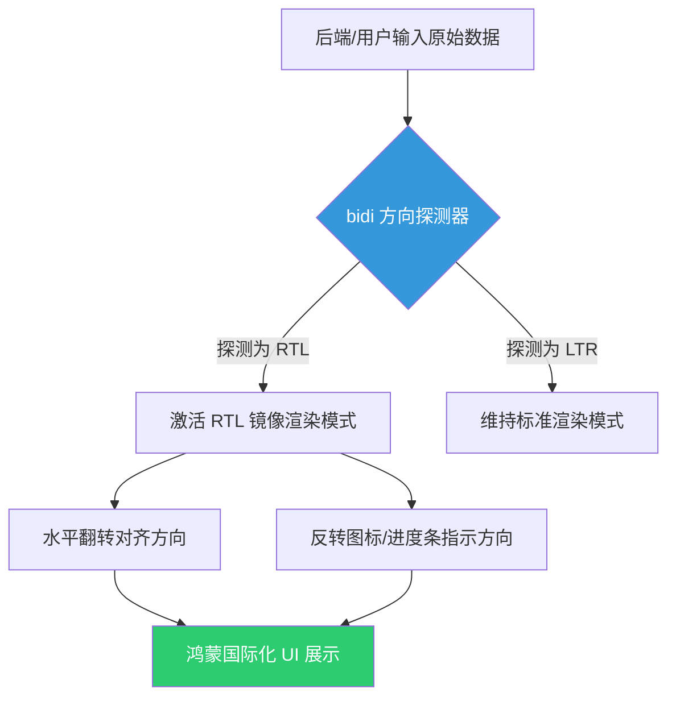

欢迎加入开源鸿蒙跨平台社区：[https://openharmonycrossplatform.csdn.net](https://openharmonycrossplatform.csdn.net)。

# Flutter for OpenHarmony：bidi — 让鸿蒙应用完美适配从右向左（RTL）的多语言排版




## 前言

随着鸿蒙（OpenHarmony）生态的全球化步伐迈向中东和北非等地区，支持 **RTL (Right-to-Left)** 布局已成为面向全球市场的核心要求。对于阿拉伯语、希伯来语、波斯语等语言，文字的顺序是从右往左读，而 UI 的整体架构（如返回按钮的位置、进度条的方向）也需要相应地进行镜像翻转。

在 **Flutter for OpenHarmony** 开发中，处理双向文本（Bi-Directional）并确保排版正确是一项精细的工作。`bidi` 库作为一个专注于双向文本逻辑处理的工具包，能帮助我们在鸿蒙应用中优雅地解决语言方向带来的“镜像挑战”。

## 一、为什么需要专门的 bidi 库？

### 1.1 文字方向的复杂性
在同一段话中，可能既包含从右向左读的阿拉伯语，又包含从左向右读的数字或英文。如果没有专门的解析逻辑，文字可能会出现错位或语义歧义。

### 1.2 核心优势
- **双向文字检测**：自动判断一段文本的主方向。
- **视觉顺序转换**：确保逻辑上的字符顺序在鸿蒙 UI 渲染时表现出符合直觉的视觉顺序。
- **极致轻量**：纯 Dart 逻辑实现，无平台特定依赖，完美兼容鸿蒙穿戴、手机及智慧屏等各终端。

### 1.3 RTL 布局自适应模型（Mermaid）



## 二、核心 API 与功能讲解

### 2.1 引入依赖
在 `pubspec.yaml` 中配置：

```yaml
dependencies:
  # 双向文本处理库
  bidi: ^0.1.0 
```

### 2.2 文本方向动态识别
在渲染前预判文字属于哪类语言族群。

```dart
import 'package:bidi/bidi.dart' as bidi;

void detectTextDirection(String text) {
  // 💡 探测文本是否以 RTL 语言为主
  bool isRtl = bidi.Bidi.startsWithRtl(text);
  
  if (isRtl) {
    print('当前输入为从右向左显示的语言（如阿拉伯语）');
  } else {
    print('当前输入为标准 LTR 语言');
  }
}
```

### 2.3 处理混合文本逻辑
在长段落中处理阿拉伯语与英文的混排。

```dart
void wrapLtrInRtl() {
  String input = "OpenHarmony 是一门创新的系统";
  // 🎨 利用库函数为特定语言块进行方向标记（Context Wrapping）
  // 确保在 RTL 环境下，英文部分不会发生“逻辑颠倒”
  String wrapped = bidi.Bidi.stripHtmlIfNeeded(input);
  print('处理后的排版代码: $wrapped');
}
```

## 三、鸿蒙应用实战场景

### 3.1 场景一：全球化社交应用中的动态反馈
在鸿蒙手机的社交应用中。当用户在评论区发表阿拉伯语动态时，应用通过 `bidi` 实时检测。如果检测到首个强方向字符是 RTL，则动态切换该卡片的文本对齐方式（`TextAlign.right`）及内边距位置。

### 3.2 场景二：分布式的系统设置面板
在适配中东地区市场的鸿蒙平板系统中。不仅是文字，连“设置”菜单的侧边导航栏也需要镜像到右侧。通过 `bidi` 的方向结果驱动 Flutter 的 `Directionality` 全局控制器，实现全站的一键一镜像变换。

<!-- IMAGE_PLACEHOLDER: [RTL 布局在鸿蒙真机上的镜像对比截图] -->
<!-- 类型: 截图 -->
<!-- 内容: 展示左边标准中文版 UI 和右边完全镜像后的阿拉伯语版 UI 排版对比 -->

## 四、OpenHarmony 平台适配建议

### 4.1 字体库的完整性。
- **📌 提醒**：RTL 语言对字体的渲染要求较高。在鸿蒙系统开发时，确保应用引用的字体集涵盖了完整的阿拉伯语或希伯来语 Unicode 字节集，防止出现“小方块”或“连字”失效。

### 4.2 图标的异步镜像策略。
- **✅ 建议**：并不是所有的图标在 RTL 模式下都需要镜像。比如“时钟”不需要翻转，但“返回按钮”和“指示箭头”必须镜像。建议建立一套图标资源映射表，结合 `bidi` 的判断结果进行动态分发。

### 4.3 字符截断与换行优化
- **⚠️ 警告**：在 RTL 环境下，文本的 `TextOverflow.ellipsis`（省略号）应该在左侧展示。在鸿蒙的高刷屏上，注意检查长文本溢出时的视觉定位是否符合该语言的阅读直觉。

## 五、完整示例：方向感应器

演示一个可在鸿蒙端运行的“即时方向识别看板”。

```dart
import 'package:flutter/material.dart';
import 'package:bidi/bidi.dart' as bidi;

void main() => runApp(const MaterialApp(home: BidiLab()));

class BidiLab extends StatefulWidget {
  const BidiLab({super.key});

  @override
  State<BidiLab> createState() => _BidiLabState();
}

class _BidiLabState extends State<BidiLab> {
  String _inputText = '';
  bool _isRtl = false;

  void _onChanged(String val) {
    // ✅ 实战：实时反馈当前文本方向
    setState(() {
      _inputText = val;
      _isRtl = bidi.Bidi.startsWithRtl(val);
    });
  }

  @override
  Widget build(BuildContext context) {
    return Scaffold(
      appBar: AppBar(title: const Text('bidi 鸿蒙国际化实验室')),
      body: Padding(
        padding: const EdgeInsets.all(20.0),
        child: Column(
          children: [
            TextField(
              decoration: const InputDecoration(hintText: '输入任何语言（如: مرحبا ）'),
              onChanged: _onChanged,
            ),
            const SizedBox(height: 30),
            Container(
              width: double.infinity,
              padding: const EdgeInsets.all(16),
              color: Colors.grey[200],
              child: Text(
                _inputText.isEmpty ? '预览区域' : _inputText,
                // ✅ 根据探测结果动态调整对齐方式
                textAlign: _isRtl ? TextAlign.right : TextAlign.left,
                style: const TextStyle(fontSize: 24),
              ),
            ),
            const SizedBox(height: 10),
            Text('方向检测: ${_isRtl ? "从右向左 [RTL]" : "从左向右 [LTR]"}'),
          ],
        ),
      ),
    );
  }
}
```

## 六、总结

在鸿蒙系统走向全球化的征程中，细节的适配直接决定了品牌的高度。通过 `bidi` 库，我们将复杂的双向文本逻辑工程化，让每一位中东地区的鸿蒙用户都能感受到那种“如履平地”的母语阅读体验。

核心要点回顾：
1. **方向自动探测**：基于 Unicode 规范精准识别 LTR/RTL。
2. **镜像逻辑驱动**：驱动 UI 排版实现镜像翻转。
3. **鸿蒙适配**：注意与多语言字体支持及特殊图标的反转策略相结合。
4. **提升包容性**：让技术跨越文化边界，构建真正全球化的鸿蒙应用。

适配 RTL，让您的鸿蒙应用具备连接世界的广阔视野！

---

> 📦 **完整代码已上传至 AtomGit**：[open-harmony-examples/bidi](https://atomgit.com/dragonbady/open-harmony-examples/tree/main/examples/bidi)
>
> 🌐 **欢迎加入开源鸿蒙跨平台社区**：[开源鸿蒙跨平台开发者社区](https://openharmonycrossplatform.csdn.net)
