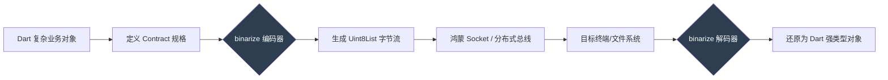

欢迎加入开源鸿蒙跨平台社区：[https://openharmonycrossplatform.csdn.net](https://openharmonycrossplatform.csdn.net)。

# Flutter for OpenHarmony：binarize — 卓越的二进制序列化与数据封包利器

## 前言

在高性能移动应用中，数据传输的效率直接决定了系统的吞吐量和延迟。虽然 JSON 格式由于其良好的可读性成为了主流，但在处理大规模结构化数据、传感器高频采样流或者是底层协议对接时，JSON 的字符解析开销和臃肿的体积往往会成为鸿蒙（OpenHarmony）应用性能的瓶颈。

在 **Flutter for OpenHarmony** 开发中，我们需要一种能够将 Dart 对象直接转换为极小字节流，并能在另一端快速还原的方案。`binarize` 库通过一种类型安全、流式处理的方式，为我们提供了工业级的二进制封包能力。今天，我们将实战如何利用它在鸿蒙设备间建立起高效的通讯底座。

## 一、为什么选择二进制序列化？

### 1.1 极致的体积优化
相比于 JSON，二进制格式可以节省 50% 以上的带宽开销。一份包含 1000 个 GPS 坐标的数据，JSON 可能需要几十 KB，而经过 `binarize` 处理后的二进制流可能仅需几 KB。

### 1.2 核心优势
- **类型安全**：通过定义 `Binarize` 规格，确保封包和解包的顺序与类型完全对应，杜绝数据错位。
- **流式读写**：支持大批量数据的分片处理，不会在内存中瞬间产生巨大的副本。
- **纯 Dart 构建**：零外部依赖，天然适配鸿蒙系统架构，且支持在 Isolates 间快速传递。

### 1.3 数据封包模型（Mermaid）



## 二、核心 API 与功能讲解

### 2.1 引入依赖
在 `pubspec.yaml` 中配置：

```yaml
dependencies:
  # 高性能二进制封包库
  binarize: ^1.1.0 
```

### 2.2 定义封包规格（Payload Define）
这是最关键的一步，必须确保两端一致。

```dart
import 'package:binarize/binarize.dart';

// 💡 定义一个用于鸿蒙设备的传感器数据规格
final sensorDataContract = Contract.named('SensorPayload', [
  Field.uint32('id'),       // 4 字节 ID
  Field.float32('temp'),    // 4 字节浮点温度
  Field.string('unit'),     // 变长字符串
]);
```

### 2.3 编码与解码
执行具体的数据转换逻辑。

```dart
void testBinarize() {
  // 🎨 编码：将对象化为字节
  final bytes = binarize(sensorDataContract, {
    'id': 1001,
    'temp': 26.5,
    'unit': 'Celsius',
  });
  
  print('压缩后的字节流长度: ${bytes.length}');

  // 🎨 解码：从字节流还原
  final result = debinarize(sensorDataContract, bytes);
  print('解包结果: ${result['temp']}');
}
```

## 三、鸿蒙应用实战场景

### 3.1 场景一：工业传感器高频数据同步
在鸿蒙平板链接多台工业传感器的场景下。通过 `binarize` 封装自定义的协议帧。由于格式极其紧凑，单台鸿蒙平板可以轻松处理每秒数万次的二进制波形数据解析，且不会产生明显的垃圾回收（GC）压力。

### 3.2 场景二：游戏状态存档与同步
在大型跨平台鸿蒙网游中。利用二进制存储游戏存档（SaveGame），读取速度相较于 JSON 显著提升，且能增加一定的反向分析难度，有效保护游戏数据的私密性。

<!-- IMAGE_PLACEHOLDER: [二进制封包在调试器中的十六进制视图截图] -->
<!-- 类型: 截图 -->
<!-- 内容: 展示一段密致的 Hex 字节流，通过 binarize 解析器瞬间变成了清晰的树状对象结构 -->

## 四、OpenHarmony 平台适配建议

### 4.1 数据的字节序（Endianness）
- **📌 提醒**：`binarize` 默认处理了标准的字节序。但在涉及鸿蒙底层特定的 N-API 或嵌入式硬件对接时，务必核对是大端（Big-Endian）还是小端（Little-Endian）序，以免数据数值出现翻天覆地的错误。

### 4.2 适配鸿蒙分布式数据管理。
- **✅ 建议**：鸿蒙的分布式数据库支持存储 `Blob` 数据。建议先通过 `binarize` 对复杂的业务字典进行压缩封包后再存入 `Blob`，这样能极大地提高分布式自动同步的成功率和响应速度。

### 4.3 内存复用。
- **⚠️ 警告**：大批量处理二进制数据时，建议使用 `Uint8List.view` 进行切片操作，而不是频繁地 `toList()` 或 `copy()`。这样在鸿蒙系统的堆内存管理中能保持极低的负载。

## 五、完整示例：简单封包演示

展示一个可在鸿蒙端运行的数据持久化封包雏形。

```dart
import 'package:flutter/material.dart';
import 'package:binarize/binarize.dart';

void main() => runApp(const MaterialApp(home: BinarizeLab()));

class BinarizeLab extends StatefulWidget {
  const BinarizeLab({super.key});

  @override
  State<BinarizeLab> createState() => _BinarizeLabState();
}

class _BinarizeLabState extends State<BinarizeLab> {
  String _info = '点击开始二进制封包实验';

  void _runExperiment() {
    // 1. 定义规则
    final userSchema = Contract([
      Field.string('name'),
      Field.uint16('age'),
    ]);

    // 2. ✅ 实战：执行极速序列化
    final bytes = binarize(userSchema, {'name': '鸿蒙先驱者', 'age': 25});
    
    // 3. 模拟接收并反序列化
    final decoded = debinarize(userSchema, bytes);

    setState(() {
      _info = '封包大小: ${bytes.length} 字节\n解包结果: ${decoded['name']} (年方 ${decoded['age']})';
    });
  }

  @override
  Widget build(BuildContext context) {
    return Scaffold(
      appBar: AppBar(title: const Text('binarize 鸿蒙封包实验室')),
      body: Center(
        child: Column(
          mainAxisAlignment: MainAxisAlignment.center,
          children: [
            const Icon(Icons.inventory_2, size: 80, color: Colors.blueGrey),
            const SizedBox(height: 20),
            Text(_info, textAlign: TextAlign.center, style: const TextStyle(fontSize: 16)),
            const SizedBox(height: 30),
            ElevatedButton(onPressed: _runExperiment, child: const Text('运行封包流程')),
          ],
        ),
      ),
    );
  }
}
```

## 六、总结

`binarize` 库是我们在 **Flutter for OpenHarmony** 系统中构建高性能通信协议的“无声功臣”。它让我们在面对海量数据时，不再仅限于低效的字符串解析，而是直接步入二进制的快车道。

核心要点回顾：
1. ** Contract 驱动**：类型安全的封包与解包契约。
2. **体积与性能双赢**：压缩带宽开销，降低 CPU 解析能耗。
3. **鸿蒙适配**：在分布式存储和 IoT 场景下具有极高的实战价值。
4. **纯净高效**：流式设计适配鸿蒙的精细化内存管控。

开启您的二进制封包之旅，让鸿蒙应用在数据的海洋中轻装前行！

---

> 📦 **完整代码已上传至 AtomGit**：[open-harmony-examples/binarize](https://atomgit.com/dragonbady/open-harmony-examples/tree/main/examples/binarize)
>
> 🌐 **欢迎加入开源鸿蒙跨平台社区**：[开源鸿蒙跨平台开发者社区](https://openharmonycrossplatform.csdn.net)
